1. `NSLookup.io` and `WhatsMyDNS.net` are online tools that allow users to check and query DNS records for specific domains across multiple DNS servers worldwide.

    1. `NSLookup.io` enables users to query DNS records from various DNS servers, making it valuable for network administrators, web developers, and anyone needing to troubleshoot or analyze DNS settings for their domains or websites.

    2. `WhatsMyDNS.net` is particularly useful for diagnosing DNS propagation issues, ensuring that changes to DNS records are correctly reflected across different DNS servers globally.

:::tip
1. For more information and to check the DNS, visit [WhatsMyDNS.net](https://www.whatsmydns.net/).

2. For more information and to query DNS records for a domain name, visit [NSLookup.io](https://www.nslookup.io/).
:::

### Chrome's DNS Internals Tool

1. The URL `chrome://net-internals/#dns` in Google Chrome, `edge://net-internals/#dns` in Microsoft Edge and `about:networking#dns` in FireFox provides access to the browser's internal networking diagnostics and DNS settings. 

2. It allows users and developers to view detailed information about the DNS cache, including the currently cached DNS records and associated metadata. 

3. This tool is particularly useful for diagnosing DNS-related issues, such as connectivity problems or incorrect IP address resolution. 

4. Users can also manually clear the DNS cache from this interface, which can help resolve issues caused by stale or outdated DNS entries.

5. The tool enables users to manually clear the DNS cache, which is often necessary when troubleshooting connectivity problems or when changes have been made to a domain’s DNS records.

##### Google Chrome

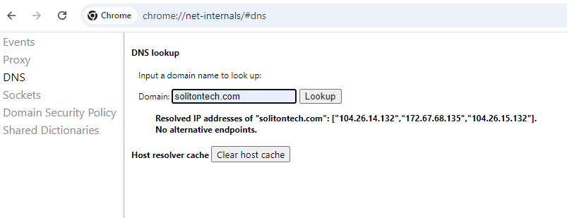

##### Microsoft Edge

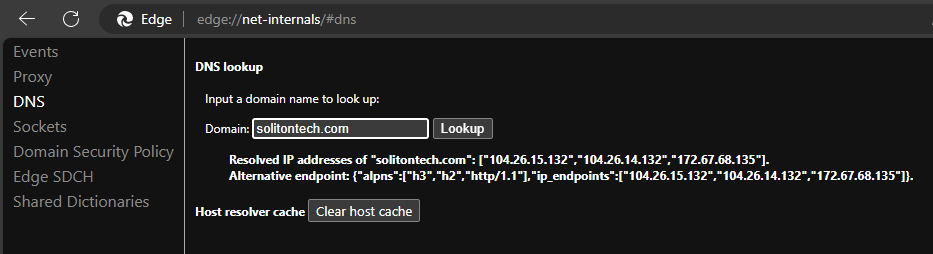

##### FireFox

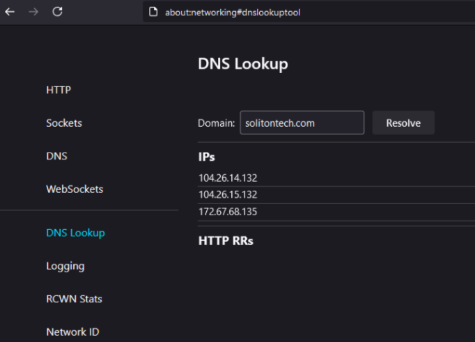

### Flushing OS DNS Cache

1. Flushing the DNS cache is a process that clears stored DNS records on your operating system local machine. 

2. This is necessary because the operating system or browser often keeps a cache of recently resolved domain names to speed up future requests. 

3. However, if a website’s IP address changes, or if there are changes to DNS records, the cached entries can lead to connectivity issues or outdated content.

<details>
<summary>Windows Flushing DNS Cache Commands</summary>
```js

# Display current DNS cache

`Get-DnsClientCache`
```
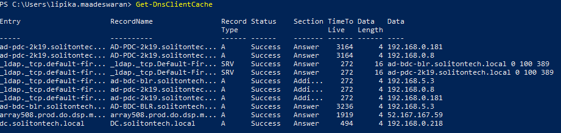

```js

# Resolve a new domain to create a cache entry


```

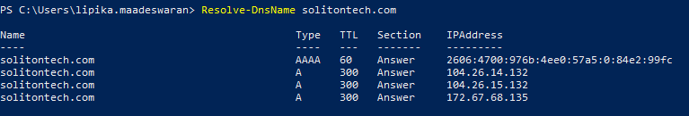


# Clear the DNS cache

`Clear-DnsClientCache`
```

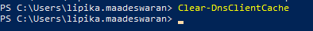

```js

# Verify cache is cleared


```
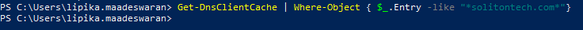

```js

# Register DNS Client with DNS Server

`Register-DnsClient`
```

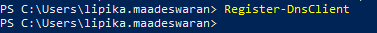

```js

# View Current DNS Server Configuration

`Get-DnsClientServerAddress`
```

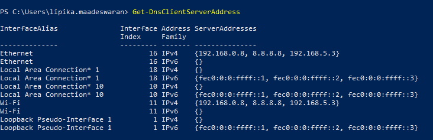

```js

# View Network IP Configuration

`Get-NetIPConfiguration`
```

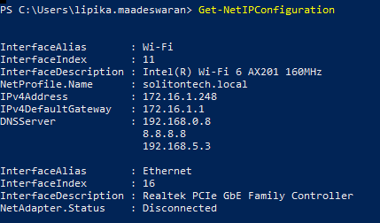

</details>

<details>
<summary>Linux Flushing DNS Cache Commands</summary>
```js

# Resolve a new domain to create a cache entry


```

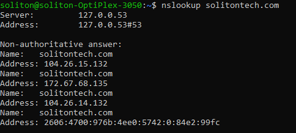

```js
# View Current DNS Server Configuration

`nmcli dev show | grep 'IP4.DNS'`
```

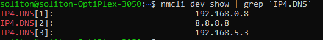
```js
# View Network IP Configuration

`ip addr show`
```

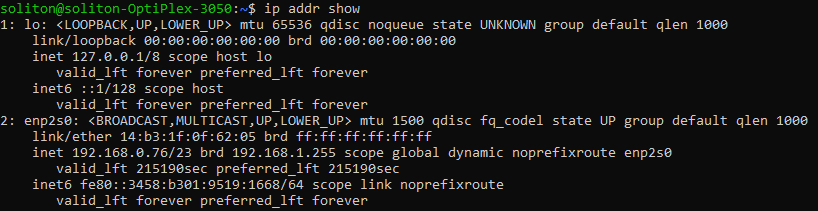
</details>