### Ping

1. Ping is a network utility used to test the reachability of a host on an IP network. 

2. It measures the round-trip time for messages sent from the originating host to a destination computer and back.

3. Ping operates by sending ICMP (Internet Control Message Protocol) Echo Request messages to the target host and waiting for an Echo Reply. 

4. This helps in diagnosing network connectivity issues and determining the performance of the network.

<table class="table-size-for-cloud-services">
    <thead>
        <tr>
            <th>Purpose</th>
            <th>Description</th>
        </tr>
    </thead>
    <tbody>
        <tr>
            <td><span class="custom-header">Network Troubleshooting</span></td>
            <td>Verify if a device or server is reachable.</td>
        </tr>
        <tr>
            <td><span class="custom-header">Latency Measurement</span></td>
            <td>Measure the time it takes for a packet to travel from the source to the destination and back.</td>
        </tr>
        <tr>
            <td><span class="custom-header">Packet Loss Detection</span></td>
            <td>Identify any loss of data packets during transmission.</td>
        </tr>
    </tbody>
</table>

<details>
<summary> Windows Ping Commands</summary>
    ```js
    # To perform a basic ping test to a target address (IP address or hostname)


    ```
    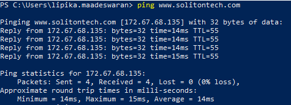

    ```js
    # To send a specific number of ping requests

    ```

    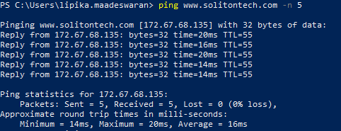

    ```js
    # To specify the size of the ping packet

    
    ```

    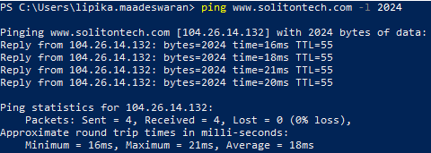

    ```js
    # To set a timeout period for each ping reply

    
    ```
    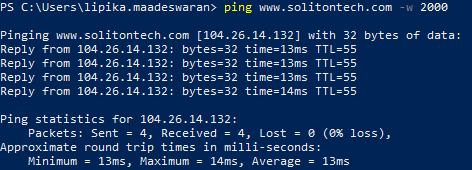

    ```js
    # To continuously ping the destination until stopped manually

    
    ```
    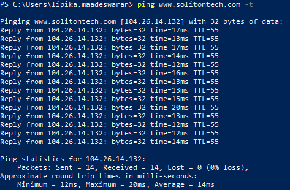

    ```js
    # To set the TTL value for each ping packet

    [Time-to-Live value, which shows the number of hops the packet has made]

    
    ```
    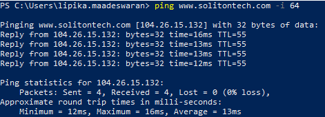

</details>

<details>
<summary> Linux Ping Commands</summary>
    ```js
# To perform a basic ping test to a target address (IP address or hostname)


```
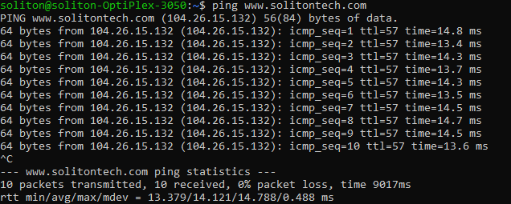

```js
# To send a specific number of ping requests


```
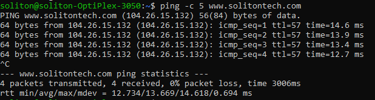
```js
# To specify the size of the ping packet


```
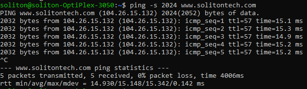

```js
# To set a timeout period for each ping reply


```
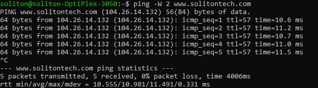
```js
# To set the TTL value for each ping packet

[Time-to-Live value, which shows the number of hops the packet has made]


```

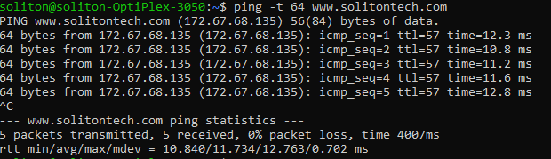

</details>

### TraceRoute

1. Traceroute is a network diagnostic tool used to trace the path that packets take from a source to a destination across a network. 

2. It provides a map of the route taken by the packets and helps in identifying points of delay or failure in the network path. 

3. Traceroute works by sending packets with gradually increasing Time-to-Live (TTL) values and recording the intermediate routers (or hops) that handle these packets.

<table class="table-size-for-cloud-services">
    <thead>
        <tr>
            <th>Purpose</th>
            <th>Description</th>
        </tr>
    </thead>
    <tbody>
        <tr>
            <td><span class="custom-header">Network Path Analysis</span></td>
            <td>Determine the path data packets take to reach a destination.</td>
        </tr>
        <tr>
            <td><span class="custom-header">Latency Identification</span></td>
            <td>Identify where delays are occurring along the network path.</td>
        </tr>
        <tr>
            <td><span class="custom-header">Troubleshooting</span></td>
            <td>Diagnose network issues and locate where failures or slowdowns occur.</td>
        </tr>
    </tbody>
</table>

<details>
<summary>Windows TraceRoute Commands</summary>
    ```js
    # To perform a basic traceroute to a target address (IP address or hostname)

    
    ```
    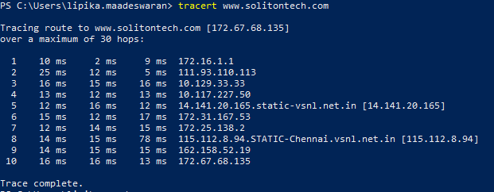

</details>

<details>
<summary>Linux TraceRoute Commands</summary>
```js
# To perform a basic traceroute to a target address (IP address or hostname)


```
</details>

### IPv4 to Decimal Conversion

An IP address can be represented in two primary formats:

    1. **Dotted-Decimal Notation:** Four decimal numbers separated by dots (e.g., 192.168.1.1).
    2. **Decimal Format:** A single decimal number.

Converting from dotted-decimal notation to a single decimal number can be useful for various networking tasks, such as IP address calculations and storage.

:::tip

For converting IPv4 to Decimal visit [IPv4 to Decimal Conversion](https://www.ipaddressguide.com/ip)

:::


### CIDR to IPv4 Conversion

1. CIDR (Classless Inter-Domain Routing) is a way to allocate IP addresses and route IP packets more flexibly than the older class-based addressing. 

2. CIDR notation expresses an IP address and its associated network mask in a compact format. For example, `192.168.1.0/24` indicates the IP address `192.168.1.0` with a subnet mask of `255.255.255.0`.

    1. **IP Address:** Specifies the network address.
    2. **Subnet Mask:** Determines the network and host portion of the IP address.
    3. **CIDR Notation:** Combines both in a format like `IP_address/Prefix_length`.

:::tip

For converting CIDR to IPv4 visit [CIDR to IPv4 Conversion](https://www.ipaddressguide.com/cidr)

:::

### Netmask

1. A `netmask`, also known as a subnet mask, is a 32-bit number that is used in conjunction with an IP address to specify which part of the address represents the network and which part represents the host.

2. It determines which portion of an IP address is used for the network address and which portion is used for host addresses. 

3. Netmasks are essential for routing IP packets between networks and identifying hosts within a subnet.

4. For example, in the IP address `192.168.1.1` with a netmask of `255.255.255.0`, the first 24 bits `(255.255.255)` represent the network address, while the remaining 8 bits (0) represent the host address.

#### Netmask Notation
:::info
1. **Decimal Notation:** Netmasks are often represented in dotted-decimal format, 
    e.g.,`255.255.255.0.`

2. **CIDR Notation:** Alternatively, netmasks are represented in CIDR (Classless Inter-Domain Routing) notation, which specifies the number of bits used for the network portion. For example, `192.168.1.1/24` means that the first 24 bits are used for the network portion.

3. Learn more about [Netmask](https://www.ipaddressguide.com/netmask)
:::
