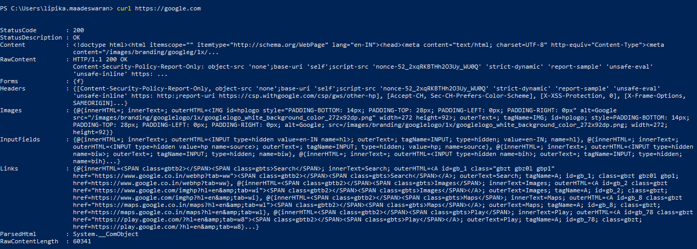

1. `cURL (Client URL)` is a versatile command-line tool and library used for transferring data with URLs across various protocols, including `HTTP`, `HTTPS`, `FTP` and more. 

2. It enables users to send and receive data to and from servers, making it invaluable for tasks like API testing, file downloads, and website monitoring.

3. With extensive customization options, cURL allows users to set headers, manage cookies, and handle authentication, making it ideal for both development and automation.

### Commands

The `curl` command is the same for both Windows and Linux when performing a basic GET request.

```js
# Basic GET Request

`curl https://google.com`
```

