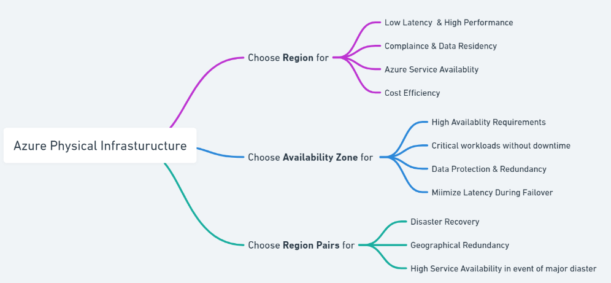

:::info 
Before deploying resources in Azure, it's essential to evaluate key
factors related to regions, availability zones and region pairs to understand
when to use these features. 
:::

### Deciding Factors for Azure Region

| Deciding Factors              | Reason                                                                                                                                                                                                         |
| ----------------------------- | -------------------------------------------------------------------------------------------------------------------------------------------------------------------------------------------------------------- |
| Latency and Performance       | Selecting a region close to your users minimizes latency and improves performance.                                                                                                                              |
| Compliance and Data Residency | Certain industries and countries have regulations & laws requiring data to be stored within specific geographical boundaries.                                                                                  |
| Service Availability          | Not all Azure services or VM types are available in every region. Consider [Service Availability](https://azure.microsoft.com/en-us/explore/global-infrastructure/products-by-region) for service availability. |
| Cost Efficiency               | [Azure pricing](https://azure.microsoft.com/en-in/pricing/calculator/) varies by region. Choosing a region with lower costs for resources can reduce your operational expenses.                                |

### Deciding Factors for Availability Zones

| Deciding Factors                   | Reason                                                                                                                                                                         |
| ---------------------------------- | ------------------------------------------------------------------------------------------------------------------------------------------------------------------------------ |
| High Availability Requirements     | Use Availability Zones if the application needs to be highly available and resilient to datacenter-level failures.                                                                 |
| Mission-Critical Workloads         | For applications that are critical to business operations and cannot tolerate downtime, Availability Zones provide an added layer of redundancy and reliability.               |
| Data Protection and Redundancy     | If data needs to be protected against hardware failures or natural disasters, deploying resources across Availability Zones helps ensure data protection.                      |
| Minimizing Latency During Failover | If the application needs to failover quickly with minimal latency, using Availability Zones within the same region ensures fast recovery times compared to cross-region failover. |

### Deciding Factors for Region Pairs

| Deciding Factors          | Reason                                                                                                                                                                                      |
| ------------------------- | ------------------------------------------------------------------------------------------------------------------------------------------------------------------------------------------- |
| Disaster Recovery         | Use region pairs to ensure business continuity in the event of a major disaster. If one region in the pair is affected, services can failover to the other region.                          |
| Geographical Redundancy   | When you need redundancy across a large geographical area to mitigate risks associated with regional outages, such as natural disasters or widespread network failures.                     |
| High Service Availability | If an application or service requires high availability with automatic failover, region pairs help to ensure that your service remains accessible even if one region experiences an outage. |

### Decision Map

