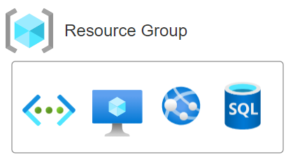
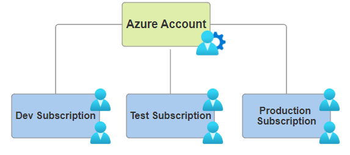
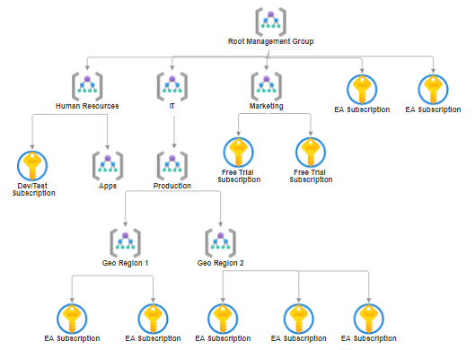

:::info 
The management infrastructure includes Azure resources, resource groups,
subscriptions, management groups and accounts. Understanding the hierarchical
organization will help plan your projects and products within Azure. 
:::

### Azure Resource

1. A **resource** is the basic building block of Azure; anything we create,
   provision, or deploy is considered a resource.

   1. Virtual Machines (VMs) 🖥️
   2. Virtual networks 🌐
   3. Storage accounts 💾

### Azure Resource Group

1. Resource groups are simply groupings of resources. When creating resources,
   it is required to place them into a resource group.

   1. A single resource can only be in one resource group.
   2. Resource groups cannot be nested within another resource group.

2. Resource groups help to manage resources with the same lifecycle. For
   example, when a delete action is applied to the resource group, all the
   resources within it will be deleted.

### Azure Subscriptions

1. Resource groups help to group resources. Azure subscriptions help to group or
   logically organize resource groups.

2. Subscriptions are linked with an Azure account, which provides authenticated
   and authorized access to Azure services.

3. **Subscriptions provide two main benefits**:

   1. **Billing Boundary**: Billing for the resource groups happens at the
      subscription level. Multiple subscriptions can be created for different
      types of billing requirements, such as organizational structure or
      development environments.

   2. **Access Control Boundary**: Subscriptions can be used to provide access
      at the subscription level, enabling users to access all the resource
      groups and resources belonging to that subscription.

### Azure Management Groups

1. Resources are placed under `resource groups` and `resource groups` are placed
   under `subscriptions`.

2. As subscriptions grow, `Azure management groups` help efficiently manage
   access, policies and compliance for subscriptions using Azure management
   groups.

3. **Applying Governance Conditions**:

   1. Governance conditions can be applied to management groups.
   2. All subscriptions within a management group automatically inherit the
      conditions applied to that management group. This inheritance model is
      similar to how resource groups inherit settings from subscriptions and
      resources inherit from resource groups.

   **Example Hierarchy**:

   
