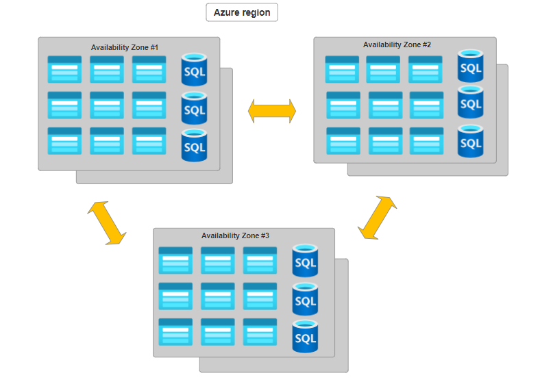
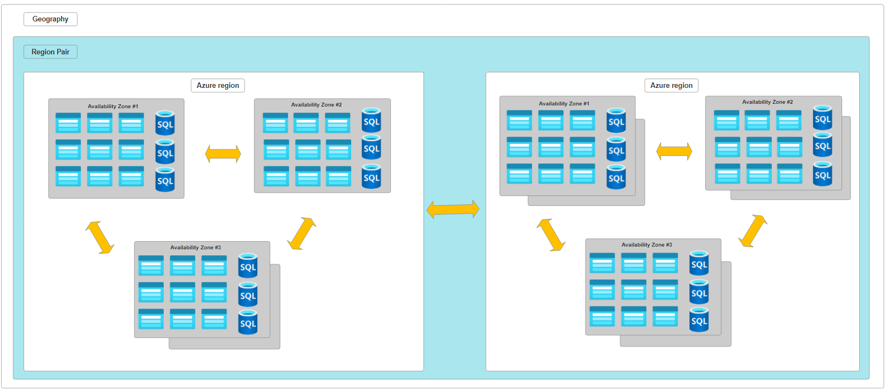

1. The physical infrastructure for Azure starts with **datacenters**.🏢
   Datacenters are facilities with resources arranged in racks with dedicated
   power, cooling and networking infrastructure. ⚡

2. Azure has data centers around the
   [world](https://infrastructuremap.microsoft.com/). These individual
   datacenters aren’t directly accessible.

3. Datacenters are grouped into **Azure Regions** or **Azure Availability
   Zones** 🌐 designed to help achieve resiliency and reliability.

### Regions

1. A **region** is a geographical area in the world that contains at least one
   or multiple **datacenters** 🏢.

2. The datacenters inside the region are connected with high-speed, low-latency
   networks 🌐.

3. To deploy a resource in Azure, you often need to choose the region to deploy
   📍.

### Availability Zones

1. **Availability Zones** are physically separate datacenters within an Azure
   region.

2. Each Availability Zone is made up of one or more datacenters equipped with
   independent power, cooling and networking.

3. They act as an isolation boundary. If one zone goes down, the other continues
   working. Availability Zones are designed for high availability and fault
   tolerance.

4. Use Availability Zones to run mission-critical applications and build
   high-availability into your application.

### Supported Azure Services

1. Availability Zones are primarily for:

   1. VMs 🖥️
   2. Managed disks 💾
   3. Load balancers ⚖️
   4. SQL databases 🗄️

2. Azure services that support Availability Zones fall into three categories:

   1. **Zonal Services**: Resources pinned to specific zones (for example, VMs,
      managed disks, IP addresses).
   2. **Zone-Redundant Services**: The Platform automatically replicates across
      zones (for example, zone-redundant storage, SQL Database).
   3. **Non-Regional Services**: Services are always available from Azure
      geographies and are resilient to zone-wide outages as well as region-wide
      outages.

### Region Pair

1. Even though Availability Zones provide additional resiliency, it is possible
   that an event could be so large that it impacts multiple Availability Zones
   in a single region. To improve further resilience, Azure uses Region Pairs.

2. Azure regions are paired with another region within the same geography, at
   least 300 miles away.

3. This pairing allows for the replication of resources across a geography,
   which helps reduce the likelihood of interruptions due to events such as
   natural disasters, civil unrest, power outages, or physical network outages
   that could affect an entire region.

