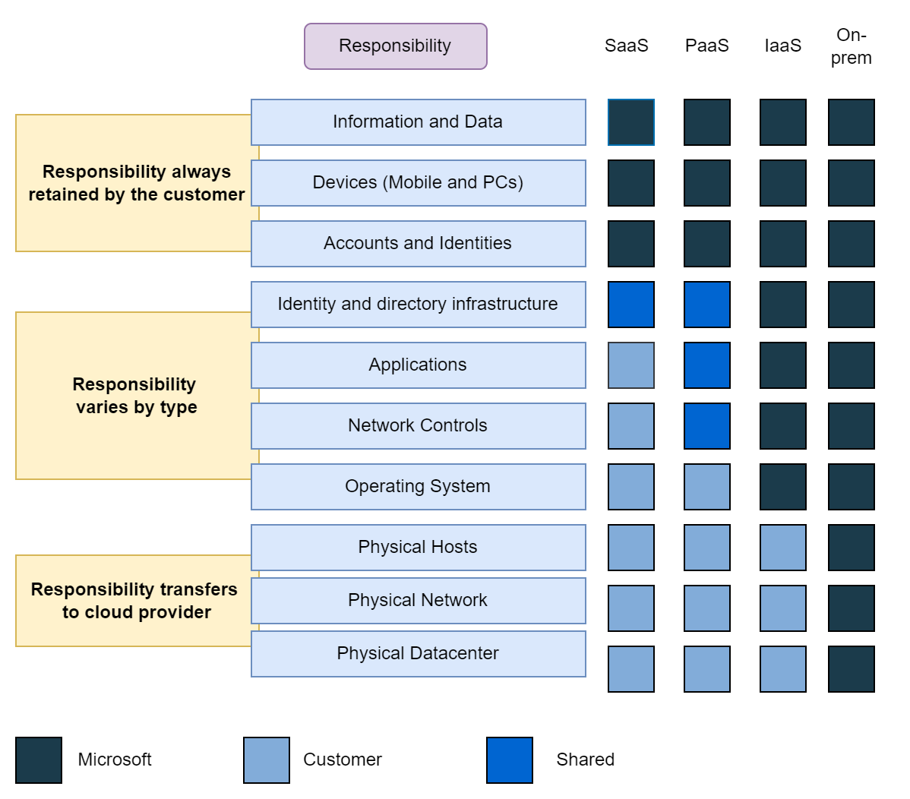

# Software as a Service (SaaS)

1. **Software as a Service (SaaS)** is the most complete cloud service model,
   providing fully developed applications.
2. It is the least flexible but easiest to deploy, requiring minimal technical
   knowledge to use.

## Scenarios

1. Email and Messaging 📧
2. Business Productivity Applications 📈
3. Finance and Expense Tracking 💵

<!--  -->

