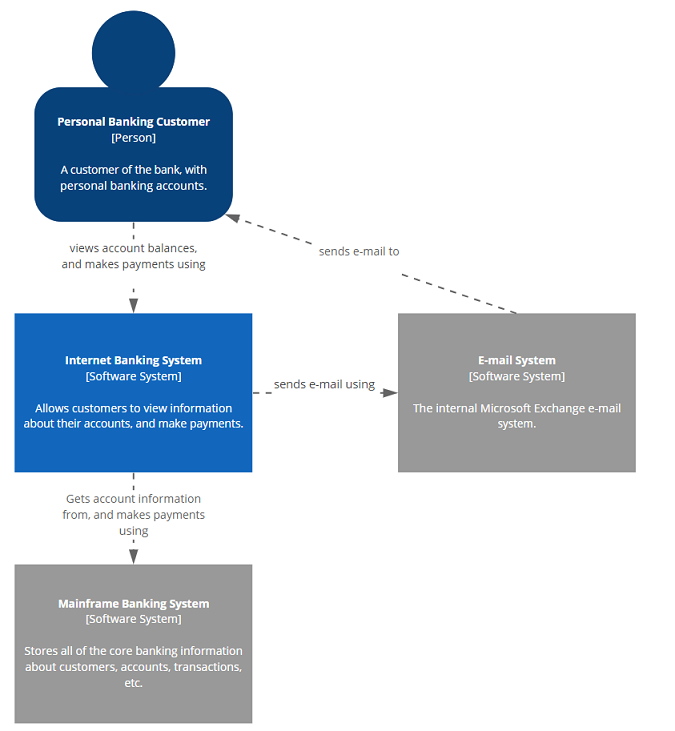
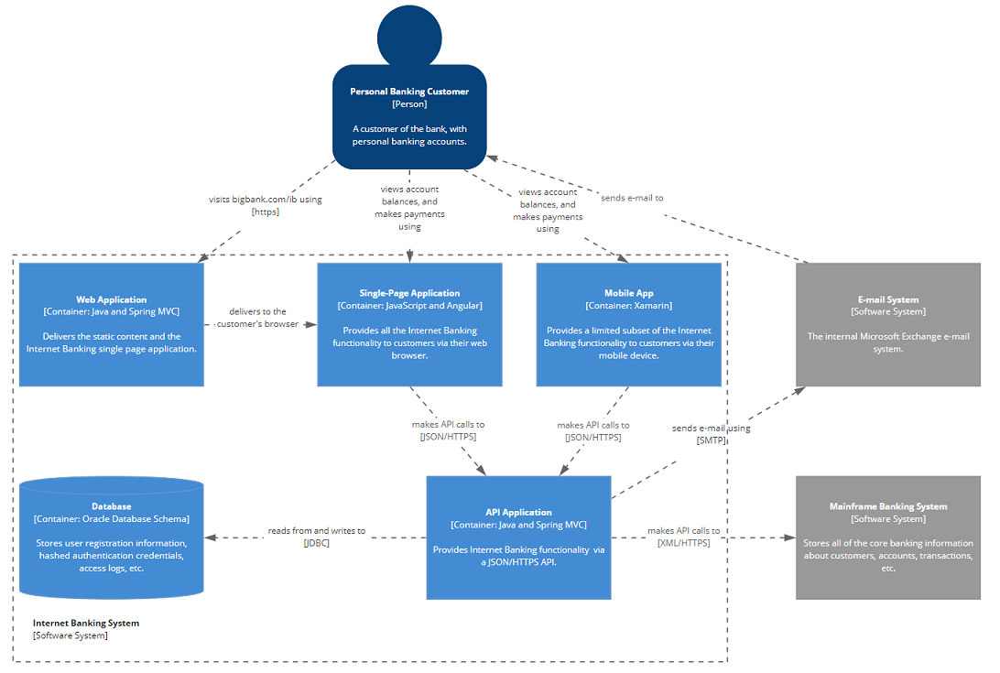
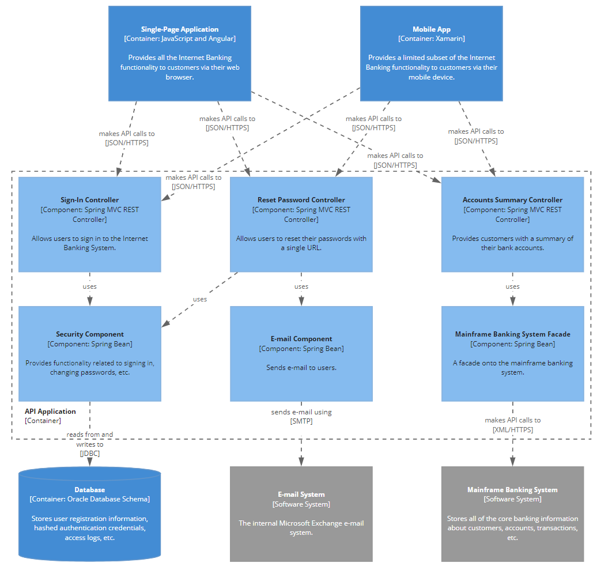
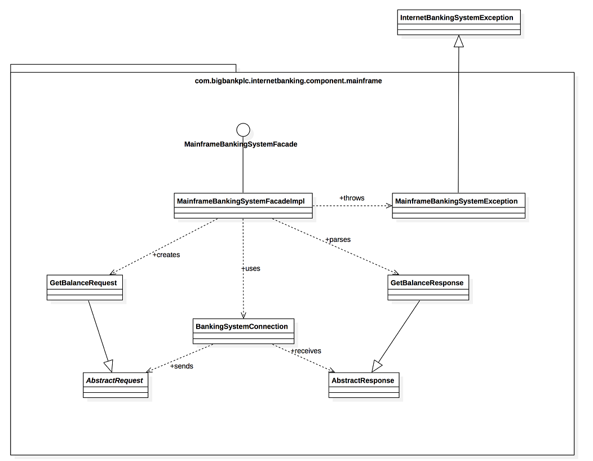

### Visualizing Software Architecture Using the C4 Model

## Purpose

This document explains what the C4 Model is and the advantages it brings. It also details how to create C4 Model architecture diagrams.

## C4 Model - Introduction

The [C4 Model](https://c4model.com/) is a method for visualizing software architecture. This approach expresses architecture through four hierarchical levels:

1. **Context Diagram** (System Context Diagram)
2. **Container Diagram**
3. **Component Diagram**
4. **Code Diagram**

It is a notation-independent and tool-independent way to visualize architecture.

## Why Choose C4?

The C4 Model offers a user-friendly and easily understandable approach to software architecture diagramming. It provides a hierarchical framework for conceptualizing the structures within a software system. Here are several distinct advantages of using C4 Models over other architecture diagramming methods like UML:

### Enhances Accessibility

- Facilitates clear comprehension by both technical and non-technical team members.
- Improves collaboration and communication among a diverse group.
- Enables more effective decision-making.

### Promotes Consistency

- Enforces a standardized way of documenting architecture.
- Ensures that everyone on the team uses a consistent format.
- Minimizes confusion and maintains clarity across different parts of the system.
- Reduces the learning curve when switching between teams or projects.

### Provides Scalability

- The zoom-in/zoom-out approach allows for different levels of detail.
- Progressively delves into specifics as needed.

### Enhances Diagram Readability

- Encourages the inclusion of concise descriptions within diagrams, making them comprehensible and usable even outside of formal documentation.

## C4 Model Diagram Hierarchy

The C4 Model employs a hierarchy of diagrams to depict various levels of a software system's architecture. It begins with a high-level Context Diagram, offering a holistic view. Users can then delve into more specific perspectives, such as Containers and Components, to gain a deeper understanding of the system's structure and relationships. This tiered approach ensures clarity and consistency in architectural documentation.

### Context Diagram (System Context Diagram)

Shows the system in its environment, including its users and other systems it interacts with. At this level, the focus is on identifying the broader context of the system, including its users, external systems it interacts with, and high-level requirements.

In the example below, the `Internet Banking System` is the software application for which we are documenting architecture via C4. The System Context Diagram shows the environment around the `Internet Banking System`, illustrating how users interact with the system and how the system interacts with other systems like the `Email System` and `Mainframe Banking System`.

### Container Diagram

Shows how the system is organized into containers (such as web applications, mobile apps, and databases). Dive deeper into the system's structure by identifying its logical containers, such as web applications, mobile apps, and databases.

> **Note:** Containers here do not represent Docker containers!

A `container` is something like a server-side web application, single-page application, desktop application, mobile app, database schema, or file system. Essentially, a container is a separately runnable/deployable unit (e.g., a separate process space) that executes code or stores data.

In the diagram below, the `Internet Banking System` is zoomed in to show its containers. This includes the `Web Application`, `Single-Page Application`, `Mobile App`, `Database`, and `API Application`. It also shows other external systems, including the `Email System` and `Mainframe Banking System`.

### Component Diagram

Shows how each container is made up of components and how they interact with each other. Zoom in further to examine the building blocks of the system, known as components. These components implement specific functionalities, such as user authentication or order processing.

The example below shows how the `API Application` container is built. It highlights all the components that make up this container and illustrates how these components interact with each other and with other containers or external systems.

### Code Level Diagram

Shows how each component is implemented in code. At this level, you can create code-level diagrams for detailed implementation insights.

In this example, we can see how the `Mainframe Banking System Facade` component is coded via a UML diagram. There are different ways to represent code diagrams, with [UML](https://en.wikipedia.org/wiki/Unified_Modeling_Language) being one of the most popular.

## How to Create C4 Model Diagrams

1. **Create a System Context Diagram:** Illustrate the system at the center, surrounded by its users and external systems.
2. **Create Container Diagrams:** For each container, visualize the internal components and their interactions.
3. **Create Component Diagrams:** For each component, detail its implementation, including classes and technologies used.
4. **Create Code-Level Diagrams (Optional):** If needed, illustrate finer details using UML diagrams. This step is optional and can be valuable for in-depth documentation or troubleshooting.

### Do's

1. **Use Standard Notation:** Follow the standardized C4 Model symbols for components, containers, people, and relationships. Consistency in notation makes diagrams easier to understand.
2. **Keep It Simple:** Use clear and straightforward diagrams. Avoid adding unnecessary details that can clutter the diagram and reduce its clarity.
3. **Maintain Consistency:** Ensure consistency in naming conventions and diagram structures throughout your documentation.
4. **Add Context:** Start with a high-level Context Diagram to show the big picture before diving into more detailed diagrams.
5. **Use Layers:** Utilize the four layers (Context, Container, Component, and Code) as needed to provide different levels of abstraction.
6. **Label Components:** Provide meaningful labels and descriptions for components, containers, and relationships to enhance understanding.
7. **Document Responsibilities:** Clearly define the responsibilities of components and containers to improve system comprehension.
8. **Collaborate:** Encourage team collaboration in creating and reviewing C4 diagrams to ensure accuracy.

### Don'ts

1. **Neglect Updates:** Don't forget to update diagrams as the architecture evolves. Outdated documentation can be misleading.
2. **Overuse Relationships:** Don't create unnecessary or excessive relationships between components or containers.
3. **Sacrifice Clarity:** Don't compromise the clarity of your diagrams. Avoid ambiguity in naming and relationships.
4. **Neglect Key Elements:** Don't overlook essential components or containers, as this can create gaps in understanding.

## References

### Links

- [C4 Model Website](https://c4model.com/)
- [IBM Garage: C4 Model for Software Architecture](https://www.ibm.com/garage/method/practices/code/c4-model-for-software-architecture)
- [InfoQ: C4 Architecture Model](https://www.infoq.com/articles/C4-architecture-model)
- [Beagle Open-Source Framework: Using C4 Model for Architecture Diagrams](https://docs.usebeagle.io/c4model/en/#/)

### Videos

- [Visualizing Software Architecture with the C4 Model](https://www.youtube.com/watch?v=x2-rSnhpw0g&t=13s)
- [C4 Architecture Model | Tech Primers](https://www.youtube.com/watch?v=Tf3eNaB-LGs)
- [C4 Model for Visualizing Software Architecture at Open Security Summit CIC](https://www.youtube.com/watch?v=iJMAD_pQTX8)

---

