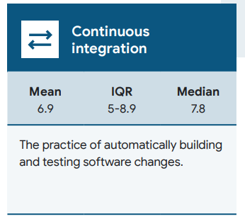
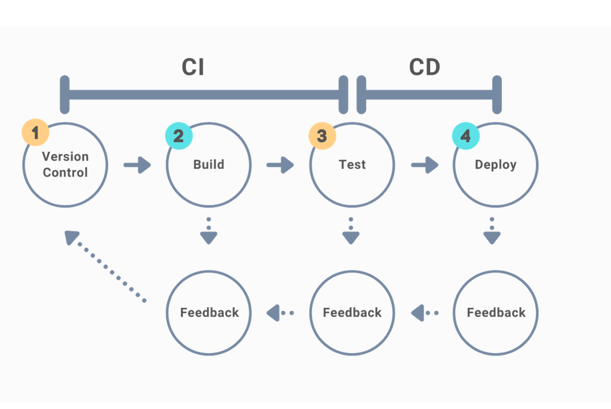
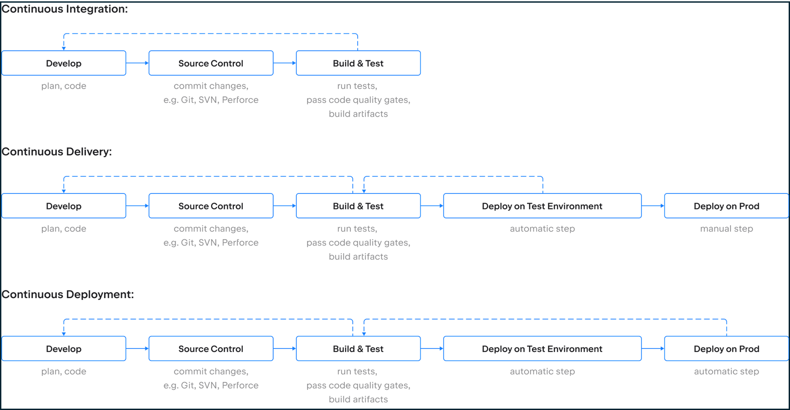

# Continuous Integration (CI)

[[_TOC_]]

## Understanding

### Overview

<!--Provide information on What, Who - Utkarsh and project stakeholders, time
investment and return of investment -->

Continuous Integration (CI) is the practice of frequently integrating code  
changes and running automated tests. Understand in detail
[here](https://dora.dev/devops-capabilities/technical/continuous-integration/)
before proceeding.

### Why?

<!--Provide reasons for why this is needed now in backing industry
standards, research conclusions from DORA-->

CI is considered to be one of the core engineering software practices
because:

1. Integration issues can be detected very early and frequently
2. Fast feedback loop on impact of current code changes to other code modules
3. Automated checks to ensure consistent code quality before it goes into main
   source code
4. Better builds and artifactory management

CI is primarily becoming a need to have to succeed in today's market conditions.
This is evident from below distribution of research data from
[State of DevOps Report 2023](https://cloud.google.com/devops/state-of-devops).
The distribution denotes that already more than half of software organizations
have modified their operations to include CI.

- Mean - Average value of whole data
- Median - The middle value in a distribution of data. If it is dramatically
  different from the mean, it might indicate that the data is skewed
- Inter Quartile Range (IQR) - By giving you the two numbers (25th and 75th
  percentiles) where the middle 50% of the data resides, these boundaries should
  help convey the spread of responses.

### What will be the impacts of CI?

<!--Provide Short term, Long term impacts to customers, team and utilization-->

#### Customer Impact

1. Short Term - Increase in delivery speed of business features without
   compromising quality
2. Long Term - Confidence in software quality & releasability having complex
   integrated modules

#### Team Impact

1. Short Term - Forget manual effort of creating builds, running tests or static
   code analysis checks at regular intervals
2. Long Term - Enhanced collaboration, team cohesion and satisfaction as
   integration hassles are significantly reduced

#### Utilization Impact

1. Short Term - More development time & less integration issues debugging time
   (which are hard to trace back)
2. Long Term - Increase in effective utilization directly contributing to
   revenue, quality while saving time

### Key differences between Continuous Integration (CI), Continuous Deployment (CD) and Continuous Delivery

<!--Mention about key differences between CI and CD and also how continuous delivery
 is related here as an additional note-->

Continuous Integration (CI) focuses on automating the integration and validation
of code changes, while Continuous Deployment (CD) automatically deploys every
successful code change to production without manual intervention.

Continuous delivery is commonly conflated with continuous deployment, but they
are separate practices. Continuous deployment is when teams try to deploy every
code change to production as soon as possible. Continuous deployment works well
for web services, but can’t be applied to software such as firmware or mobile
apps. Continuous delivery is applied to all kinds of software including firmware
and mainframe systems, and in highly regulated environments.

As you acknowledge from the above differences, CI phase stops with build & test.

### Pre-requisites for effectiveness

<!--Mention any dependent pre-requisites that will enhance this practice benefits.
This can be other core practices itself-->

Trunk based development enhances CI practice's effectiveness. It helps to commit
small code batches across all modules into one central trunk, thereby enabling
incrementally small integration steps. In a way trunk based development is also
a required practice for effective continuous integration

For more details refer to
[DORA's trunk based development practice](https://dora.dev/devops-capabilities/technical/trunk-based-development/)

### Risks of not following

> :no_entry: Failing to follow CI can lead to
>
> 1. Infrequent integration that leads to quality issues
> 2. Broken or unusable application state
> 3. Delayed defects discovery
> 4. Difficult merges and overall slower development
> 5. Poor developer productivity

> :warning: **Note:**
>
> When starting to adopt CI, Tech Lead should take care of the following,
>
> 1. Mindset shift for identifying integration issues early rather than
>    addressing just before release
> 1. Understanding current setup to identify pain points
> 1. Deciding what level of CI is needed in my project based on pain points
> 1. Educating and aligning with customers on CI

## Implementation

Following are the typical stages in CI, which can be adjusted based on project
needs

### Stage 1 - Automate in local

> :checkered_flag: Focus on automating build creation, test runs and lint checks
> locally

1. Ensure that build command is available for packaging, otherwise create an
   automated build script
2. Existing manual test cases should be converted into automated test cases -
   unit, integration or acceptance tests
3. Install & setup static code analysis
   tools for:
   - Linting
   - Formatting
   - Spelling checks for documentation
4. Install & setup security vulnerability scan tools
   ([npm audit example](https://docs.npmjs.com/cli/v10/commands/npm-audit))
5. Get builds, configuration, automated tests, static code analysis checks,
   security vulnerability scans - Command Line Interface (CLI) ready in local
   setup

### Stage 2 - Setup pipelines

> :checkered_flag: Focus on setting up pipeline triggers before and after PR
> merges

1. Setup pipeline in projects using CI tools for the platform
   ([AzDO pipelines](https://learn.microsoft.com/en-us/azure/devops/pipelines/create-first-pipeline?view=azure-devops&tabs=java%2Ctfs-2018-2%2Cbrowser#prerequisites---azure-devops),
   [Github Actions](https://docs.github.com/en/actions/quickstart), Travis CI,
   Jenkins, etc.)
2. Create CI workflow scripts in the chosen tool to:
   1. Trigger creation of build artifacts & packages
   2. Run automated tests (Parallelize test execution wherever possible)
   3. Run Linting, spell checking, formatting
   4. Run security vulnerability scans
3. Publish builds and other artifacts to artifact repositories to manage
   versions and disaster recovery
   1. Azure Artifacts
   2. Github Actions Artifacts
   3. JFrog
4. Establish a process within team to write automated tests for each PR to cover
   the scope of developed code in that PR
5. Setup triggers to run CI pipeline:
   1. When a new PR is created and for each new commits to that PR
   2. After the PR is merged to main/trunk
6. PR merges should be blocked on any CI pipeline failure

### Stage 3 - Report & Fix

> :checkered_flag: Focus on reporting and fixing the pipeline failures

1. Setup below notification alerts on pipeline failures. Let's take example of
   AzDO:

   1. Setup dashboards for analyzing pipeline (or) build health over a period
      (say last 15 days)
   2. Setup email notifications to alert on pipeline failures
   3. Setup Microsoft teams notifications to alert on pipeline failure

2. On failure, focus on fixing the issue first before proceeding.
3. Do not ignore any intermittent test failures through re-run and merge.
   Identify root cause promptly and fix them
4. Do not ignore random build failures. Again identify root cause promptly and
   fix them
5. CI output logs should be developer friendly to narrow down to root cause
   sooner

### Non-negotiable items

<!--List concepts in each stage which are non-negotiable for customization to fit
project needs-->

To ensure the success of the Continuous Integration (CI) process, certain
non-negotiable should be adhered to across the mentioned stages:

1. Version control to check-in repository files
2. Compile time extensions in local for automatic error highlighting and fixing:
   1. Static Code Analyzer Extensions
   2. Code Formatting Extensions
   3. Documentation Formatting Extensions - Markdown
3. 1 CI pipeline for code modules which runs:
   1. Automated tests for each PR
   2. Creation of build packages
   3. Static code analyzer checks
   4. Security scanning for vulnerabilities
4. 1 CI pipeline for documentation which runs:
   1. Lint checks
   2. Formatting checks

> :warning: **Note:** In scenarios such as
>
> 1. Non-availability of security scanning tools for LabVIEW
> 2. Non-availability of documentation inside repository, etc.
>
> Project tech leads can have conversation with Cohort Leads to take exception
> from the above non-negotiable list as needed. However any tools that needs to
> be developed for technical improvement, will be captured in corresponding
> project backlog or TechOps team's backlog after minimal definition, analysis
> and ball park estimate to get an exception.

# Frequently Asked Questions (FAQs)

> **CI 001 - How much time is needed for setting up CI pipeline? Is it one time
> or recurring investment?**

- Time required to create a new CI pipeline can vary depending on the complexity
  of the project and the tools used. AzDO pipelines and GitHub Actions are
  popular tools for building CI/CD pipelines, and it is known for its ease of
  use and simplicity. One-time investment includes the time required to set up
  the pipeline initially, while the recurring investment includes the time
  required to maintain and update the pipeline.

  - One-time investment - Typically it would take few days - few weeks per
    pipeline setup initially. And a project can have many pipelines setup for
    different modules across code files, documentation files, etc.

---

> **CI 002 - What are some common pitfalls when starting to adopt CI?**

- DORA Continuous integration practice has a good list of
  [common pitfalls](https://dora.dev/devops-capabilities/technical/continuous-integration/#common-pitfalls)
  that can affect adoption of CI

---

> **CI 003 - What are some common challenges when starting CI and how can I
> overcome them?**

1. _Mindset shift_ - Adopting a CI/CD pipeline requires a culture shift, and it
   can be challenging to ensure that everyone on the team is aligned with the
   new approach. It is important to ensure that everyone understands the
   benefits of the pipeline and is committed to making it work

1. _Large project dilemma_ - A single CI/CD pipeline is often not recommended
   for a large project, especially those that are developed on a global level in
   big companies. In such cases, it is recommended to break down the project
   into smaller components and create separate pipelines for each component

1. _Resource Management_ - Resource management is generally not an issue while
   working on a smaller project. However, as the project grows, it becomes
   increasingly important to manage resources effectively. This includes
   managing the number of build agents, parallel builds, and other resources. We
   can align with customers' central team and internal TechOps team to sort out
   these issues on a case by case basis.

1. _Lack of expertise_ - CI/CD pipelines require a certain level of expertise to
   set up and maintain. Teams may face challenges if they do not have the
   necessary skills or experience to work with the tools used in the pipeline.
   We can take help and guidance from TechOps team to overcome this challenge
   based on project size and complexity

---
