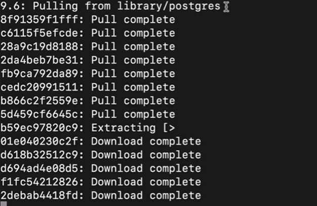
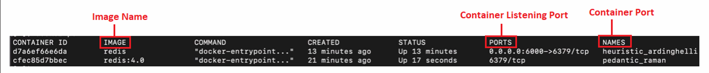
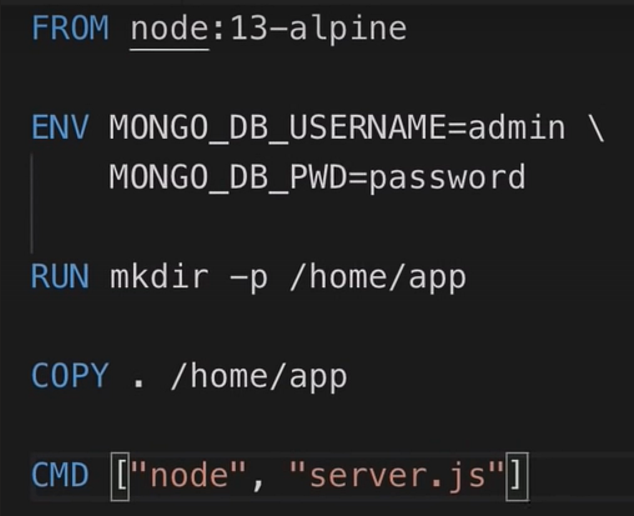
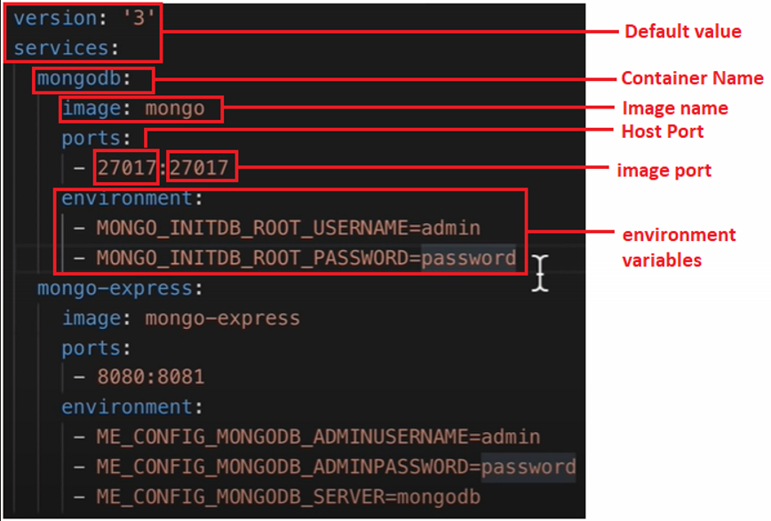
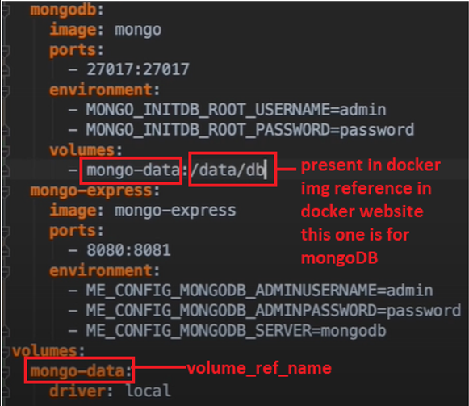
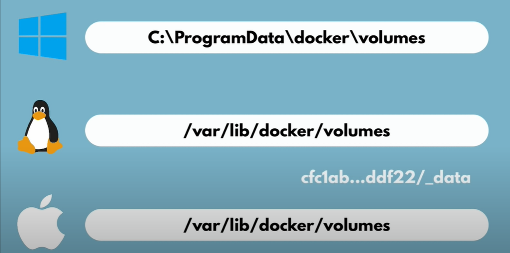

# Docker Basics

## What is Docker?
Docker is a DevOps tool used to share applications between different people and systems along with all its dependencies. 

## Why Docker?
Applications are often built using several tools or environments, such as Node.js, Python, or ASP.NET. To run an application, the source code alone is not enough—the environment must also be recreated. Docker simplifies this by packaging applications with their runtime environments, eliminating dependency issues.

## Main Components of Docker
1. **Docker File**
2. **Docker Image**
3. **Docker Container**
4. **Docker Compose**
5. **Docker Volumes**

## Docker Container
A Docker container is a lightweight, standalone package that contains everything needed to run an application. Containers are stored in repositories, either private or public. One common public repository is Docker Hub, which hosts many containers for installation and use.

### Container Composition
Containers are built from Docker images. These images consist of multiple layers, each representing a part of the environment. For example, to install Python from Docker Hub, the following command is used:

```bash
docker pull python:<version>
```

This command installs the specified version of Python into your local machine, where it is stored in a Docker memory space as a container.

### Example: Postgres Installation

Refer to the image below to see the installed Postgres running in a Docker container along with its details.



## Docker File
A Docker File is used to build the Docker image for an application. Each Docker file command starts with a capital letter. Here's an example:

```Dockerfile
FROM python:3.9
WORKDIR /app
COPY . .
RUN pip install -r requirements.txt
CMD ["python", "app.py"]
```

To learn more about Docker files, check the [Dockerfile documentation](https://docs.docker.com/engine/reference/builder/).

## Docker Compose
Docker Compose is a `.yaml` file that contains all the Docker commands needed to set up and run containers on different systems. It's like a script for automating container setup.



### Example:

```yaml
version: '3'
services:
  web:
    image: nginx
    ports:
      - "8080:80"
```

To execute this file:

```bash
docker-compose -f <file_name> up
docker-compose -f <file_name> down
```

## Docker Volumes
Docker volumes retain data, ensuring that it persists even after a container restarts. Without volumes, data would be lost between sessions.

### Example of Using Docker Volumes
To use a Docker volume, add it to the Docker Compose file:



```yaml
version: '3'
services:
  db:
    image: postgres
    volumes:
      - ./data:/var/lib/postgresql/data
```



The data directory is stored locally to persist across container restarts.

## Basic Docker Commands

1. `docker run <image>:<version>`  
   Pulls the container from Docker Hub (if not available locally) and runs it, displaying run details.  
   *Press `Ctrl + C` to stop it.*
   
2. `docker run -d <image>:<version>`  
   Runs the container in detached mode, showing only the container ID.

3. `docker pull <image>:<version>`  
   Pulls a specific image version from Docker Hub.

4. `docker ps`  
   Lists all currently running containers.

5. `docker ps -a`  
   Lists all available containers, including stopped ones.

6. `docker start <container ID>`  
   Starts an existing container.

7. `docker stop <container ID>`  
   Stops a running container.

8. **Restarting a Container**  
   Stop and start a container using the following commands:
   ```bash
   docker stop <container ID>
   docker start <container ID>
   ```

9. `docker run -p <host port>:<container port> <image>`  
   Maps the container port to the host machine’s port to avoid conflicts.

10. `docker run -p <host port>:<container port> -d <image>`  
    Runs the container in detached mode without displaying run details.

11. `docker images`  
    Lists all images stored locally on your machine.

12. `docker run -p <host port>:<container port> -d --name <container name> <image>`  
    Assigns a custom name to the container.

13. `docker logs <container name>`  
    Displays the container's logs, useful for debugging.

14. `docker exec -it <container ID> /bin/bash`  
    Opens a terminal within the container, granting root access to view files and environment variables.

15. `docker network ls`  
    Lists all available Docker networks.

16. `docker network create <network name>`  
    Creates a new Docker network.

17. **Running MongoDB in a Custom Network**

```bash
docker run -d \
  -p <host port>:<container port> \
  --net <network name> \
  --name <container name> \
  -e MONGO_INITDB_ROOT_USERNAME=<username> \
  -e MONGO_INITDB_ROOT_PASSWORD=<password> \
  <image>
```

18. **Connecting Mongo Express to MongoDB**

```bash
docker run -d \
  -p <host port>:<container port> \
  --net <network name> \
  --name <container name> \
  -e ME_CONFIG_MONGODB_ADMINUSERNAME=<admin username> \
  -e ME_CONFIG_MONGODB_ADMINPASSWORD=<admin password> \
  -e ME_CONFIG_MONGODB_SERVER=<MongoDB container name> \
  <image>
```

19. `docker build -t <image>:<tag> ./<location>`  
    Builds a Docker image using a Docker file.

20. `docker tag <image>:<tag> <aws-registry-name>/<image>:<tag>`  
    Tags and copies the Docker image to a new repository.

21. `docker push <repository>:<tag>`  
    Pushes a Docker image to a specified repository.

22. `docker --help`  
    Displays a list of Docker commands and their descriptions.
```

This format will work well for a Docusaurus documentation setup, providing clear explanations, code blocks, and examples.