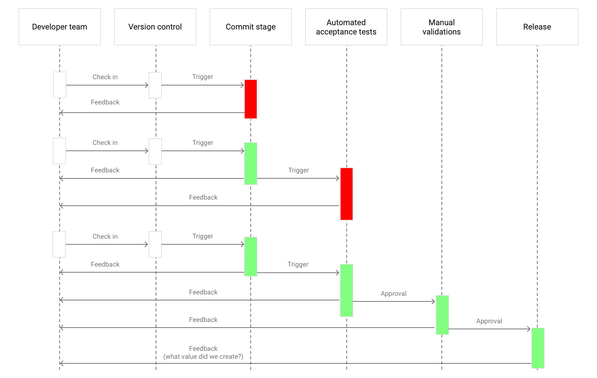
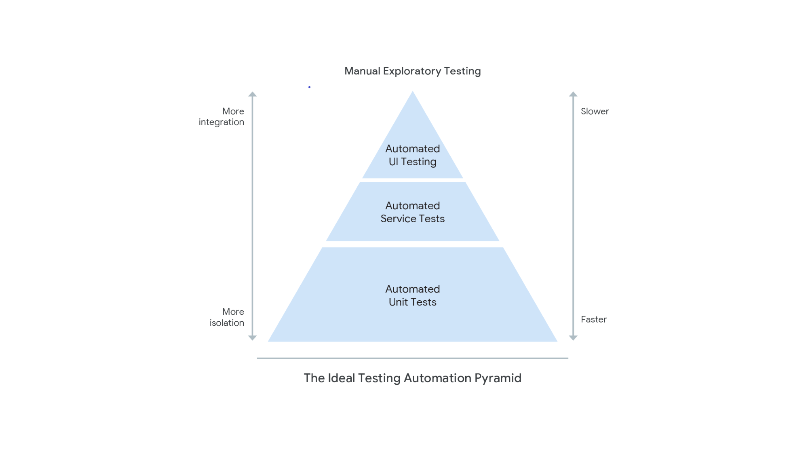
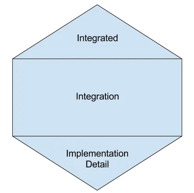
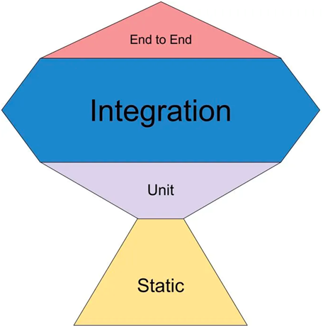

### 🔍 Overview - Test Automation

This document provides an overview on test automation, a must-have software
engineering practice for all projects.

## 📖 Glossary

Before we start reading this document, let's understand some important
terminologies used in this document:

- **Test Automation** - Test automation refers to the whole practice of using
  automated processes, tools, and frameworks to consistently and efficiently
  execute tests throughout the software development lifecycle, with the goal of
  ensuring higher quality, faster release cycles, and improved collaboration
  between development and operations teams.

- **Automated testing** - Automated tests are specific test cases (usually
  regression tests) executed automatically by testing tools, focusing on
  verifying particular aspects of software functionality.

- **Exploratory Testing** - Exploratory testing, as defined by Cem Kaner, is a
  software testing approach where the tester actively controls the design of the
  tests as they are performed and uses their domain knowledge, testing skills,
  and intuition to guide the testing process. It involves simultaneously
  learning, designing, and executing test cases, making real-time decisions
  based on what the tester discovers during testing.

- **Usability Testing** - Usability testing refers to evaluating a product or
  service by testing it with representative users. Typically, during a test,
  representative users will try to complete typical tasks while observers watch,
  listen, and identify usability improvements.

- **Acceptance Testing** - Acceptance testing is a black-box testing process where
  the functionality is verified to ensure the software product meets the
  acceptance criteria.

- **Smoke Tests** - Smoke tests verify whether the most important features work as
  expected and that there are no showstopper issues in the build that can
  potentially lead to blocking the entire testing team. These types of tests are
  common during production checkouts in pipeline which ensures important features
  work as expected before release.

## 🤔 Why?

Traditionally, teams relied on manual testing and code inspection to verify
systems’ correctness. These inspections and tests typically occurred in a
separate phase after “dev complete,” with the following drawbacks:

- **Time-Consuming**: Manual regression testing is time-consuming and expensive.
- **Unreliable**: Manual tests and inspections are unreliable for repetitive
  executions.
- **Delayed Feedback**: Developers have to wait for feedback after development
  completion, resulting in substantial work to triage defects and address issues
  during the next feature's development.
- **Manual Test Suite Maintenance**: Maintaining manual test suites for evolving
  systems is challenging.

Test Automation should allow you to spend more of your time focused on making
the product better continuously and consistently, eliminating a siloed testing
phase after "dev complete":

- **Continuous Testing**: Test automation supports continuous testing throughout
  the software delivery lifecycle.
- **Shifting Left**: Test Automation shifts the testing phase earlier in the
  software development lifecycle, thereby detecting and fixing defects at an
  earlier stage, reducing development costs.
- **Fast and Reliable Tests**: Automated tests provide fast, reliable test suites
  that integrate with continuous delivery pipelines.
- **Faster Feedback**: When integrated with continuous delivery pipelines,
  feedback is sufficiently fast, enabling quicker discovery of quality issues due
  to new additions.
- **Improved Software Quality**: Test automation helps build high-quality software
  faster, improves stability, reduces team burnout, and minimizes deployment
  issues, providing increased productivity and output in the longer run.

By adopting this practice, developers have most of their work validated in a
matter of minutes, instead of days or weeks, so they can fix bugs as soon as
possible.

_Figure 1: Test Automation Feedback loop ([Source page - DORA](https://dora.dev/devops-capabilities/technical/test-automation/))_

## 🤨 How to implement test automation

To build quality into the software, both automated and manual test runs are
necessary. It is important to have both organizational and technical components.

### Teams perform better through below organization

From an organizational standpoint, [DORA research](https://dora.dev/) recommends
that teams perform better when they:

- Allow testers to work alongside developers throughout the software development
  and delivery process.
  > **Note:** “Tester” is a role, not necessarily a full-time job.

- Focus manual testing efforts on exploratory testing, usability testing, and
  acceptance testing coverage.

### Teams can automate tests as below

- **Unit tests** - Test individual methods, classes, or functions in isolation
  which ensures that unit-level functions and code operate as desired. It's
  important to understand that based on the need for the software test cases,
  using [test doubles](https://martinfowler.com/bliki/TestDouble.html)
  judiciously for unit test cases helps to maintain the test suite in the longer
  run. Refer to the [unit tests section from Martin Fowler's article](https://martinfowler.com/articles/practical-test-pyramid.html) for a detailed read.

- **Acceptance tests** - Test the running app or service to verify higher-level
  functionality as per acceptance criteria and detect regression errors. The
  importance of acceptance testing is immense. These tests are very synonymous
  with user journey tests that satisfy the acceptance criteria. Exercise caution
  to focus the implementation of code from a user interaction perspective rather
  than having code-level interfaces and implementation details.

- **Integration Tests** - These tests help to identify and resolve any issues that
  may arise when components are combined, such as compatibility issues,
  performance problems, incorrect communication, or data corruption. Refer to
  how to write narrow integration tests and contract tests as needed from
  [Martin Fowler's recommendation](https://martinfowler.com/bliki/IntegrationTest.html).

- **End-to-End (E2E) Tests** - E2E tests evaluate the entire application flow,
  from start to finish. It ensures that all components work as expected and the
  software application functions correctly in real-world scenarios.

Unit tests and acceptance tests are recommended to be mandatory for any
application, while integration and E2E testing can be added based on the
complexity and long-term roadmap for software.

For more details on how to adopt test automation in your project, refer to
[Steps for Adoption](#steps-for-adoption).

### Testing Approach discussions in software industry

- **Test Pyramid** - Test Pyramid is a testing strategy that emphasizes a balanced
  distribution of tests, with a base of unit tests, followed by integration
  tests, and a smaller number of end-to-end tests.

_Figure 2: Test Pyramid ([Source page - DORA](https://dora.dev/devops-capabilities/technical/test-automation/))_

- **Testing Honeycomb** - Testing Honeycomb is an innovative testing approach
  designed for Microservices testing. It emphasizes integration tests that
  verify service correctness while minimizing implementation detail tests.

_Figure 3: Testing Honeycomb ([Source page - Manish Saini](https://manishsaini74.medium.com/test-pyramid-test-honeycomb-test-trophy-a-triumphant-trio-for-effective-testing-d48507ed7ba4))_

- **Testing Trophy** - The testing trophy introduces static testing as the
  foundation of all testing activities. This strategy assigns the most importance
  to integration testing.

_Figure 4: Testing Trophy ([Source page - Kent C Dodds](https://kentcdodds.com/blog/the-testing-trophy-and-testing-classification))_

## ⚠️ Common Pitfalls

### Not having developers involved in testing

When groups other than core developers own automated tests, two problems often
arise:

- **Test suites are frequently in a broken state** - Code changes might require
  tests to be updated.
  
- **Developers write code that is hard to test** - Developers tend to solve the
  problem they are given without thinking about how it will be tested.

### Failing to maintain your test suites

- **Maintain representative user flow tests** - Acceptance test suites should
  typically represent real [end-to-end](https://testing.googleblog.com/2016/09/testing-on-toilet-what-makes-good-end.html)
  user journeys through the system.

- **Use page objects** - Keep your test suites well-factored. Use the page object
  pattern to decouple your tests from the system under test.

### Having the wrong proportion of unit and acceptance tests

One of the main objectives of the automated test suite is to detect errors at
the earliest stage possible.

### Tolerating Unreliable tests

Tests should be reliable. Don’t tolerate flaky tests. 
[Read about Google’s mitigation strategy for flaky tests.](https://testing.googleblog.com/2016/05/flaky-tests-at-google-and-how-we.html)

## 🏆 Ways to measure success

You can measure the results of automated testing in your environment by doing
the following:

| **Factor to Test**                         | **What to Measure**                                                                                                  | **Goal**                                                                                                                                                                                               |
| ------------------------------------------ | -------------------------------------------------------------------------------------------------------------------- | ------------------------------------------------------------------------------------------------------------------------------------------------------------------------------------------------------ |
| Writers of acceptance and unit tests       | Percentage of tests written by developers, testers, and other groups                                                 | Primary authors

 of automated tests should be developers or testers working alongside developers.                                                                                                        |
| Health of the test suite                   | Number of tests executed successfully on the first run                                                               | A greater percentage of the test suite should successfully execute on the first run.                                                                                                                    |
| Success of the test suite as a validation  | Percentage of tests validating errors caught within acceptance or unit tests instead of higher-level, e2e tests       | Most issues should be detected in early-level tests rather than higher-level tests.                                                                                                                    |
| How fast your tests are                    | Time to get feedback from automated tests from running tests during software development lifecycle (e.g., PR check-in) | Automated tests should run quickly enough to provide fast feedback during the development cycle.                                                                                                        |
| How useful your tests are                  | Percentage of times that tests fail in their ability to catch bugs                                                    | Flaky tests should be minimized. Tests should reliably fail when real bugs are present and pass when the code is working correctly.                                                                      |
| Test coverage                              | Percentage of coverage of critical user journeys                                                                     | Ensure adequate coverage of critical functionality and avoid test duplication, over-testing trivial cases, and under-testing complex workflows. Focus testing efforts on maintaining user flow coverage. |

## 🎯 Steps for Adoption

| Steps to follow                                                                                                                                                                                                                                                    |
| ------------------------------------------------------------------------------------------------------------------------------------------------------------------------------------------------------------------------------------------------------------------- |
| **Set up your test strategy** - Review the [DORA page for test automation adoption](https://dora.dev/devops-capabilities/technical/test-automation/) and the recommendations from [Accelerate book](https://itrevolution.com/book/accelerate/) before adopting it. |
| **Set up your testing pyramid** - Ensure that your project structure follows the testing pyramid discussed earlier.                                                                                                                                                  |
| **Ensure acceptance tests are mandatory** - Make acceptance test suites mandatory for your project, and automate these tests using appropriate frameworks based on your team's preference.                                                                            |
| **Set up unit testing pipeline** - Set up and enforce unit test pipelines.                                                                                                                                                                                           |
| **Communicate between developers and testers** - Actively involve both testers and developers in creating, maintaining, and refining automated test suites.                                                                                                          |
| **Track progress continuously** - Track progress continuously based on the metrics discussed earlier.                                                                                                                                                               |

