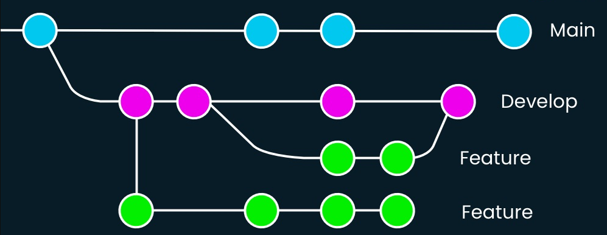
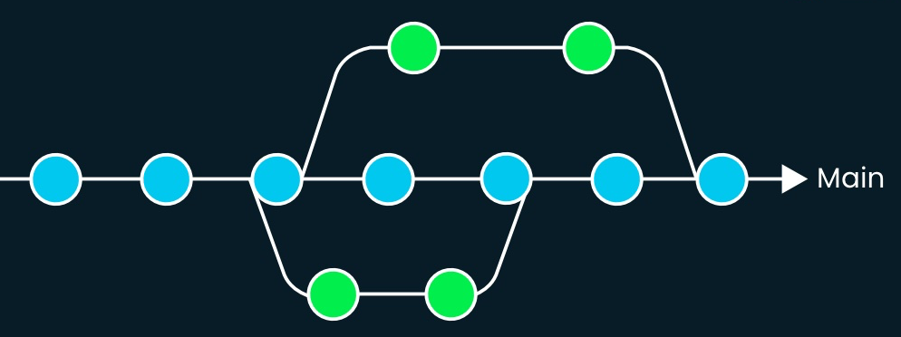

# Trunk Based Development (TBD)

## Understanding

### Overview

Trunk-based development is a version control management strategy where
developers merge small, frequent updates to a core `trunk` or `main` branch.

Understand in detail
[here](https://dora.dev/devops-capabilities/technical/trunk-based-development/).

### Why?

Trunk-based development is considered to be one of the core engineering software
practices

1. Faster integration and hence faster feedback on issues
2. Reduced merge conflicts
3. Enables release readiness for continuous delivery and continuous deployment
4. Indirectly encourages better granular planning of tasks to keep PR sizes
   small for faster integration
5. Enhanced team collaboration as Trunk-based development fosters good
   understanding between the developers by providing more awareness of all the
   current changes

### Key differences between Gitflow workflow and Trunk-based development

In Gitflow, there is a secondary branch (dev/develop) for on-going development.
Feature branches are merged into the secondary branch only when the feature is
complete. With several long lived feature branches, conflict resolution becomes
an overhead. During release, a code freeze is needed on the dev branch from
which a release branch will be taken and merged to master and dev after release
completion.

In Trunk-based development, all the work goes directly into the primary branch
which enables faster integration avoiding complex merge conflicts. Features are
broken down into smaller units of work that can be completed and merged into the
primary branch frequently. TBD is ideal for Continuous integration and
deployment. During release, development can still happen in the main trunk while
a release branch can be taken off at the desired commit and release tags can be
maintained separately in the release branch

### Pre-requisites for effectiveness

1. Automated tests - to make sure the trunk is always stable. In case automated
   tests are not available, there has to be an additional effort of rigorous
   manual testing for every PR before it gets merged to trunk
2. Breakdown stories into smaller tasks - it should only be a few hours of
   development effort or to the maximum a couple of days of effort
3. Ensure faster code reviews - limit the number of reviewers to a maximum of 2,
   have alternate code owners for complex modules

### Risks of not following

:no_entry: Failing to follow TBD can lead to

1. Complex merge conflicts
2. Integration difficulties and quality issues
3. Release delays
4. Productivity loss - time and cost impact
5. CI/CD will not be frequent and effective without Trunk-based development

### Resources

| Topic           | Description                                                                                                                                                                     |
| --------------- | ------------------------------------------------------------------------------------------------------------------------------------------------------------------------------- |
| Feature flags   | [What are they](https://trunkbaseddevelopment.com/feature-flags/), [How to implement in Python](TBD), [How to implement in Javascript](TBD), [How to implement in LabVIEW](TBD) |
| Release process | [Release Process](ReleaseProcess.md)                                                                                                                                            |
| External Links  | [DORA documentation on TBD](https://dora.dev/devops-capabilities/technical/trunk-based-development/), [Trunk-based development](https://trunkbaseddevelopment.com/)             |

### Moving from Gitflow to TBD

Here are some steps to get started with when you are moving from Gitflow to TBD

1. Delete all the inactive branches
2. Make sure the main branch is up to date (merge develop to main)
3. Redirect all the PRs to main instead of develop
4. Make sure main branch is protected with a pre integration step of rigorous
   testing (ideally through test automation)
5. :warning: Gradually abandon the develop branch. Need not drop the develop
   branch abruptly

### Note

When starting to adopt TBD, Tech Lead should take care of the following,

1. Mindset shift in the team for developing and merging in
   [small chunks](https://google.github.io/eng-practices/review/developer/small-cls.html)
2. Deciding whether feature flags are needed and how to implement them
3. Understanding and deciding on the release process based on your project
   needs. As all the work goes into one main branch we should decide how release
   branches will be handled. For example, whether the main branch will always be
   release ready (with proper hiding of incomplete features) or release branch
   will be taken out at the right commit from main
4. Groom the stories well and split them into smaller tasks
5. Monitor how well the adoption is happening with the help of these

## Implementation

1. The project repository should have a `main` branch (the trunk)
2. Develop in small batches (a few commits) and merge back to the `main` branch
3. For each batch of work, developers should -
   1. Create a new branch from the `main` branch
   2. Name the branch using pattern `users/<firstname-lastname>/<task-name>`
      (eg: `users/sathish-thangavel/my-task-123`)
   3. Add necessary code changes (a few commits)
   4. Add necessary automated tests
   5. Merge back to `main` using PR workflow
   6. Delete the user branch created
   7. For complex modules where parallel development is needed, create sub
      branches from the base feature branch and create a PR against the base
      feature branch to ease the code review process and get the review comments
      quicker. But the merge should always happen to the `main` branch. Once the
      base feature branch is merged to `main`, the sub branch can be updated
      with the latest from `main` and PR can be redirected to `main` to get it
      merged
4. Use [feature flags](https://martinfowler.com/articles/feature-toggles.html)
   to hide any work that is still in progress. But we should make sure automated
   tests are added even for the hidden feature.
5. User branch should not be very deviated from `main`. Merge user branches to
   `main` at least once a day (Ideal state). If closing the development and
   merging the user branch in a day is not possible, we should make sure the
   user branch is in sync with `main` (pull / rebase with main) at least once a
   day.
6. Use
   [Squash Merge](https://learn.microsoft.com/en-us/azure/devops/repos/git/merging-with-squash?view=azure-devops#squash-merge)
   when merging to the `main` branch.
7. Have very few active development branches (one active branch per developer).
8. Have separate `release branch` for production releases
   1. Use `release branch` as the stable branch during release
   2. Team should not be blocked to merge changes to `trunk` during release
   3. `release branch` should use `feature flags` to hide any work that is still
      in progress
   4. After the `release branch` is taken, if there are any bugfixes integrated
      into `main` that is needed for release, cherry pick the commits into
      `release branch`
   5. `release branch` should not be merged back into `main`. If any bugfixes
      are done directly on `release branch` it has to be cherry-picked back into
      `main`
   6. Once the release is done, tag the commit in `release branch` with the
      appropriate release tag and delete the `release branch`
   7. Active release branches should have the same CI pipeline as the `main`
      branch
9. Read more -
   1. [DORA Trunk-based development](https://dora.dev/devops-capabilities/technical/trunk-based-development/)
   2. [DORA Working in small batches](https://dora.dev/devops-capabilities/process/working-in-small-batches/)

### Non-negotiable items

To ensure the success of the Trunk-based development process, certain
non-negotiable should be adhered:

1. Version control setup to check-in repository files
2. Small chunks of work merged to main on a regular basis (ideally everyday)
3. Clear process for ensuring stability of main branch (ideally complete test
   automation)
4. Proper naming convention for branches
5. Minimal number of active branches
6. Well established release procedure
7. Usage of feature flags if needed
