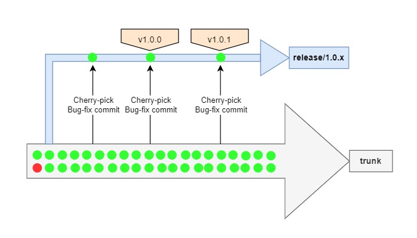

## Trunk-based development

Release process for Trunk-based development can be decided based on the release
cadence of each team.

1. If the team does very frequent release (like one release per day), they can
   go with
   '[Release from trunk](https://trunkbaseddevelopment.com/release-from-trunk/)'
   strategy.
2. The teams with low release cadence (cycle/iteration releases - one release
   per sprint or month) can follow
   '[Branch for release](https://trunkbaseddevelopment.com/branch-for-release/)'
   strategy.

This document provides more details on the release process based on frequency of
release.

[[_TOC_]]

## Recommended Release Process for teams with low release cadence

For teams with low release cadence, they can go with 'Branch for release'
strategy. This is the default recommendation for teams. It also helps in
handling intermediate bug fix releases seamlessly.

### Roles involved

- **Release owner** - A designated person from the development team can act as
  release owner for a particular release. This role can be assigned to
  developers on a rotational basis
- **Tech Lead**
- **Developers**
- **QA**

### Release process

#### Taking release branch

1. Once all the features required for the release are available in trunk,
   release owner takes a `release branch` from the `trunk`
2. If version updates are done manually, the right version for the upcoming
   release has to be updated in `trunk` before taking the `release branch`.
3. The `release branch` can be named as `release/<version-number>` (Example:
   `release/1.0.0`)
   1. We can also have 'x' in place of bugfix version in the release branch
      name, so that it is more evident that all the bug fixes for a particular
      release are handled in this release branch (Example: `release/1.0.x`)
4. The feature development can continue in `trunk` but `release branch` should
   not receive any new updates.
5. `Release branch` acts as the stable place for testing and other release
   activities.

#### Release testing

1. After the `release branch` is taken, the release owner deploys it to the
   staging environment (if applicable) and initiates the release testing process
   by informing the QA team.
   - If dedicated QA team is not available, the equivalent role has to be played
     by the developers during release time
2. The duration of release testing depends on the nature of the project and
   whether or not test automation is in place. If there is no test automation, a
   significantly higher amount of time has to be put in for the release testing.
   It should ensure rigorous testing of all the features in the application and
   not just focus on the newly added features.

#### Handling bug fixes

1. When a bug is identified during release testing, it should be assigned to a
   developer. They will be considered as the bug fix owner.
2. The bug fix owner should do the following
   1. Reproduce the bug in `trunk`
   2. Take a `user branch` from `trunk`
   3. Fix the bug in the `user branch`
   4. Test the changes in dev environment
   5. If applicable, update the test cases to make sure the bug will be captured
      in automation going forward
   6. Raise a PR from `user branch` to `trunk`
3. The PR has to be reviewed by Tech Lead / Code owner and merged to `trunk`
4. Once the bug fix is merged to `trunk`, bug fix owner should do the following,
   1. Create a `user branch` from `release branch`
   2. Cherry pick the bug fix commit from `trunk` in to the `user branch`
   3. Raise a PR from `user branch` to `release branch`
5. Release owner is responsible for reviewing and merging the cherry-picked bug
   fix PR to `release branch` and redeploying it to staging to continue with
   release testing
6. **Note**: In very rare cases where the bug is not reproducible in `trunk` but
   happening only in `release branch`, the `user branch` can be taken from
   `release branch` instead of `trunk`. Fix and merge to `release branch`,
   cherry-pick the bug fix commit from `release branch` to `trunk` as needed to
   make sure the fix is applied in both the places (`release branch` and
   `trunk`)

#### Completing the release

1. When the release testing is complete and QA team has given a 'GO',
   1. Tag the top commit in release branch with the appropriate release label.
      The tag format can be `v<version number>` . (Example: `v1.0.0`)
2. After the release, the `release branch` can stay alive for some time until
   the released version is stable, typically for about a month.
3. If there are any production issues in the released version that needs a patch
   / bug fix release, make use of the same `release branch` to fix the issues
   and make the patch release.
   1. The bug fix has to go through the same process as mentioned in the
      [above section.](#handling-bug-fixes)
   2. Make sure to add tags for all such interim releases.

#### Deleting the release branch

1. Once the release is well stabilized, the release branch can be deleted.
2. Note that release branch need not be merged to trunk.
3. The released commit can be tracked anytime using the tags that are created,
   hence the release branch is safe to be deleted if you have the right tags in
   place.
4. **Note:** The above suggestion is based on Git version control system. If you
   are using a different VCS, it is important to understand how tagging works
   there before deciding to delete release branch

##### **When not to delete release branch**

1. Never delete the release branch **without creating proper tags** to refer to
   the released commits. Once the release branch is deleted, if the commits are
   not tagged, it will be garbage collected by git as dangling commits
2. Never delete the release branch if the version control system you are using
   **doesn't allow creating tags**

## Recommended Release Process for teams with high release cadence

For teams with high release cadence, the recommendation is to go with 'Release
from trunk' strategy.

1. Ideally for high release cadence teams, there should be complete test
   automation and CI/CD in place to deliver directly from Trunk
2. The released commit in trunk has to be tagged to track the release later
3. Feature flags should be in place to hide any work in progress
4. Any production issues will be dealt in fix forward approach where the updates
   will be made in trunk and released again.

**Note:** 'Release from trunk' strategy is less likely to be followed . Hence the process is not explained in detail in this document.

# Frequently Asked Questions (FAQs)

> When Task B is dependent on Task A which is not yet merged and in PR still,
> where to take the branch for Task B and how to merge it back?

- Take the branch for Task B from Task A. If Task B is completed, raise a PR to
  Task A(if it is still not merged to trunk). This helps in reviewing only the
  specific changes
- If Task B PR is approved. Wait for Task A to be merged to trunk. Then redirect
  Task B PR to trunk and merge it to trunk
- Note: Any merge should happen only to trunk

> In our project, we follow milestone based releases and the frequency is not
> high. In this case, I do not see a need for hiding incomplete features using
> feature flags. Is this okay?

- Ideally when we follow trunk based development, we should aim to have the
  trunk in releasable state always. If the project nature doesn't demand for
  frequent releases, you can make the decision to skip feature flags. But we
  should have clarity on how to implement feature flag if a need arises.
