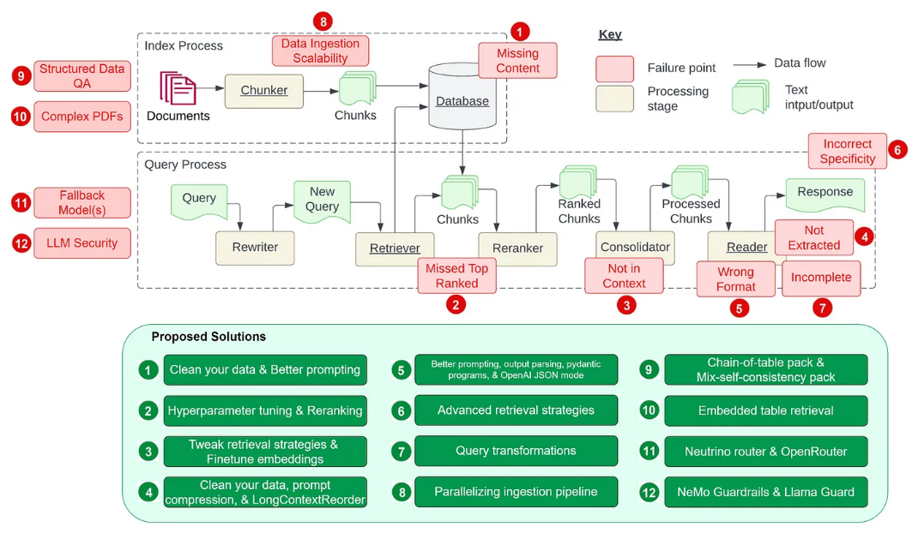

### Challenges in Retrieval-Augmented Generation (RAG)

1. The Retrieval-Augmented Generation (RAG) framework presents several
   challenges, particularly in the context of data ingestion, efficient
   embedding, integration and knowledge updating, missing content, retrieval
   failures, and handling failures.

2. Addressing these challenges is critical to the successful implementation and
   operation of RAG systems.

3. Some of the challenges are,

 `Note: Below are some challenges summarized - Need to be improved. `

### Data Ingestion Challenges

1. Extracting information from different document types and source without
   losing context. Example: In PDF, information like headers, sub headers are
   parsed as text as those attributes are lost while parsing.
2. Creating meaningful chunks from the unstructured data.
3. Meta data extraction from the unstructured data as part of the data ingestion
   pipeline. This meta data helps with filtering data during retrieval, but
   identifying meta data is not always straight forward during data ingestion.

### Data Retrieval Challenges

1. Duplicate or similar information in ingested data polluting the retrieval
   process, thus reducing the quality of results.
2. Accuracy of retrieval techniques.
3. Not so great user question or input.

### Data Ingestion

**_Challenge_** Ingesting unstructured data such as PDFs, PPTs, and DOCX files
into a vector store index is complex due to difficulties in parsing the text and
creating meaningful chunks. For example, documents might contain a meaningful
information in a single line or across pages, or tables that represents a
register in a single or across multiple pages, or a FAQs with questions and
answer in a single or multiple pages. In all the above examples, the challenge
is that the information is unstructured for a parser to extract each meaningful
chunks separately as only humans known what a meaningful set of
information/chunk is.

:::info 
Meaningful Chunk in this context means, 1 FAQ or 1 register table in a
chunk means a meaningful chunk. If we have only a question from a FAQ or
question and a partial answer in a chunk, then it is not a single meaningful
chunk.
:::

### Efficient Embedding

1. Managing a vector database effectively involves several key components,
   including the allocation of compute resources, efficient monitoring, and data
   sharding. 2.These factors are crucial to maintain the performance and
   scalability of the system, especially as the volume of data and the
   complexity of queries increase.

### Integration and Knowledge Updating

1. The integration of parametric knowledge (the knowledge embedded within a
   pre-trained model) and non-parametric memory components (such as dynamically
   retrieved data) presents several challenges.
2. These include keeping the knowledge up-to-date, ensuring the interpretability
   of the combined information, and preventing hallucinations—where the model
   generates information that is not supported by the retrieved data.

### Missing Content

1. The absence of relevant content in the database can significantly impair the
   system's ability to generate accurate and contextually appropriate responses.

2. This gap in the available data limits the model's effectiveness, particularly
   in scenarios where precise and comprehensive information is crucial.

### Missed Top Ranked Documents

1. When the most relevant documents are not retrieved, the system's ability to
   generate optimal responses is compromised.

2. This can result in answers that are less accurate or less relevant to the
   user's query, diminishing the overall effectiveness of the system.

### Out-of-Context Information

1. Even when relevant documents are retrieved, the system might fail to
   consolidate them correctly, leading to the use of information that is out of
   context.

2. This misalignment can distort the intended meaning and reduce the accuracy of
   the generated responses.

### Incomplete Data Utilization

1. Inefficient extraction and processing of crucial information can result in
   incomplete data utilization, leading to suboptimal performance in the
   generation of responses.

2. This challenge can cause the system to overlook important details that could
   significantly enhance the quality of the output.

### Incorrect or Unusable Outputs

1. Formatting issues during data retrieval and integration can lead to incorrect
   or unusable outputs.
2. These errors can arise when the system mishandles the structure of the data,
   resulting in outputs that are either misleading or completely unusable.

### Partial Data Extraction

Incomplete responses can occur due to partial data extraction or processing
errors, which may lead to a failure in capturing all the relevant information
needed to generate a comprehensive answer.

### Handling Failures

    1. Ensuring system reliability requires the effective implementation and integration of fallback models to manage situations where primary methods fail.

    2. Without a robust fallback mechanism, the system's reliability and user trust can be significantly compromised.

Addressing these challenges requires a combination of technical strategies and
manual interventions to ensure the RAG system functions optimally and provides
accurate, relevant, and contextually appropriate responses.

### **Reference Link** 
:::info 
1. [Reference Research Paper](https://arxiv.org/pdf/2401.05856) 

2. [Reference Link](https://towardsdatascience.com/12-rag-pain-points-and-proposed-solutions-43709939a28c)

:::
