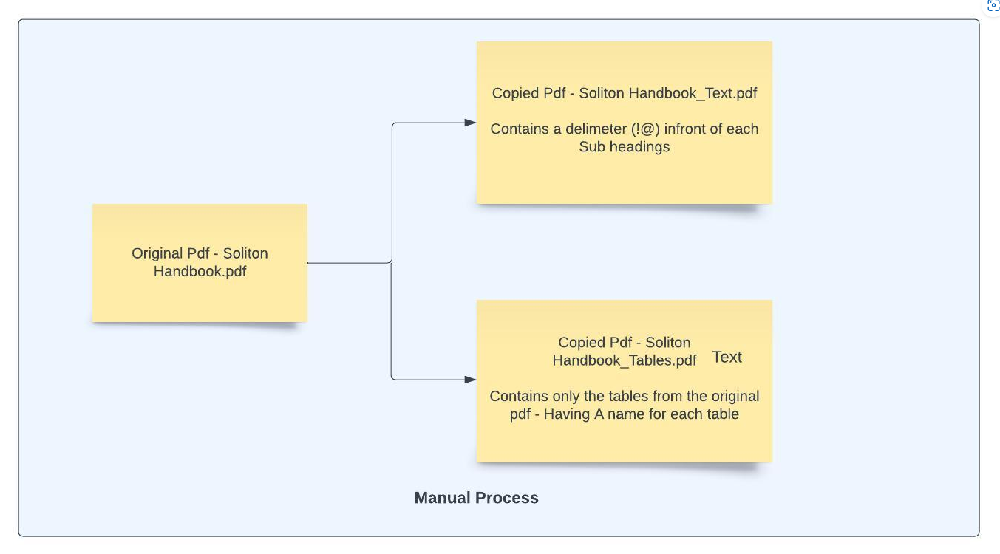

Here, we manually adding delimiter `!@` (context aware chunking), which is good
for fixed and small set of documents

### Advantages

1. LLM will be able to answer efficiently with the chunks are being proper.

2. Less complexity for the LLM.

### Disadvantages

1. Manual process will be a little time consuming task.

2. Not suitable for large documents, we need to move for `LayoutPDFParser `and
   `recursiveCharacterTextSplitter`.

### Use cases:

1. Identify FAQ's from pdf have it in a chunk with some meaning in it. If an FAQ
   is a continuation from its previous FAQ - then It is recommended to have
   those 2 FAQ in a same chunk. In a FAQ, Question and answer can be in same
   chunk.

2. Thinking that we need to perform text and table embeddings separately, to
   have a separate raw data pdfs for texts and tables. So that embedding becomes
   a less complex. So, we can manually add the delimeter to make the chunk.

3. Also can add some delimeters before the Sub headings in the pdf to make
   python understand this as a Sub heading. This delimeter will not be
   embedded - This just acts as a place holder.
