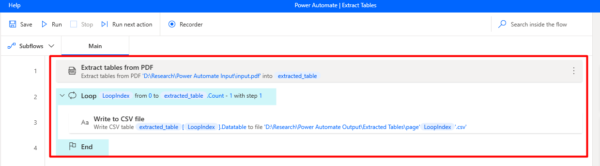
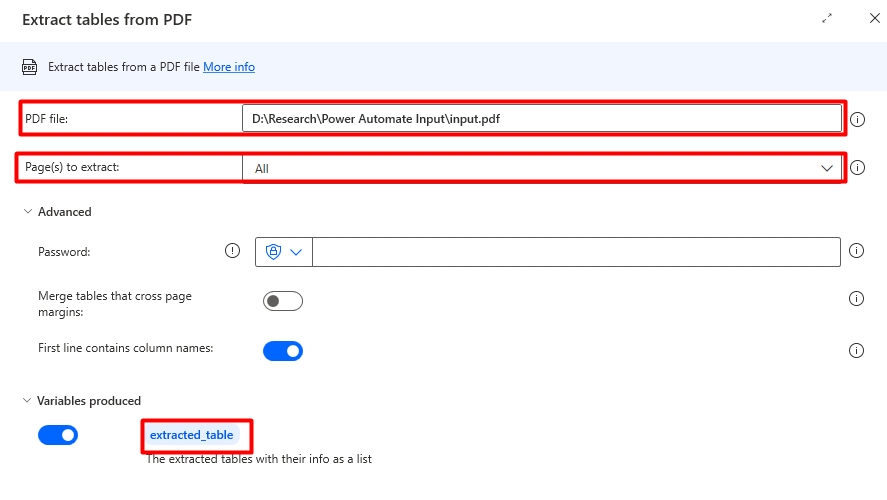
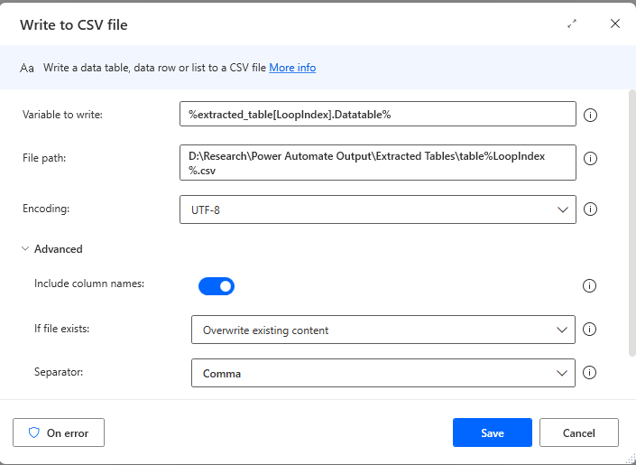
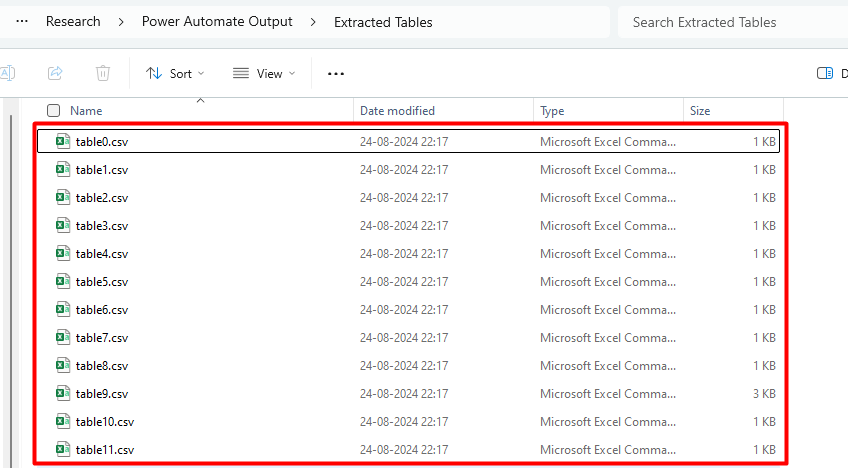
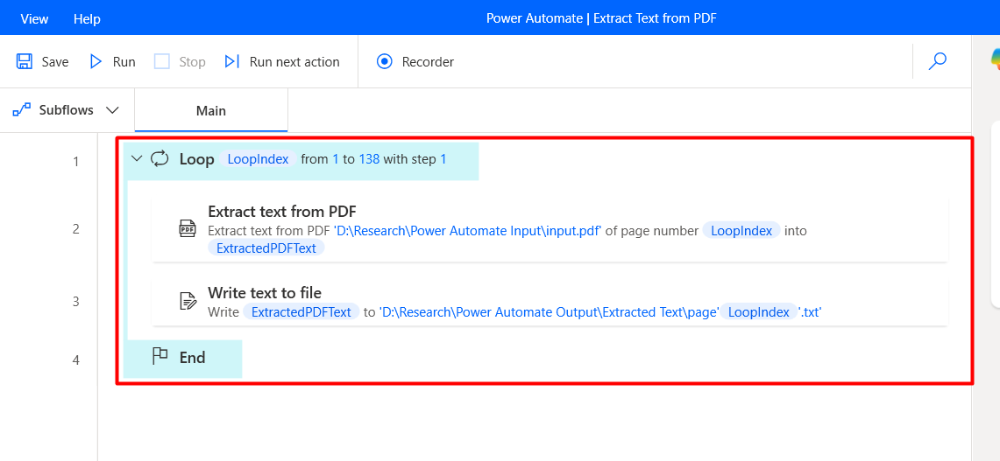
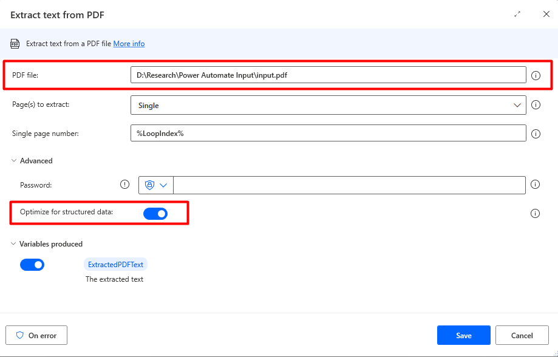
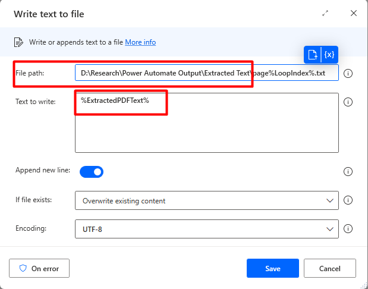
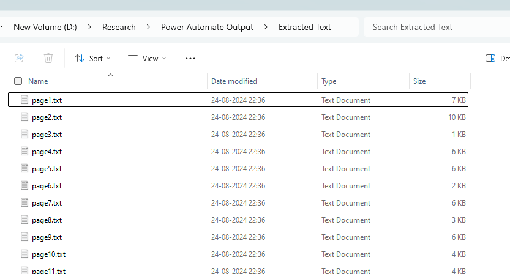
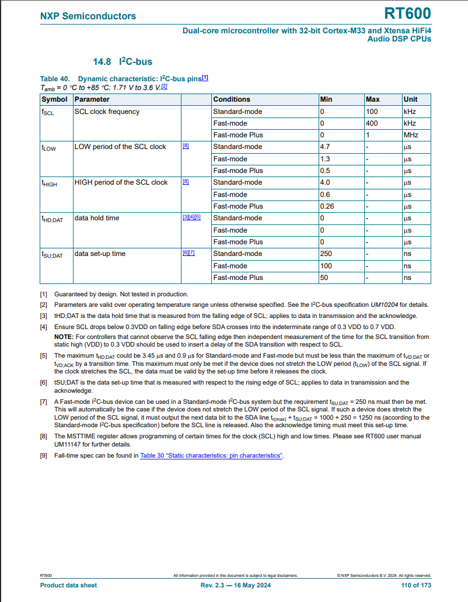

### Extraction of Content Inside Tables using Power Automation

#### What is Power Automation for Table Content Extraction?

#### **Explanation**

1. This topic covers the use of Power Automation, a tool in the Microsoft Power
   Platform, to automate the extraction of text and data from tables embedded in
   PDF documents.

2. The process involves converting table data into a structured format that is
   easily accessible and manageable. In the broader context of data preparation,
   extracting data from PDFs is essential for integrating accurate and efficient
   data extraction into automated workflows, particularly when handling large
   volumes of documents for further analysis or processing.

#### **Problem Statement**

Handling and extracting data from tables in PDF documents is often challenging
due to the static and non-interactive nature of PDFs. The manual process is
time-consuming and prone to errors.

### Installation Link

:::info [Setup Installation](https://go.microsoft.com/fwlink/?linkid=2102613)

[Reference Link](https://learn.microsoft.com/en-us/power-automate/desktop-flows/install#install-power-automate-using-the-msi-installer)
:::

### Advantages

<table class="table-size-for-cloud-services">
    <thead>
        <tr>
            <th>Benefit</th>
            <th>Description</th>
        </tr>
    </thead>
    <tbody>
        <tr>
            <td><span class="custom-header">Efficiency</span></td>
            <td>Saves significant time compared to manual extraction.</td>
        </tr>
        <tr>
            <td><span class="custom-header">Understanding</span></td>
            <td>Simplifies the process of turning static table data into dynamic, usable formats.</td>
        </tr>
        <tr>
            <td><span class="custom-header">Scalability</span></td>
            <td>Scales to handle numerous documents, beneficial for large organizations or extensive research projects.</td>
        </tr>
    </tbody>
</table>

### Setup the Power Automate

### Extracting Tables from PDF using Power Automate

1. Create a Power Automate Flow extract Tables

   

1. Use the Actions from Power Automate to create a flow

   1. Extract Tables from PDF
      1. The below configuration extracts all the tables present in each page of
         the PDF.
      2. Make sure the path of the PDF file in the local directory is configured
         correctly in the `PDF file` configuration.
      3. If there are tables present on the subsequent pages and they need to be
         merged, enable the `Merge tables that cross page margins` option.

   

   2. Write to CSV file
      1. All the tables extracted from the previous action will be in the format
         of `DataTable`
      2. Write this data to a csv file for parsing and data manipulations using
         Python.
      3. The folder in which the tables needs to be stored should be configured.

   

   3. The tables will be extracted and will be stored in csv files

   

### Extract text from pdf using Power Automate

1. Actions used

   1. Extract text from pdf
   2. Write text to file

   

2. Loop though each page of the PDF and write its contents into a text file
   1. Specify the file path of the local PDF file
   2. Select `Optimize for structured data` option to extract the text in the
      same way present in the pdfs.
   3. Specify the Start and End page numbers for extracting the text from
      specific pages 
3. Write to text file

   1. Specify the file path in which the text files needs to be stored
      1. These text files can be consumed by the Python functions and can be
         used embedding and retrieval

   

4. For each of the pages, a text file will be created as an output

   

### Example

```js
import subprocess, shlex

power_auomate_flow_name = "Extract Tables"

POWER_AUTOMATE_FLOW_TRIGGER_COMMAND = f'"C:\Program Files (x86)\Power Automate Desktop\PAD.Console.Host.exe" "ms-powerautomate:/console/flow/run?workflowName={power_auomate_flow_name}"'

process = subprocess.Popen(
    shlex.split(POWER_AUTOMATE_FLOW_TRIGGER_COMMAND), stdout=subprocess.PIPE
)

```

### Input and Output
**Input**:



**Output**:
```
RT600
             NXP Semiconductors
                                                            Dual-core microcontroller with 32-bit Cortex-M33 and Xtensa HiFi4
                                                                                                                         Audio DSP CPUs
                              14.8  I2C-bus
             Table 40.   Dynamic characteristic: I2C-bus pins[1]
             Tamb = 0 C to +85 C; 1.71 V to 3.6 V.[2]
             Symbol  Parameter                                  Conditions                       Min           Max        Unit
             fSCL       SCL clock frequency                        Standard-mode                   0              100        kHz
                                                                      Fast-mode                        0              400        kHz
                                                                      Fast-mode Plus                   0              1           MHz
             tLOW      LOW period of the SCL clock     [8]        Standard-mode                   4.7            -           s
                                                                      Fast-mode                        1.3            -           s
                                                                      Fast-mode Plus                   0.5            -           s
             tHIGH      HIGH period of the SCL clock     [8]        Standard-mode                   4.0            -           s
                                                                      Fast-mode                        0.6            -           s
                                                                      Fast-mode Plus                   0.26          -           s
             tHD;DAT   data hold time                     [3][4][5]    Standard-mode                   0              -           s
                                                                      Fast-mode                        0              -           s
                                                                      Fast-mode Plus                   0              -           s
             tSU;DAT    data set-up time                   [6][7]      Standard-mode                   250           -            ns
                                                                      Fast-mode                        100           -            ns
                                                                      Fast-mode Plus                   50            -            ns
             [1]  Guaranteed by design. Not tested in production.
             [2]  Parameters are valid over operating temperature range unless otherwise specified. See the I2C-bus specification UM10204 for details.
             [3]  tHD;DAT is the data hold time that is measured from the falling edge of SCL; applies to data in transmission and the acknowledge.
             [4]  Ensure SCL drops below 0.3VDD on falling edge before SDA crosses into the indeterminate range of 0.3 VDD to 0.7 VDD.
                  NOTE: For controllers that cannot observe the SCL falling edge then independent measurement of the time for the SCL transition from
                 static high (VDD) to 0.3 VDD should be used to insert a delay of the SDA transition with respect to SCL.
             [5]  The maximum tHD;DAT could be 3.45 s and 0.9 s for Standard-mode and Fast-mode but must be less than the maximum of tVD;DAT or
                 tVD;ACK by a transition time. This maximum must only be met if the device does not stretch the LOW period (tLOW) of the SCL signal. If
                 the clock stretches the SCL, the data must be valid by the set-up time before it releases the clock.
             [6]  tSU;DAT is the data set-up time that is measured with respect to the rising edge of SCL; applies to data in transmission and the
                 acknowledge.
             [7]  A Fast-mode I2C-bus device can be used in a Standard-mode I2C-bus system but the requirement tSU;DAT = 250 ns must then be met.
                 This will automatically be the case if the device does not stretch the LOW period of the SCL signal. If such a device does stretch the
                  LOW period of the SCL signal, it must output the next data bit to the SDA line tr(max) + tSU;DAT = 1000 + 250 = 1250 ns (according to the
                 Standard-mode I2C-bus specification) before the SCL line is released. Also the acknowledge timing must meet this set-up time.
             [8]  The MSTTIME register allows programming of certain times for the clock (SCL) high and low times. Please see RT600 user manual
                  UM11147 for further details.
             [9]  Fall-time spec can be found in Table 30 “Static characteristics: pin characteristics”.
             RT600                                        All information provided in this document is subject to legal disclaimers.             © NXP Semiconductors B.V. 2024. All rights reserved.
             Product data sheet                                  Rev. 2.3 — 16 May 2024                                           110 of 173
```