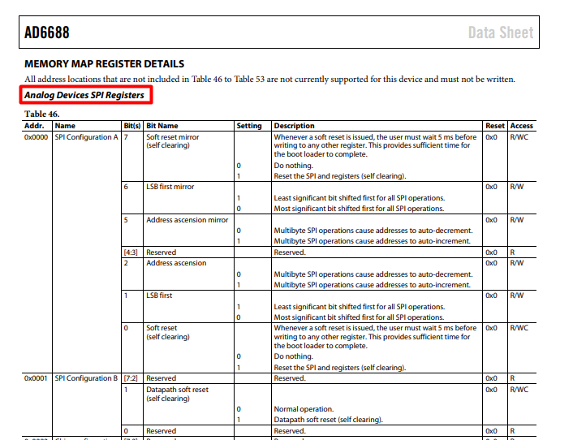

1. Register Map contains information about registers present in the device.
2. The register map also has more granular information about the registers.

   1. The below image shows the register information of AD6688 device.
      [Link to AD6688 Register Information](https://www.analog.com/media/en/technical-documentation/data-sheets/AD6688.pdf)
   2. The Register Map has the details about the register like:
      1. Name of the register
      2. Address of the register
   3. A bit field is a set of bits within a register that defines a numerical
      value or a specific function.
      1. The bit field information will also be present in the register map.
         1. The Access Control of the Bit Field.
         2. The size of the bit field
         3. The description which tells the functionality of the Bit Field.

3. Typically, the registers are physical entities present in the register, and
   **Bit Fields** are the functional entities of the register.

   

### Preparing the Register Map Data and Performing RAG

1. The register map data might be present in many forms.

   1. As like the above example, the register map information is present in
      Datasheet.
   2. It can also be present in excel files as well.

2. To parse and get the information, it is good to preserve the structure in
   which the data is represented in the raw documents.

3. If the data is present in pdf, use Python libraries or Power Automate.

4. If the data is present in excel use Pandas library in python or `openpyxl`
   module for handling the data.

   1. The register map will contain merged cells in the excel.
   2. Use `openpyxl` library for handling all the merged cells and make sure all
      the cells are filled with data.

5. Once we get the table (register map), chunk/split the register map based on
   need.

### Chunking Strategies

1. **Bit Field-Based Chunking:**

   1. Each Bit Field is treated as a separate chunk.
   2. Include Register Information as metadata for each chunk.

2. **Register-Based Chunking:**
   1. Each register is treated as a separate chunk.
