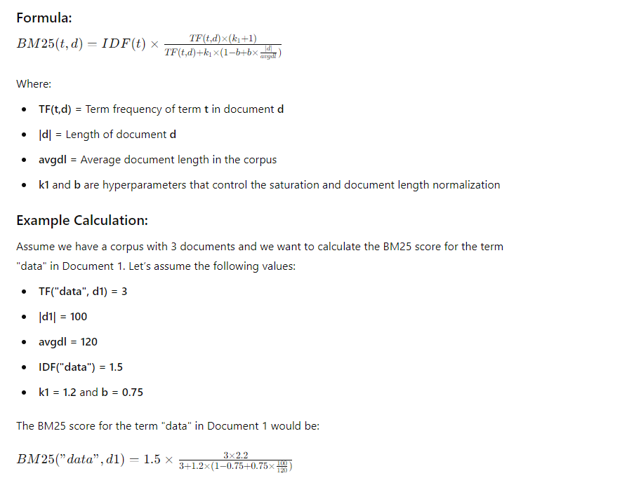

## Creating Sparse Vectors with BM25

### Introduction to BM25

1. **BM25 (Best Matching 25)** is a ranking function used by search engines to
   evaluate how relevant a document is to a given query.

2. It is an extension of the classic TF-IDF model and is part of the family of
   probabilistic information retrieval models.

3. BM25 is particularly effective in ranking documents based on their relevance
   to a query, making it a widely used technique in information retrieval
   systems.

4. Weaviate uses BM25 algorithm to create sparse vectors whereas Qdrant uses
   light weight BM25 model to create sparse vectors

### Why BM25 Works: Term Weighting with Saturation

1. BM25 can be considered an enhancement of TF-IDF due to two key factors: 1. It
   takes into account the document length. 2. It incorporates the concept of a
   keyword saturation term.

2. It emphasizes terms that are frequent in a document but rare across the
   corpus, similar to TF-IDF.

3. However, BM25 adds a non-linear saturation function that prevents the term
   frequency from growing too large, ensuring that very frequent terms do not
   disproportionately influence the ranking.

### Key Concepts in BM25

<table class="table-size-for-cloud-services">
    <thead>
        <tr>
            <th>Factors</th>
            <th>Reason</th>
        </tr>
    </thead>
    <tbody>
        <tr>
            <td>Term Frequency (TF)</td>
            <td>Measures how often a term appears in a document. BM25 applies a logarithmic scaling to this frequency to prevent very frequent terms from dominating the score.</td>
        </tr>
        <tr>
            <td>Inverse Document Frequency (IDF)</td>
            <td>Measures how unique a term is across all documents in the corpus. BM25 uses a slightly modified IDF calculation that adds a constant to the denominator, avoiding extreme values.</td>
        </tr>
        <tr>
            <td>Document Length Normalization</td>
            <td>BM25 normalizes term frequency by the length of the document, ensuring that longer documents are not unfairly penalized or favored.</td>
        </tr>
    </tbody>
</table>

### Calculating BM25 Score

1. The BM25 score is calculated by combining term frequency, inverse document
   frequency, and document length normalization.

2. The formula for BM25 is as follows:

## Creating the Sparse Vector

### Sparse Vector Representation

For each document, BM25 creates a sparse vector where each dimension corresponds
to a term from the vocabulary, and the value at each dimension is the BM25 score
for that term in that document.

### Sparsity

As with TF-IDF, BM25 also produces sparse vectors because many terms in the
vocabulary do not appear in any given document, leading to many zero entries in
the vector.

### Example

1.  The sparse BM25 vector for Document 1 might look like this (with non-zero
    elements shown):

        \[ [0, 0, 1.8, 2.2, 0, 0, 0, 0, 0, 0] \]

2.  This vector indicates that only a few terms from the vocabulary have
    non-zero BM25 scores in Document 1.

## Technical Details

### Sparse Representation

BM25, like TF-IDF, produces sparse vectors, but the weighting of terms is more
nuanced due to the saturation and normalization effects. This results in more
balanced representations, especially for longer documents.

### Dimensionality

The dimensionality of a BM25 vector depends on the number of unique terms in the
corpus. However, the sparsity of the vector ensures that only a few terms have
non-zero weights, making it memory efficient.

### Memory Usage Example

For a corpus with 1 million documents and 10,000 unique terms:

    1. **Dense Representation**: Storing full vectors for each document would require 10 billion floats.
    2. **Sparse Representation**: BM25’s sparse vectors require significantly less storage, as only non-zero entries (i.e., terms that actually appear in the document) are stored.

## Advantages and Disadvantages of BM25

#### **Advantages:**

<table class="table-size-for-cloud-services">
    <thead>
        <tr>
            <th>Factors</th>
            <th>Reason</th>
        </tr>
    </thead>
    <tbody>
        <tr>
            <td>Relevance</td>
            <td>BM25 is highly effective in ranking documents by relevance, outperforming simpler models like TF-IDF in many cases.</td>
        </tr>
        <tr>
            <td>Simplicity</td>
            <td>Despite its enhancements, BM25 remains relatively simple to implement and interpret.</td>
        </tr>
        <tr>
            <td>Efficiency</td>
            <td>Sparse vectors reduce memory usage and computational load, making BM25 suitable for large-scale retrieval tasks.</td>
        </tr>
    </tbody>
</table>

#### **Disadvantages:**

<table class="table-size-for-cloud-services">
    <thead>
        <tr>
            <th>Factors</th>
            <th>Reason</th>
        </tr>
    </thead>
    <tbody>
        <tr>
            <td>Hyperparameter Sensitivity</td>
            <td>The effectiveness of BM25 can be sensitive to the choice of hyperparameters \( k_1 \) and \( b \).</td>
        </tr>
        <tr>
            <td>Vocabulary Size</td>
            <td>The dimensionality of BM25 vectors grows with the size of the vocabulary, which can become challenging for very large corpora.</td>
        </tr>
        <tr>
            <td>Context Ignorance</td>
            <td>Like TF-IDF, BM25 does not capture the semantic meaning of words or their context within a document.</td>
        </tr>
    </tbody>
</table>

## Known Limitations of BM25

<table class="table-size-for-cloud-services">
    <thead>
        <tr>
            <th>Factors</th>
            <th>Reason</th>
        </tr>
    </thead>
    <tbody>
        <tr>
            <td>Context Sensitivity</td>
            <td>BM25, like TF-IDF, does not consider the context in which a term appears, which can lead to misinterpretations in cases where context is crucial.</td>
        </tr>
        <tr>
            <td>Synonym Handling</td>
            <td>BM25 treats synonyms as different terms, potentially leading to redundant features and diluting the importance of key concepts.</td>
        </tr>
        <tr>
            <td>Scalability Issues</td>
            <td>While BM25’s sparse vectors are memory-efficient, the increasing dimensionality with larger corpora can pose scalability challenges, particularly in terms of computational resources.</td>
        </tr>
    </tbody>
</table>
