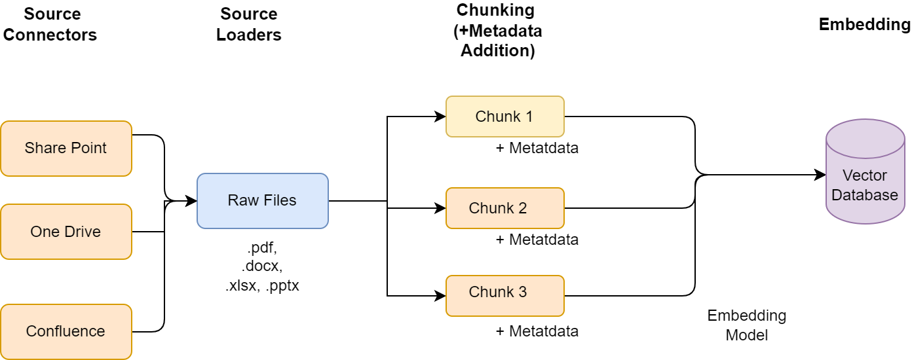

1. **Data ingestion** is the process of `importing`, `transferring`, and
   `processing data` from various sources into a system for storage and
   analysis.

2. In Retrieval Augmented Generation (RAG), this step is crucial for gathering
   and processing the vast amounts of information that the RAG model uses to
   generate answers or summarizations, ensuring access to relevant and updated
   data.

3. In a RAG system, efficient data ingestion is foundational for accurate and
   relevant information retrieval, directly impacting the quality of the
   generated outputs.

4. Without effective data ingestion, RAG systems might struggle with outdated,
   irrelevant, or low-quality data, impeding their ability to generate accurate
   and contextually appropriate outputs.

### Example Scenario

#### **Building a Chatbot for an Organization using RAG with Astro Platform**

1.  An organization wants to implement a Retrieval Augmented Generation (RAG)
    model to power an internal chatbot.

2.  This chatbot is intended to assist employees by providing quick answers to
    queries about company policies, procedural documentation, and general
    inquiries, all based on the organization's diverse document formats stored
    in SharePoint.

3.  For Example :-
    1.  PDFs: 📄
    2.  Excel spreadsheets: 📊
    3.  PowerPoint presentations: 📈
    4.  Word documents: 📝.

#### Need for Data Ingestion

1. The variety of document formats and the static nature of SharePoint storage
   pose challenges for real-time information retrieval and response generation
   by the chatbot.

2. Effective data ingestion becomes crucial to transform these static documents
   into a dynamic, queryable format that the RAG model can utilize efficiently.

### Detailed Steps/Workflow

#### **1. Data Collection**

    <table class="table-size-for-cloud-services">
    <thead>
        <tr>
            <th>Feature</th>
            <th>Description</th>
        </tr>
    </thead>
    <tbody>
        <tr>
            <td>Source Connectors</td>
            <td>Utilize Astro's source connectors to seamlessly fetch data from SharePoint where the documents are stored. These connectors are capable of accessing various file types (PDFs, DOCX, XLSX, PPTX) and can handle initial bulk ingestion as well as continuous ingestion of new or updated files.</td>
        </tr>
    </tbody>

</table>

#### **2. Data Processing**

   <table class="table-size-for-cloud-services">
    <thead>
        <tr>
            <th>Process</th>
            <th>Description</th>
        </tr>
    </thead>
    <tbody>
        <tr>
            <td>Chunking the Data</td>
            <td>Once the data is imported, the information, often in large files, needs to be broken down into manageable pieces. Chunking involves dividing each document into sections or paragraphs that provide enough contextual information for accurate response generation.</td>
        </tr>
        <tr>
            <td>Data Preparation</td>
            <td>Transform the data (text extracted from different file types) into a uniform format suitable for further processing. This might involve text extraction, removing non-text elements, or converting tabular data into readable formats.</td>
        </tr>
    </tbody>
</table>

#### **3. Vectorizing and Indexing**

   <table class="table-size-for-cloud-services">
    <thead>
        <tr>
            <th>Process</th>
            <th>Description</th>
        </tr>
    </thead>
    <tbody>
        <tr>
            <td>Chunking the Data</td>
            <td>Once the data is imported, the information, often in large files, needs to be broken down into manageable pieces. Chunking involves dividing each document into sections or paragraphs that provide enough contextual information for accurate response generation.</td>
        </tr>
        <tr>
            <td>Data Preparation</td>
            <td>Transform the data (text extracted from different file types) into a uniform format suitable for further processing. This might involve text extraction, removing non-text elements, or converting tabular data into readable formats.</td>
        </tr>
    </tbody>
</table>

#### **4. Continuous Updates**

   <table class="table-size-for-cloud-services">
    <thead>
        <tr>
            <th>Feature</th>
            <th>Description</th>
        </tr>
    </thead>
    <tbody>
        <tr>
            <td>Ongoing Updates Handling</td>
            <td>The chatbot system is equipped to handle ongoing updates. As new documents are added to SharePoint or existing documents are revised, the system detects these changes. The updated or new documents are then processed and vectorized in the same way, and their vectors are added to the database. This ensures that the chatbot’s responses are always based on the most current information available.</td>
        </tr>
    </tbody>
</table>

#### Advantages of Effective Data Ingestion in this Context

<table class="table-size-for-cloud-services">
    <thead>
        <tr>
            <th>Benefit</th>
            <th>Description</th>
        </tr>
    </thead>
    <tbody>
        <tr>
            <td>Accuracy</td>
            <td>Ensures that the data fed into the RAG model is accurate, leading to reliable outputs from the chatbot.</td>
        </tr>
        <tr>
            <td>Timeliness</td>
            <td>Updates the chatbot’s knowledge base continuously as new documents are added or existing ones are modified, keeping the information current.</td>
        </tr>
        <tr>
            <td>Interactivity</td>
            <td>Enhances the chatbot's ability to interact meaningfully by understanding context from various document types.</td>
        </tr>
    </tbody>
</table>

#### Reference

:::info 
Learn more about [Astro Platform](https://astro-platform-main.azurewebsites.net/assistants) 
:::

#### **Outcome**

1. Employees interact with the chatbot through a simple interface, posing
   questions as they would to a human resource.

2. The chatbot, powered by the RAG model, retrieves the most relevant document
   vectors to the query, generates an accurate and concise response, and
   presents it back to the employee.

3. This system significantly enhances information accessibility and
   decision-making speed within the organization, turning a vast repository of
   diverse documents into an easily navigable knowledge base.
