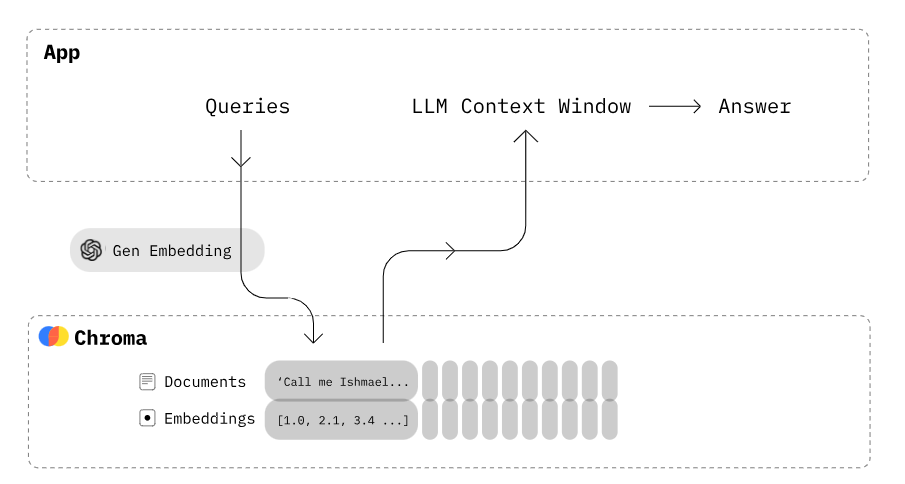
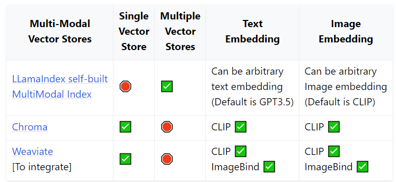

:::tip

1. [Chroma DB](https://www.trychroma.com/)
2. [Docs](https://docs.trychroma.com/)
3. [Llamaindex X Chroma](https://docs.llamaindex.ai/en/stable/examples/vector_stores/ChromaIndexDemo.html)
:::

1. Chroma is an open-source embedding database.
2. Chroma gives the tools to:
   1. store embeddings and their metadata
   2. embed documents and queries
   3. search embeddings
3. Chroma currently maintains 1st party clients for Python and Javscript.
   1. ##[Client](https://docs.trychroma.com/reference/Client) - is the object
      that wraps a connection to a backing Chroma DB
   1. EphemeralClient - In memory client.
   1. PersistentClient - In memory client that can persist in disk.
   1. HttpClient - as a server running on local machine or in the cloud.
   1. Client can contain multiple collections. At present only one collection
      can be used to create a vector store.
   1. Provides
      [CRUD functions](https://docs.trychroma.com/reference/Client#create_collection)
      to be performed on collections.
   1. ##[Collection](https://docs.trychroma.com/reference/Collection) - is the
      object that wraps a collection
   1. Collections are where you'll store your embeddings, documents, and any
      additional metadata.
   1. Collections support
      [CRUD operations](https://docs.trychroma.com/reference/Collection#add) on
      embeddings and documents.
   1. [Querying a Collection](https://docs.trychroma.com/usage-guide#querying-a-collection) -
      Get the n_results nearest neighbor embeddings for provided
      query_embeddings or query_texts.
      [query](https://docs.trychroma.com/reference/Collection#query) function
      can run similarity search in the collection.
   1. Filtering can be applied to query output using where and where_document
      which filter based on metadata and document text content respectively.
   1. A single ChromaVectorStore object corresponds to data of 1 Collection.
   1. Chroma has no support for Multiple Vector Store objects at present.

    3. [Embeddings](https://docs.trychroma.com/embeddings)
      1. Chroma provides lightweight wrappers like [OpenAIEmbedding](https://docs.trychroma.com/embeddings/openai) around popular embedding providers, making it easy to use them
          1. By default, Chroma uses the [Sentence Transformers](https://docs.trychroma.com/embeddings#sentence-transformers) all-MiniLM-L6-v2 model to create embeddings.
      2. Chroma provides lightweight wrappers around popular embedding providers, making it easy to use them in your apps.
      

      3. Collections can be created with the desired embedding functions and every operation(CRUD) of that collection will use the same embedding function.

      4. When using .get_collection to get a collection in a Client, the embedding function must be passed as parameter.

      5. Chroma supports creation of [custom embedding function](https://docs.trychroma.com/embeddings#custom-embedding-functions)

      6. When document texts are added to a collection the Chroma collection will automatically generate embeddings for the text using the provided embedding function, if not the default sentence transformer embedding function.

      7. Embeddings may also be generated early and then added to collection with corresponding texts/docs and metadata and ids.

      8. Chroma's functionalities revolve around the `__*ids*__` attribute of the collection that holds the list of ids of the embeddings. When texts/documents are added/deleted/updated to a collection with/without embeddings `__*ids*__` are required parameter.

TLDR - [API cheatsheet](https://docs.trychroma.com/api-reference).

### Limitations

1. There is a cap in the number of embeddings that can be processed at a time
   based on the machine that chroma is running on. It can be accessed by
   **_chroma_client.max_batch_size_**, where **chroma_client** is an instance of
   Chroma Client class. The value cannot be changed manually. The value is
   automatically generated based on system capabilities.

2. Need to make sure same embedding functions are used while doing CRUD
   operations.

3. Using Chroma Vector Store with
   [Ingestion Pipeline of LlamaIndex](/Astro/ETL-Pipeline/Ingestion-Pipeline-in-Llama%2DIndex)
   poses uncertainty in how embeddings are added and how existing embeddings are
   updated in the vector store.

4. While Chroma Collections are able to use
   [upsert](https://docs.trychroma.com/reference/Collection#upsert) function to
   update existing embeddings and insert new embeddings with the help of ids,
   the same was not possible while using vector store within Ingestion Pipeline.

5. There were fluctuations in how embeddings were created. There were new
   duplicate embeddings created in few pipeline runs.

### Metrics

| Client            | Throughput       | Latency         | Memory Usage |
| ----------------- | ---------------- | --------------- | ------------ |
| Persistent Client | 90 - 100 queries | 3.66 s ± 180 ms | 213-214 MiB  |
| Http Client       | 90 - 100 queries | 3.77 s ± 176 ms | 244-245 MiB  |
