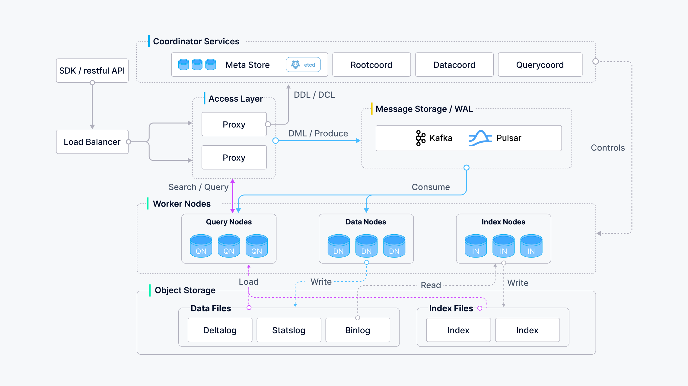

## What is Milvus?

Milvus is an open-source vector database designed to handle large-scale vector similarity searches and store vector embeddings efficiently. It supports multiple index types, providing a flexible and scalable architecture suitable for handling different types of similarity searches. In today’s data-driven world, managing and utilizing embedding vectors generated by machine learning models is crucial, especially in areas like image retrieval, video search, and recommendation systems.

Unlike traditional databases that work with structured data, Milvus is optimized for vector data, which represents complex and diverse types of information. It can handle vast amounts of data—up to a trillion vectors—and is essential for tasks involving high-dimensional data. Milvus finds similarities between pieces of data by comparing these vectors, making it indispensable for AI applications. As unstructured data becomes more common, Milvus plays a pivotal role in storing and analyzing vectors that represent this data, enabling efficient search and retrieval.

### Why We Need Milvus

Milvus is highly valuable due to its ability to:
1. Offer high performance when conducting vector searches on massive datasets.
2. Cater to developers with multi-language support and a strong toolchain.
3. Provide cloud scalability and high reliability, even in case of disruptions.
4. Perform hybrid searches, pairing scalar filtering with vector similarity search for more precise results.

## Design of Milvus

Milvus is built as a cloud-native vector database, designed to separate storage and computation for enhanced elasticity and flexibility. Its architecture is entirely stateless, breaking the system into four key layers:

1. **Access Layer**: This group of stateless proxies serves as the system's front layer, acting as the user-facing endpoint.
2. **Coordinator Service**: Functions as the brain of the system, assigning tasks to worker nodes.
3. **Worker Nodes**: These act as the executors, following the instructions from the coordinator service and executing user commands.
4. **Storage**: Responsible for data persistence, it consists of meta storage, a log broker, and object storage.

This modular and stateless design ensures the flexibility and scalability needed for large-scale applications.

## Advantages and Disadvantages

### Advantages

| Factors      | Reason                                                                 |
|--------------|------------------------------------------------------------------------|
| Efficiency   | Provides fast response times, even with extremely large datasets.      |
| Understanding| Simplifies the complexity of handling high-dimensional vector data.    |
| Scalability  | Capable of scaling to billions of vectors and multiple nodes.          |

### Disadvantages

| Factors       | Reason                                                                                      |
|---------------|----------------------------------------------------------------------------------------------|
| Complexity    | Requires a solid understanding of vector database theory and the Milvus architecture.        |
| Resource Usage| High resource consumption (memory and processing power) when handling very large datasets.    |
| Limitations   | While ideal for similarity searches, it may not be suitable for conventional relational tasks.|

## Additional Capabilities of Milvus

Milvus supports both sparse and dense vectors, offering users flexibility when choosing metrics and index types for each collection. This customization makes Milvus highly adaptable for various use cases. Built on a microservice architecture and written in Go, Milvus is particularly well-suited for scalability.

### Hybrid Search Capabilities
One of Milvus's standout features is its hybrid search, where it can combine multiple vector searches. For instance, developers can modify the Llama index wrapper to perform sparse keyword searches. Hybrid searches allow customization, such as combining dense and sparse vectors or applying re-ranking algorithms like Reciprocal Rank Fusion and WeightedRanker. The ability to pair scalar filtering with vector similarity search gives Milvus a competitive edge in handling complex queries.

Milvus also supports meta-data filtering and role-based access control, allowing granular management of data access. Users can search across various media types, including text, images, videos, and audio, making it a versatile tool for different data-intensive applications.

### Storage and Visualization
Milvus employs a partition concept to store collections, where a single collection is divided into multiple partitions for efficient management and retrieval. Tools like [Attu](https://github.com/zilliztech/attu) offer visualization options, making it easier for developers to manage and explore Milvus collections. Compared to other vector stores, Milvus offers faster index times, making it highly competitive.

### Deployment Options
Milvus provides flexibility in deployment with multiple configurations:
1. **Milvus Lite**: A lightweight version similar to SQLite, offering local file storage.
2. **Standalone**: Deployed in a Docker container for moderate use cases.
3. **Cluster**: Used for larger, distributed environments.
4. **Standalone GPU**: A GPU-accelerated version for demanding tasks.

### Embedding Models and Index Types
Milvus supports a wide range of embedding models, including:
1. OpenAI
2. Sentence-Transformer
3. BM25
4. Splade
5. BGE-M3
6. VoyageAI
7. Jina
8. Cohere
9. Instructor - Mistral AI
10. Nomic - mGTE

Additionally, Milvus supports several index types for efficient vector storage and retrieval:
1. BIN_FLAT
2. BIN_IVF_FLAT
3. GPU_IVF_FLAT
4. GPU_IVF_PQ
5. HNSW (commonly used for dense vectors)
6. DiskANN
7. CAGRA

Time taken to create each type of vector and uploading it to the vector stor is faster, but slower RPS and latency with higher dimension embeddings
 
Reference Link : [Qdrant](https://qdrant.tech/benchmarks/)  

 Batch size of how many vectors that can be uploaded at a time. (Default batch size 100, customizable in client code). Supported Max embedding dimension - 32,768 (configurable, needs testing) 
## References

:::info

1. Learn more about [Milvus Documentaion](https://milvus.io/docs)

2. Learn more about [Milvus Local SetUp](https://milvus.io/docs/quickstart.md)
:::