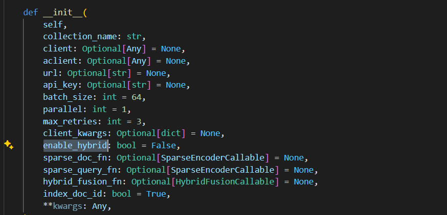

## Qdrant vector store

1. Qdrant is an open-source vector similarity search engine and vector database
   designed to store, index, and query high-dimensional vectors efficiently.

2. Currently Qdrant Vector store is supports multiple vector types like

   1. Dense vectors
   2. Sparse vectors
   3. Dense-uint8
   4. Matryoshka vectors
   5. Multi-vector representation using late interaction models

3. Dense vectors can be created by models like Sentence transformers/Embedding
   models like OpenAI Ada - 002. Dense vectors are arrays that store each
   element in a contiguous block of memory. A dense vector typically contains a
   value for every dimension, and most of these values are non-zero.

4. Sparse vectors is created by fastembed python library. Sparse vectors store
   only non-zero values and their corresponding indices. Most of the elements
   are assumed to be zero and only the non-zero values are explicitly
   represented.

5. Supported models by fastembed to create sparse vectors

   1. Qdrant/BM25
   2. Qdrant/bm42-all-minilm-l6-v2-attentions
   3. prithivida/Splade_PP_en_v1
   4. For detailed information :
      [Fastembed supported models](https://qdrant.github.io/fastembed/examples/Supported_Models/#supported-sparse-text-embedding-models)

6. By default in llama-index-vector-stores-qdrant, it uses
   prithivida/Splade_PP_en_v1 to create sparse vectors.

7. While creating embeddings for Qdrant, by default the dense vectors alone will
   be generated. Time taken to create these embeddings is also less when
   compared to Weaviate. It supports only sematic search.

8. To create sparse vectors, while initializing the vector store, we need pass
   an argument named enable_hybrid to True. 

9. Creating this sparse vectors, is taking more time than expected. It's around
   3 to 4 times slower than time required by Weaviate when using Splade models,
   it can reduced when moving to the Qdrant/BM25 model.

10. Once this sparse vector is created, we can decide whether we need similarity
    based results (dense vectors) or keyword based results (sparse vectors)
    based on the alpha value.

11. When querying with hybrid mode, we can set similarity_top_k and sparse_top_k
    separately.

12. sparse_top_k represents how many nodes will be retrieved from each dense and
    sparse query. For example, if sparse_top_k=5 is set, that means I will
    retrieve 5 nodes using sparse vectors and 5 nodes using dense vectors.
    similarity_top_k controls the final number of returned nodes. In the above
    setting, we end up with 10 nodes. A fusion algorithm is applied to rank and
    order the nodes from different vector spaces (relative score fusion by
    default with llama-index). similarity_top_k=2 means the top two nodes after
    fusion are returned.

13. Once the vectors are generated, we also need to specify the batch_size, the
    number vectors that will be uploaded at a time, by default it is 64.

14. Parallel - Number of parallel processes of upload. By default it is 1. We
    can specify based on the number of cores available in the system.
    

15. Recommended configurations for 192.168.0.101 (Test PC) for generating sparse
    vectors

    1. `batch_size = <=10`
    2. parallel - 2

16. Qdrant provides UI support to see the available collections and visulaize
    the dense vectors in it. To access the dashboard,
    `{qdrant_app_service_url}`/dashboard and inside that enter the secret api
    key to access the collections.

17. The backup in the Qdrant vector store is called snapshot. We can configure
    in the Azure service, to take snapshots of collections on the regular
    intervals or download it manually.

18. The configuration for Qdrant can be still optimized by
    [config.yaml](https://qdrant.tech/documentation/guides/configuration/) file.

## Test results

The below test results are done with Qdrant `version <1.9` and
prithivida/Splade_PP_en_v1 for Sparse vectors

### Embedding Method Configuration

| Embedding Method                                     | Batch Size | Vector Store | Hybrid Search Enabled | Time Consumption for Embedding |
| ---------------------------------------------------- | ---------- | ------------ | --------------------- | ------------------------------ |
| Injestion pipeline running locally with PyPDF Reader | 20         | Qdrant       | False                 | Around 30 s                    |
| Injestion pipeline running locally with PyPDF Reader | 20         | Qdrant       | True                  | Around 7 minutes 30 s          |
| Injestion pipeline running locally with PyPDF Reader | 20         | Weaviate     | True                  | Around 45 s                    |
| Injestion pipeline running locally with PyPDF Reader | 20         | Weaviate     | False                 | Around 45 s                    |

### Embedding Method Performance

| Embedding Method                                     | Vector Store | Hybrid Search Enabled | Expected Answer Relevance Score | Context Relevance Score | Answer Relevance Score | No of Questions with "I couldn't find answer" |
| ---------------------------------------------------- | ------------ | --------------------- | ------------------------------- | ----------------------- | ---------------------- | --------------------------------------------- |
| Injestion pipeline running locally with PyPDF Reader | Qdrant       | False                 | 0.59                            | 0.82                    | 0.85                   | 7                                             |
| Injestion pipeline running locally with PyPDF Reader | Qdrant       | True                  | 0.61                            | 0.88                    | 0.88                   | 5                                             |
| Injestion pipeline running locally with PyPDF Reader | Weaviate     | True                  | 0.59                            | 0.86                    | 0.82                   | 8                                             |
| Injestion pipeline running locally with PyPDF Reader | Weaviate     | False                 | NA                              | NA                      | NA                     | NA                                            |

### Advantages

1. SPLADE is supported in Qdrant.
2. Collections are not lost if we use App Service, but can create snapshots of
   collections.
3. Qdrant supports multiple vector types

### Disadvantages

1. Time taken to create embeddings and retrieve embeddings is quite high when
   using Splade models for Sparse vectors. It can be rectified by BM25 models
2. With Qdrant collections are mapped with Azure File Share and App Service
   restarts for maintenance - App Service takes a longer time to restore the
   collections from File Share to App Service container.The time to restore
   depends on the size of the collections.This restore time has a conflict with
   the Azure App Service start-up time value(Max-startup time for Azure App
   service - 30 minutes).
