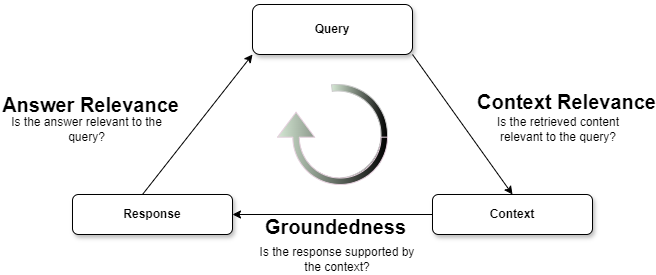
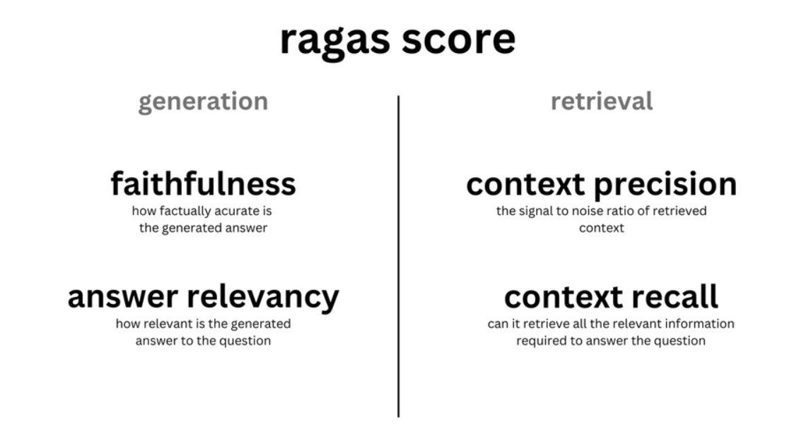

1. Just like in any machine learning system, the performance of individual
   components within the LLM and RAG pipeline has a significant impact on the
   overall experience.

2. Ragas offers metrics tailored for evaluating each component of your RAG
   pipeline in isolation.

3. We have two evaluation Frameworks 1. Trulens 2. Ragas Score

4. **TruLens** and **RAGas** are both tools used to evaluate and improve
   Retrieval-Augmented Generation (RAG) applications, but they serve slightly
   different purposes:

### **TruLens**

#### **Purpose**

     TruLens is designed to evaluate the performance of RAG pipelines by providing feedback and performance metrics. It measures response relevance, groundedness, and tracks performance over time³.

#### **Use Cases**

     It's particularly useful for developers who want to ensure their RAG applications are free from hallucinations and provide accurate, relevant responses. TruLens evaluates context relevance, groundedness, and answer relevance¹.[Learn more](https://www.trulens.org/trulens_eval/getting_started/core_concepts/rag_triad/)

### **RAGas**

#### **Purpose**

     RAGas is another evaluation tool that focuses on scoring metrics through well-designed prompts. It helps in assessing the quality of the generated responses in RAG applications⁴.

#### **Use Cases**

     It's beneficial for developers looking to fine-tune their RAG models by providing detailed insights into the performance of their applications.

### **When to Use Each**

#### **Use TruLens**

    If you need a comprehensive evaluation of your RAG pipeline, including tracking performance over time and ensuring the relevance and groundedness of responses. Mostly used, when you don't know the ground truth.

#### **Use RAG's**

    If you need specific scoring metrics and detailed insights into the quality of your generated responses.  Mostly used, when you know the ground truth. [Learn more](https://docs.ragas.io/en/stable/concepts/metrics/faithfulness.html)
