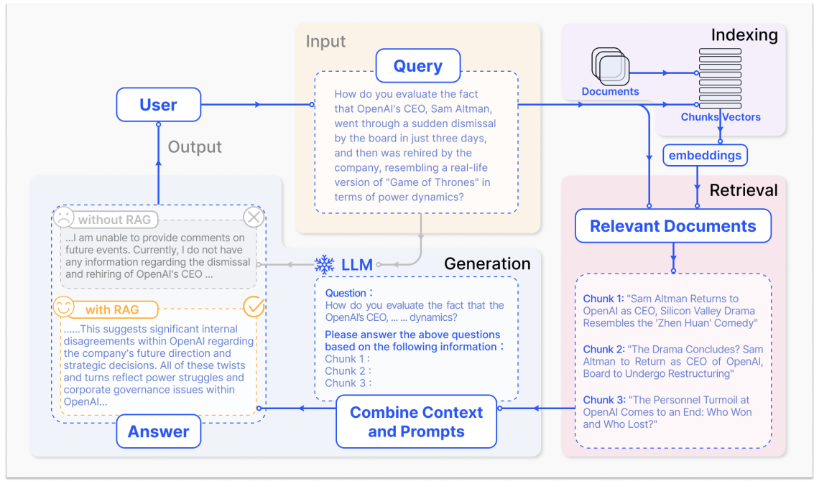
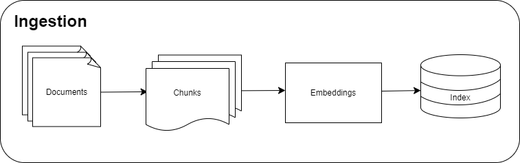
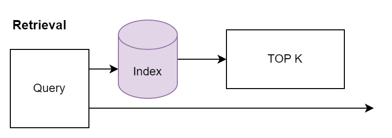
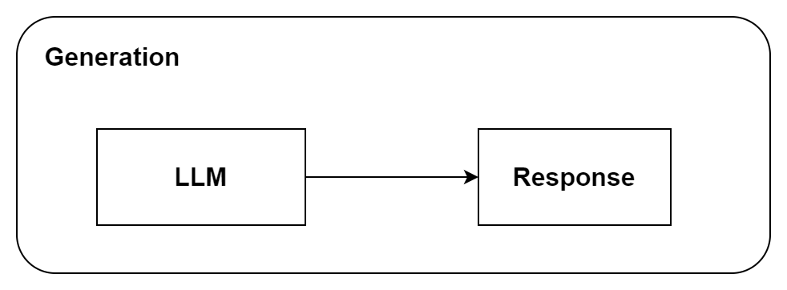

## What is RAG

1. **Retrieval Augmented Generation (RAG)** is an AI concept designed to enhance
   the performance of Large Language Models (LLMs) by incorporating real-time,
   contextually relevant information from external sources during the generation
   of responses.

2. This addresses key limitations of LLMs, such as,

   1. Limitation of the training dataset of the foundational model.
   2. Inconsistencies and gaps in domain-specific or organization-specific
      knowledge.

3. This mitigates the risk of producing incorrect or fabricated (hallucinated)
   responses.

4. RAG approach enhances the capabilities of language models like GPT-4 by
   bridging the information gap through the incorporation of external databases.

5. Typically, when a user asks ChatGPT about recent news, the model’s responses
   are limited to the pretraining data, which may not include the most current
   events.

6. RAG addresses this limitation by sourcing up-to-date information from
   external repositories, such as news articles, to provide more relevant and
   timely answers.

7. This process involves gathering pertinent articles related to the user’s
   query and combining them with the initial question to form a comprehensive
   prompt.

8. This method significantly enhances the depth and accuracy of the responses
   generated by the language model, ensuring that it can provide well-informed
   and current answers.

:::tip

1. Analogy between pretrained model & Retrieval Augmented Generation: Pretrained
   model is like studying beforehand and performing in the exam based on what is
   already learnt.

2. On the other hand, RAG is like an open book exam, where no studying
   beforehand is required, and the student searches for the answer in the book
   based on the question and answers it during the exam.
:::

 A representative instance of the RAG
process applied to question answering.

RAG operates through three critical phases:

1. Data Ingestion
2. Retrieval
3. Generation

### Data Ingestion

1. The Data ingestion process in Retrieval Augmented Generation (RAG) is key to
   preparing data for the model to generate responses.

2. It involves three main steps: `chunking`, `embedding`, and `indexing`.

   1. **Chunking** involves breaking down documents into smaller, manageable
      segments based on criteria like size or natural text divisions. This
      allows the model to focus on specific parts of the text, improving its
      ability to retrieve relevant information.

   2. **Embedding** converts these text chunks into vector representations,
      capturing the essential qualities of the text in a format that is easy for
      the model to process.

   3. **Indexing** organizes these vectors into a structured format optimized
      for fast retrieval, storing them in a searchable database to help the
      model quickly find and use the most relevant information.

3. In short, chunking divides the text, embedding transforms it into vectors,
   and indexing arranges these vectors for efficient retrieval, enabling the
   model to generate accurate and contextually appropriate responses.

:::info 

Please note that there are other steps critical to data ingestion that
are explained in subsequent sections, as this page covers only key information.
:::

### Retrieval

The retrieval component involves the following steps:

1.  **User Query:** When a user submits a natural language query to the Language
    Model (LLM), such as "What are the key components of cloud computing?", the
    system begins a sequence of processes to generate an informed response.

2.  **Query Conversion:** The natural language query is first processed by an
    embedding model, which converts it into a numerical format called an
    embedding or vector representation. This embedding model is aligned with the
    one used during the document ingestion phase, ensuring consistency in data
    processing.

3.  **Vector Comparison:** The system then compares the user's query vector with
    those stored in a pre-constructed index of a knowledge base. This comparison
    uses similarity metrics like cosine similarity to determine how closely the
    query vector matches the vectors in the index.

4.  **Top-K Retrieval:** Based on these similarities, the system retrieves the
    top-K documents or passages from the knowledge base that are most relevant
    to the query.

        ***For example**, if K is set to 5, the system would select the five most pertinent documents that relate to the components of cloud computing.*

5.  **Data Retrieval:** Finally, the system extracts the content from the
    selected top-K documents and presents it in a readable format, providing
    detailed and contextually relevant information about the user's query.

Through this retrieval process, the LLM gains context from the most relevant
sections of the knowledge base, allowing it to deliver a well-informed response,
such as detailing the key components of cloud computing, including computing,
storage, and networking services.

:::info 
Please note that the below sections explain different techniques in
retrieval that can provide better performance in different scenarios.
:::

### Generation

1. The synthesis phase in Retrieval Augmented Generation (RAG) is similar to how
   large language models (LLMs) typically generate responses.

2. However, what sets it apart is the addition of extra context from a detailed
   knowledge base.

3. In this phase, the LLM creates a final answer by combining its usual language
   generation abilities with the information it has retrieved.

4. This makes the response more complete and accurate, as it includes references
   to specific documents or historical data.

5. By using both its generative strengths and precise knowledge inputs, the
   model delivers a well-informed and reliable response to the user.

### Conclusion

1. In summary, the Retrieval Augmented Generation (RAG) framework improves
   traditional language models by adding extra steps to make sure the responses
   are accurate and relevant.

2. The process starts with the **data ingestion phase**, where documents are
   broken down into smaller pieces, turned into embeddings, and stored in an
   index for easy retrieval.

3. In the **retrieval phase**, the system uses this index to find the most
   relevant documents based on similarity when a user asks a question.

4. Finally, in the **synthesis phase**, the model combines this retrieved
   information with what it already knows to generate a precise and accurate
   response.

5. This approach not only improves the accuracy of the responses but also allows
   for verification of the sources of information, reducing the need for
   frequent retraining.

6. RAG effectively solves the limitations of traditional language models by
   ensuring the generated content is both relevant and accurate.

7. It also tackles challenges like data parsing, efficient embedding, and
   generalization across different domains, all without needing to train the
   model on domain-specific data.

8. This makes RAG easy to apply to new domains without additional training.

This overview covers the key aspects of RAG, with further details provided in
the following sections.

:::tip

One of the major advantage of the RAG is instead of just guessing an answer, it looks for relevant documents that we have provided first, then uses that information to generate the output which is more accurate and detailed.
:::

### Reference

:::info

1. Image Source:
   https://www.deeplearning.ai/short-courses/langchain-for-llm-application-development/
  :::
