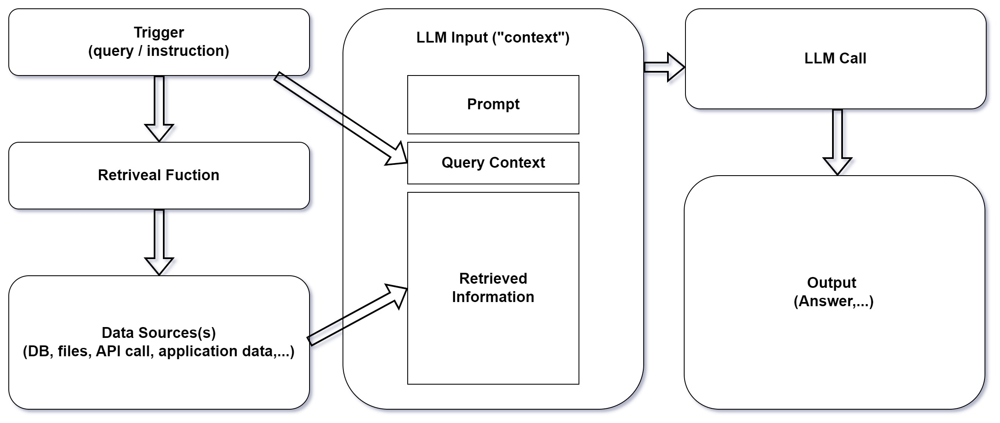

### What is Grounding

#### Augmentation Generation in Large Language Models (LLMs)?

1. Grounding LLMs refers to the technique of enhancing the functionality of
   large language models by integrating them with specific, relevant information
   that is not inherently part of their pre-trained data sets.

2. This method is critical in boosting the accuracy, relevance, and reliability
   of outputs provided by LLMs.

#### Context and Integration

1. In the broader artificial intelligence landscape, LLMs stand out due to their
   extensive training on wide-ranging data sets.

2. Despite this, their knowledge remains static and restricted to information as
   of their last update, not reflecting real-time or niche changes and details
   post-training.

3. Grounding effectively bridges this gap, bringing in updated, context-specific
   data that enhances the model’s outputs, making them more tailored and
   applicable to current needs.

4. Retrieval-Augmented Generation (RAG) and fine-tuning are two primary means of
   achieving this grounding, though RAG has become more favored due to its ease
   of application across various scenarios.

### Why We Need Grounding

#### Problem Statement

1. The challenge arises from LLMs' inherent design - they are not continuously
   updating databases but rather static repositories of knowledge as of their
   last training cut-off.

2. They lack real-time updates and specific niche knowledge that might be
   critical for certain applications.

#### Use Cases

<table class="table-size-for-cloud-services">
    <thead>
        <tr>
            <th>Use Cases</th>
            <th>Description</th>
        </tr>
    </thead>
    <tbody>
        <tr>
            <td class="custom-header">Search and Question-Answering Systems</td>
            <td>Grounded LLMs can significantly enhance the performance of search engines and Q&A systems by integrating real-time data for more accurate responses.</td>
        </tr>
        <tr>
            <td class="custom-header">Content Generation</td>
            <td>In scenarios like coding in Visual Studio Code or drafting emails in Microsoft 365, grounding facilitates context-aware suggestions, enhancing productivity and user experience.</td>
        </tr>
        <tr>
            <td class="custom-header">External Data Integration</td>
            <td>For functions that rely on up-to-the-minute information, such as weather updates or stock market prices, grounding allows LLMs to access and integrate external data sources effectively.</td>
        </tr>
    </tbody>
</table>



#### Benefits

1. Understanding and implementing grounding in LLMs can lead to significantly
   improved accuracy and relevance of the output, tailored content generation,
   and more engaged and context-aware interaction in applications.

2. This customizability makes LLMs far more useful in real-world applications
   than they would be with only their pre-trained general knowledge.

### Advantages and Disadvantages of Grounding LLMs

#### Advantages

<table class="table-size-for-cloud-services">
    <thead>
        <tr>
            <th>Factors</th>
            <th>Description</th>
        </tr>
    </thead>
    <tbody>
        <tr>
            <td class="custom-header">Efficiency</td>
            <td>Saves time and resources by providing more accurate answers faster due to the reduced need for human intervention.</td>
        </tr>
        <tr>
            <td class="custom-header">Scalability</td>
            <td>Can be applied broadly across different fields and for various applications, adapting to the size and complexity as needed.</td>
        </tr>
    </tbody>
</table>

#### Disadvantages

<table class="table-size-for-cloud-services">
    <thead>
        <tr>
            <th>Factors</th>
            <th>Description</th>
        </tr>
    </thead>
    <tbody>
        <tr>
            <td class="custom-header">Complexity</td>
            <td>The integration of additional data sources can increase the complexity of setting up and maintaining LLM systems.</td>
        </tr>
        <tr>
            <td class="custom-header">Resource Usage</td>
            <td>May require more computational power or data costs due to the constant retrieval of external data.</td>
        </tr>
        <tr>
            <td class="custom-header">Limitations</td>
            <td>Grounding can be limited by the availability and accessibility of relevant data sources, and might still not cover every niche requirement.</td>
        </tr>
    </tbody>
</table>

### Example Scenario: Implementing RAG for a Customer Support AI

### Example with Grounding

#### **Input**

```js
prompt = "Who is the current RBI Governor of India?";
response = get_completion(prompt);
print(response);
```

#### **Output (with grounding)**

```js
The current RBI Governor of India is Shaktikanta Das. He has held the position since December 12, 2018.
```

In this example, the response is "grounded" in real-world knowledge, providing a
factual answer based on the most current information.

### Example without Grounding

#### **Input**

```js
prompt = "Who is the RBI Governor of India?";
response = get_completion(prompt);
print(response);
```

#### **Output (without grounding)**

```js
I'm not sure who the current RBI Governor is, but you can check the latest information on the official RBI website or through a news source.
```

In this example, the response is "without grounding" because it doesn't provide
a specific answer but rather suggests ways to find the information.

### **Reference Link**

:::info 
Learn more about [Grounding](https://techcommunity.microsoft.com/t5/fasttrack-for-azure/grounding-llms/ba-p/3843857)
:::
