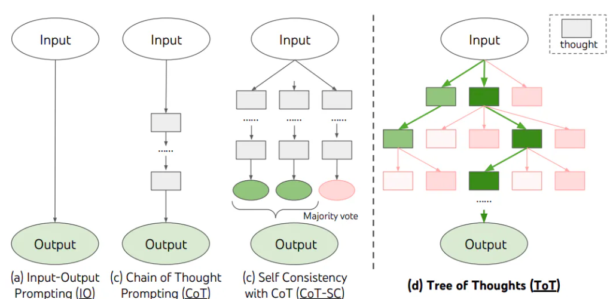
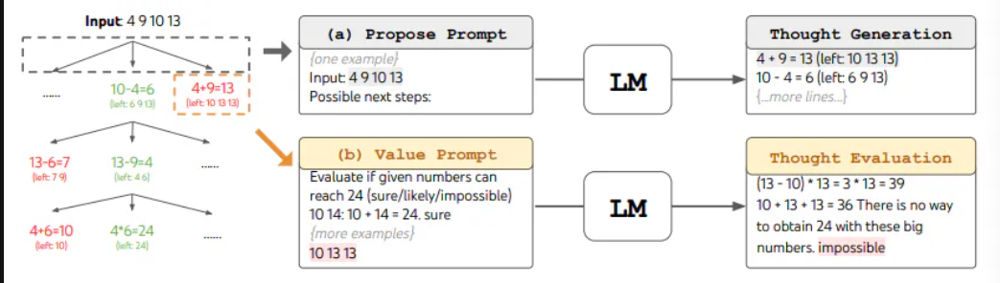

### Tree of Thoughts (ToT)

#### What is Tree of Thoughts?

1. The Tree of Thoughts (ToT) framework is a methodological advancement in
   language models that enhances their problem-solving capabilities.

2. Developed by researchers such as Yao et al. (2023) and Long (2023), ToT
   extends beyond standard chain-of-thought processes, integrating systematic
   exploration techniques through trees of intermediate thoughts or steps.

3. These trees allow the language model to navigate and evaluate different
   thought paths, drawing closer to a solution through an iterative process of
   reasoning.

#### **Context**

1. Tree of Thoughts fits into the broader context of artificial intelligence by
   improving how language models tackle complex and strategy-dependent tasks.

2. By structuring thought processes similar to decision trees, ToT allows for
   clearer reasoning paths, making it easier to trace how conclusions are
   reached, thus enhancing the interpretability and effectiveness of language
   models in problem-solving scenarios.

### Why We Need Tree of Thoughts

    1. Traditional single-step or linear prompting often falls short in complex problem-solving scenarios where multiple pathways need evaluation.

    2. ToT addresses this gap by enabling thorough exploration and strategic lookahead in thought processes.

#### 2. **Use Cases**

    1. ToT is particularly useful in tasks involving deep reasoning and multi-step logic, such as mathematical puzzles, strategic game planning, and complex decision-making scenarios.

    2. For example, the Game of 24 utilized in the research requires decomposing the problem into several logical steps, evaluating each for viability.

#### 3. **Benefits**

    1. The primary benefit of ToT is its ability to enhance the depth of reasoning in language models, resulting in more accurate and reliable solutions.

    2. This structured approach also aids in debugging and refining AI behaviors by providing a clear trace of the decision-making process.

### Advantages and Disadvantages

#### **Advantages**

 <table class="table-size-for-cloud-services">
    <thead>
        <tr>
            <th>Factor</th>
            <th>Description</th>
        </tr>
    </thead>
    <tbody>
        <tr>
            <td>Efficiency</td>
            <td>ToT speeds up the problem-solving process by enabling parallel evaluation of multiple thought paths and quickly discarding less promising ones.</td>
        </tr>
        <tr>
            <td>Understanding</td>
            <td>By outlining clear intermediate steps, ToT enhances interpretability, making it easier to understand how decisions were made.</td>
        </tr>
        <tr>
            <td>Scalability</td>
            <td>ToT can be applied to increasingly complex problems as its methodology does not rely on problem simplicity.</td>
        </tr>
    </tbody>
</table>

#### **Disadvantages**

 <table class="table-size-for-cloud-services">
    <thead>
        <tr>
            <th>Factor</th>
            <th>Description</th>
        </tr>
    </thead>
    <tbody>
        <tr>
            <td>Complexity</td>
            <td>Implementing ToT involves a steep learning curve and sophisticated model training, as it integrates advanced search algorithms and decision-making protocols.</td>
        </tr>
        <tr>
            <td>Resource Usage</td>
            <td>More computing resources might be required due to the multiple pathways explored simultaneously.</td>
        </tr>
        <tr>
            <td>Limitations</td>
            <td>The initial setup of thought trees and ensuring appropriate backtracking and lookaheads can be challenging.</td>
        </tr>
    </tbody>
</table>

### Example Scenario

_Situation:_ Imagine using ToT in the Game of 24, as mentioned in the source
material. _Steps/Workflow:_

1. Step 1: Deploy thoughts in initial nodes, consisting of potential equations
   leading to the number 24.
2. Step 2: Use a breadth-first search algorithm to expand on each node,
   evaluating and branching out subsequent thoughts.
3. Step 3: Prune impossible solutions based on logical deductions and
   feasibility checks.
4. Step 4: Select optimal paths that accurately solve the equation.

:::tip[Outcome] 
_Outcome:_ The outcome is a set of potential solutions or a
single optimal solution to the problem, achieved through systematic and
strategic exploration of possible thought paths. The process ensures both
accuracy and efficiency in problem-solving. 
:::

### Reference Link

:::info 
Learn more about [Tree of Thoughts](https://www.promptingguide.ai/techniques/tot) 
:::
