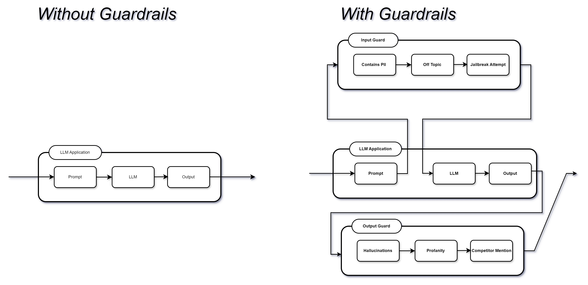

### Guardrails in AI: Ensuring Safe and Ethical AI Operations

1. Guardrails in AI are essential frameworks and mechanisms designed to ensure
   that AI systems function within established ethical, legal, and technical
   boundaries.

2. These safeguards are critical to preventing harm, avoiding biased decisions,
   maintaining user privacy, and complying with regulatory standards.

3. Below, we explore various ways guardrails can be implemented, with specific
   examples to highlight their practical applications.

4. Guardrails runs Input/Output Guards in your application that detect, quantify
   and mitigate the presence of specific types of risks.

5. To look at the full suite of risks, check out Guardrails Hub. And it helps
   you generate structured data from LLMs.

### Validating User Prompts

1. Guardrails can validate user prompts to ensure they do not contain sensitive
   information, toxic language, or inappropriate content.

2. This is particularly important when dealing with closed-source models that
   might pose data security risks.

:::info 
_Scenario:_ A company uses an AI chatbot to interact with customers on
its website. The chatbot is programmed to reject prompts containing offensive
language or personal data, ensuring interactions remain respectful and secure.

_Example:_ A customer types: "Hey, you stupid bot, what's my credit card
number?" The AI chatbot, equipped with prompt validation guardrails, responds:
"I'm here to help, but please use respectful language. For your security, I
can't assist with credit card information." 
:::

### Generating Structured Data

1. Large language models (LLMs) can produce unstructured and varied output.

2. Guardrails can be used to ensure that the output is formatted into structured
   data, making it easier to use and analyze.

:::info 
_Scenario:_ An AI system processes medical research papers to extract
structured data about clinical trials, including trial phases, results, and
participant numbers.

_Example:_ Input: Unstructured text from research papers. Output: A structured
table that lists each clinical trial's name, phase, number of participants,
outcomes, and conclusion. 
:::

### Enforcing Length Constraints

1. Guardrails can enforce length constraints on generated text to ensure that
   responses are concise and within specified limits.

2. This can be particularly useful in contexts where brevity is important, such
   as social media or messaging applications.

:::info 
_Scenario:_ A marketing tool uses an AI to generate social media posts.
To adhere to platform limitations (e.g., Twitter’s character limit), the AI is
set up to automatically keep its outputs concise.

_Example:_ Input Prompt: Generate a tweet about our new product launch. Output:
"Exciting news! Our new product has landed. Explore the future of innovation
today!" 
:::

### Ensuring URL Accessibility

1. LLMs might generate responses that include URLs.

2. Guardrails can be used to verify the accessibility and validity of these URLs
   before including them in the final output.

:::info 
_Scenario:_ An AI-powered content creation system includes links to
further resources. Before publication, the AI checks whether the URLs are active
and lead to safe, relevant content.

_Example:_ Input: Generated content suggesting readers visit [ExampleURL] for
more information. Output: Prior to user seeing the content, the AI checks and
confirms [ExampleURL] is active and relevant or replaces it with a valid link.
:::

### Customization for Specific Use Cases

1. Guardrails can be tailored to align with industry-specific requirements and
   responsible AI policies.

2. This ensures that AI applications meet the unique standards and ethical
   considerations of different sectors.

:::info 
_Scenario:_ An AI system developed for the healthcare industry ensures
compliance with HIPAA (Health Insurance Portability and Accountability Act),
focusing on patient data privacy and security.

_Example:_ Custom AI setup: All outputs by the AI are filtered to remove any
personally identifiable information (PII) about patients, ensuring that any
shared or stored data is in strict compliance with HIPAA guidelines. 
:::

### References

:::info

1. Docs:-https://www.guardrailsai.com/docs
2. Guardrails Hub:- https://hub.guardrailsai.com/ 

:::
