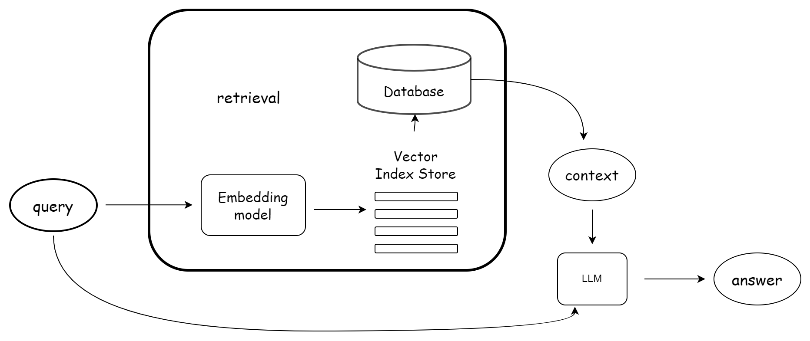

### What is Retrieval in RAG?

1. Retrieval in `Retrieval Augmented Generation (RAG)` includes both the
   Pre-Retrieval and Post-Retrieval stages.

2. These two phases work towards enhancing the quality and relevance of the
   output generated by RAG models.

3. Retrieval in RAG plays a crucial role in the functioning of models that
   combine retrieval of information with generative capabilities.

4. It ensures that the generated responses are not only contextually accurate
   but also enriched with relevant external knowledge.

### Why Do We Need Retrieval in RAG?

1. In the generation of responses, especially in complex domains, mostly relying
   on pre-trained knowledge this can lead to inaccuracies or outdated
   information.

2. Retrieval in RAG addresses this by fetching up-to-date and context-specific
   data, thereby improving the quality of the response.

### **Advantages**

<table class="table-size-for-cloud-services">
    <thead>
        <tr>
            <th>Factors</th>
            <th>Reason</th>
        </tr>
    </thead>
    <tbody>
        <tr>
            <td>Efficiency</td>
            <td>Streamlines the response generation process by using effective indexing and relevant data retrieval, significantly reducing the time to answer.</td>
        </tr>
        <tr>
            <td>Understanding</td>
            <td>Enhances the model’s ability to contextualize responses better due to access to a broader range of information.</td>
        </tr>
        <tr>
            <td>Scalability</td>
            <td>Adapts to different scales of queries by adjusting the depth and breadth of retrieval according to the complexity of the query.</td>
        </tr>
    </tbody>
</table>

### Example Explanation with AZCG Project

1. In the AZCG project, retrieval plays a fundamental role in generating highly
   relevant and context-specific responses.

2. The project's architecture integrates an advanced methodology for embedding
   and retrieving data categorized into five predefined categories, ensuring
   correct and precise information retrieval.

3. Here’s how the retrieval process is structured in the AZCG project.

### Data Embedding and Categorization:

1. In the AZCG project, data is meticulously organized into five specific
   categories, each holding distinct types of information: 
   1. **Station Set-Up**: Covers all details related to the setup and configuration of
   stations. 
   
   2. **Driver Info**: Contains comprehensive data about drivers. 
   
   3. **Driver Info - Leap**: Stores enhanced or additional details about drivers
   under the Leap schema. 
   
   4. **Plugin Info**: Holds information about various
   plugins. 
   
   5. **Plugin Info-Leap**: Contains enriched data about plugins under
   the Leap schema.

2. Each node (data point) within these categories has metadata tagging that
   specifies its category, making it easier to locate and retrieve specific data
   types.

### Pre-Retrieval Process

The pre-retrieval stage in the AZCG project is user-driven and begins with
category selection: 
   1. **User Interaction**: Users interact with a UI to select
a specific category from which they seek information. 
   
   2. **Query Formulation**: Based on the user’s input and the specified category, a search query is
generated. 

   3. **Initial Retrieval**: Utilizing the search query, the system
fetches the top 15 nodes from the selected category, leveraging the embedded
data structure and metadata for efficient retrieval.

### Post-Retrieval Process

1. After the initial data is fetched, the project employs a sophisticated
   reranking and synthesis mechanism to refine and utilize the retrieved data:

   1. **Re-Ranking**: An offline Python library, Flash Rank, is employed to
      rerank the retrieved top 15 nodes. This reranking is based on query
      relevance ensuring that only the most pertinent nodes are considered for
      the next step.
   2. **Synthesization**: Post reranking, the top 5 nodes are selected and
      utilized for synthesis, forming the basis of the generated output or
      response.

2. Post-retrieval content informs the model’s response. It can be used to
   enhance the generated output, validate facts, or incorporate external
   knowledge.

### Workflow Integration and Response Generation

1. This structured retrieval process ensures that every response generated by
   the AZCG project is not only contextually relevant but also more accurate and
   updated data available from the specified category.

2. Users receive detailed and customized responses that directly address their
   queries with precision.

### Conclusion

1. The retrieval system in the AZCG project showcases an exemplary
   implementation of advanced data handling and retrieval techniques.

2. By categorizing data, accommodating user-driven retrieval inputs, and
   employing powerful reranking tools, the AZCG project effectively enhances the
   accuracy and relevance of generated responses, ultimately leading to improved
   user satisfaction and system efficiency.
