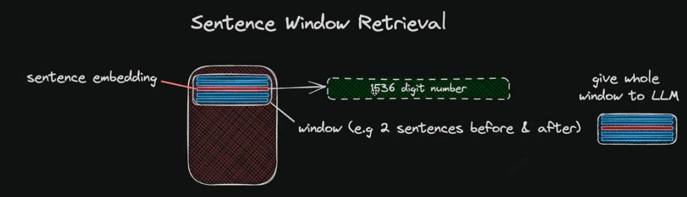

1. The strategy here aims for smaller chunk retrieval for improved search
   quality while incorporating surrounding context for reasoning by the Language
   Model.

2. Two options can explored:

### Sentence Window Retrieval

<table class="table-size-for-cloud-services">
    <thead>
        <tr>
            <th>Factors</th>
            <th>Reason</th>
        </tr>
    </thead>
    <tbody>
        <tr>
            <td>Sentence Embedding</td>
            <td>Each sentence in the document is individually embedded to maximize accuracy during cosine distance searches between the query and the context.</td>
        </tr>
        <tr>
            <td>Sentence Retrieval</td>
            <td>The most relevant single sentence is retrieved based on the cosine similarity between the query and the sentence embeddings.</td>
        </tr>
        <tr>
            <td>Context Window Extension</td>
            <td>A specified number of sentences before and after the retrieved sentence are included to create an extended context.</td>
        </tr>
        <tr>
            <td>Extended Context Submission</td>
            <td>The extended context, which now includes surrounding sentences, is sent to the Large Language Model (LLM).</td>
        </tr>
        <tr>
            <td>Enhanced Understanding</td>
            <td>The inclusion of surrounding context enables the LLM to better understand the nuances and broader meaning of the retrieved sentence, leading to more informed and accurate responses.</td>
        </tr>
    </tbody>
</table>

### Auto-Merging Retriever

<table class="table-size-for-cloud-services">
    <thead>
        <tr>
            <th>Factors</th>
            <th>Reason</th>
        </tr>
    </thead>
    <tbody>
        <tr>
            <td>Document Splitting</td>
            <td>Documents are initially divided into smaller child chunks, with each child chunk linked to a larger parent chunk.</td>
        </tr>
        <tr>
            <td>Chunk Retrieval</td>
            <td>During the retrieval process, these smaller child chunks are fetched first based on relevance to the query.</td>
        </tr>
        <tr>
            <td>Auto-Merging Process</td>
            <td>If the top retrieved chunks surpass a specified threshold and are linked to the same parent node (larger chunk), the context provided to the LLM is replaced by this parent node.</td>
        </tr>
        <tr>
            <td>Granularity and Context Balance</td>
            <td>This method captures both the fine details (granularity) and the broader context by automatically merging relevant chunks into their parent chunk.</td>
        </tr>
        <tr>
            <td>Enhanced LLM Responses</td>
            <td>The auto-merging retriever method improves the LLM’s ability to generate comprehensive and coherent responses by ensuring that the context fed to the model is both detailed and contextually rich.</td>
        </tr>
    </tbody>
</table>

### Reference

:::info
[Source Link](https://medium.com/@shivansh.kaushik/advanced-text-retrieval-with-elasticsearch-llamaindex-sentence-window-retrieval-cb5ea720aa44)
:::
