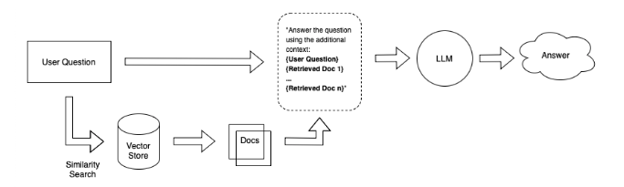
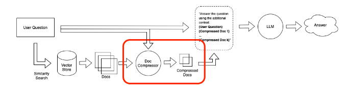
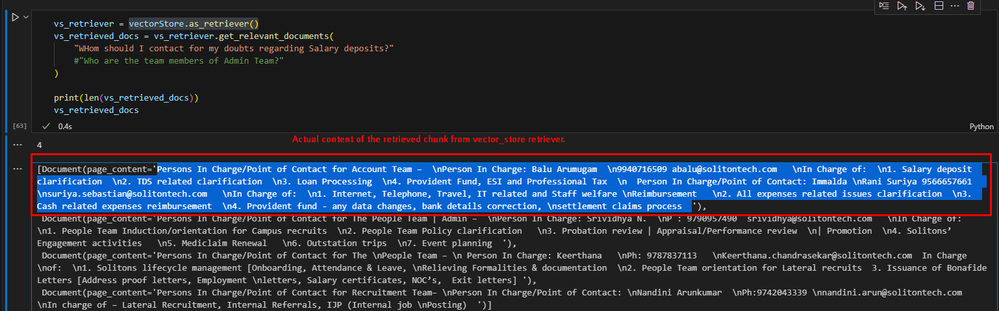
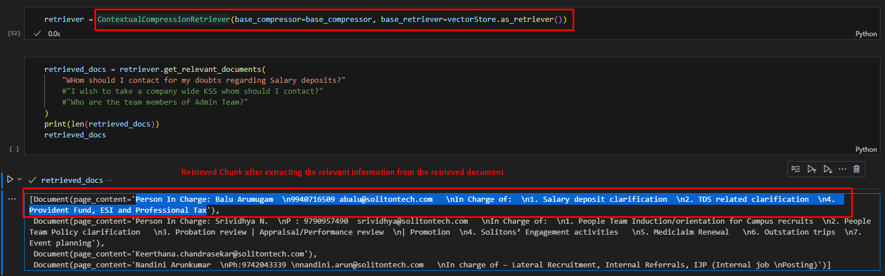

#### Contextual Compressors & Filters | LangChain

### Simple RAG System

Let us assume the high level flow of RAG system.

Here,

1. The User Question is embedded and the system searches does a similarity
   search in the Vector Store.
2. This returns a set of relevant documents for a given K size
3. Now these relevant documents are passed in the prompt of the LLM to get a
   summarized answer with reset to the given query.

### Problems with the above System

1. There are chances that the set of K relevant nodes may contain some
   irrelevant information or a node may itself be irrelevant to the user
   question. This irrelevant information may confuse/distract the LLM during
   summarization.
2. It also takes up the prompt space.

### Solution

1. As a solution to the above mentioned problems, The RAG system can be modified
   in such a way, 

2. Here, 1. In the above mentioned system, A simple Postprocessing of the
   retrieved documents will happen. 2. This will extract only the relevant
   content from the retrieved documents. If the retrieved document does not
   contain any relevant information w.r.t user question then that document will
   be skipped. 3. Only the extracted content from the relevant documents will be
   sent to the LLM for summarizing the answer.

### Samples

`vector_store.as_retreiever()`

`ContextualCompressionRetriever()`

### Advantages

1. Is designed to improve answers from vector store searches by better taking
   query context into account
2. Reduces distraction for subsequent chains parsing retrieved documents

### Disadvantages

1. Each extracted relevant document will undergo a separate LLM call to extract
   the relevant information from the retrieve document. This is a slow and
   costly process. As a solution to this they are also supporting some Embedding
   Filters which will retrieve only the docs with a certain score by setting the
   `similarity_threshold` value.

### Source Links

:::info

1. Learn more about
   [LangChain Docuentation](https://js.langchain.com/docs/modules/data_connection/retrievers/how_to/contextual_compression)

2. Learn more about
   [LangChain Blog](https://blog.langchain.dev/improving-document-retrieval-with-contextual-compression/)
   :::
