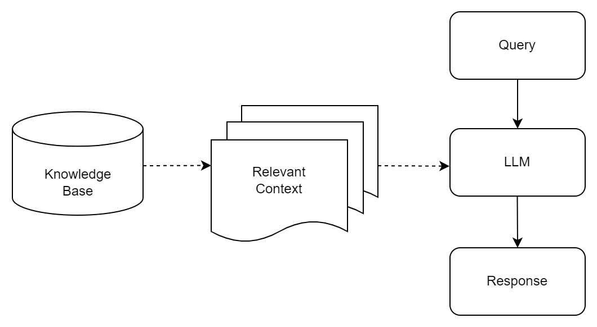

### What is Unstructured Data Retrieval in RAG Systems?

1. Unstructured data retrieval involves extracting relevant information from
   sources like texts, documents, and web pages without relying on predefined
   data models.

2. In Retrieval-Augmented Generation (RAG) systems, this process is essential
   for providing generative models with accurate and relevant information, which
   enhances the quality and relevance of the generated content.

3. In a RAG system, unstructured data retrieval serves as the initial step,
   where the system searches through vast amounts of unstructured text to find
   content that the generation component can use to produce coherent and
   contextually appropriate outputs.

### Why We Need Unstructured Data Retrieval

Handling large volumes of unstructured data is challenging for many AI systems
due to the lack of structure and predefined data models, which often leads to
inefficiencies in information retrieval and data processing.

### Advantages

<table class="table-size-for-cloud-services">
    <thead>
        <tr>
            <th>Factors</th>
            <th>Reason</th>
        </tr>
    </thead>
    <tbody>
        <tr>
            <td>Efficiency</td>
            <td>Streamlines the processing of large unstructured datasets, making it quicker to find relevant information.</td>
        </tr>
        <tr>
            <td>Understanding</td>
            <td>Improves the overall comprehension of the data by identifying key pieces of text that are most relevant to the query.</td>
        </tr>
        <tr>
            <td>Scalability</td>
            <td>Adaptable to different scales of data, making it ideal for both small and large applications.</td>
        </tr>
    </tbody>
</table>
