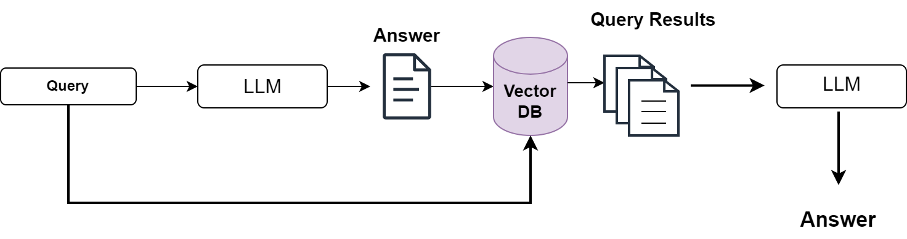

### What is Query Optimization in the Context of RAG?

1. Query optimization in Retrieval-Augmented Generation (RAG) involves refining
   how information is retrieved in response to user queries to enhance both
   accuracy and efficiency.

2. This process includes strategies such as expanding, transforming, and routing
   queries to obtain the most relevant information.

:::note 
1. In RAG systems, which integrate text retrieval with the generation
process, query optimization is essential for improving the quality of
AI-generated responses by ensuring that the additional data fetched from
databases is highly relevant. 

2. It addresses inefficiencies and inaccuracies in
initial query handling, making it a crucial component in the overall mechanism
of information retrieval and response generation. 
:::

#### Techniques of Query Optimization

1. **Query Expansion**

   1. **Definition:** Involves adding additional terms to the original query to
      capture a broader range of relevant documents.
   2. **Advantage:** Increases the probability of retrieving relevant
      information by expanding the search scope.
   3. **Disadvantage:** May introduce noise by retrieving irrelevant documents,
      thus requiring further filtering.

2. **Query Transformation**

   1. **Definition:** Modifies the original query into a more effective form
      based on syntactic or semantic rules.
   2. **Advantage:** Enhances the query's ability to retrieve precise and
      contextually relevant information.
   3. **Disadvantage:** Requires sophisticated algorithms to ensure that the
      transformation improves relevance without distorting the query's intent.

3. **Query Routing**
   1. **Definition:** Directs the query to specific sub-collections or databases
      based on its characteristics.
   2. **Advantage:** Improves retrieval efficiency by targeting the most
      relevant sources.
   3. **Disadvantage:** Needs an intelligent routing mechanism to accurately
      identify the best sources, which can be computationally intensive.

### Why is Query Optimization Important?

When users ask questions, they might not always be clear or specific enough to
get the best answers. Query optimization helps with this problem by making sure
that, even if the question is vague or broad, the system can still find the most
relevant information.

#### Advantages

<table class="table-size-for-cloud-services">
    <thead>
        <tr>
            <th>Factors</th>
            <th>Reason</th>
        </tr>
    </thead>
    <tbody>
        <tr>
            <td>Efficiency</td>
            <td>It makes the retrieval process quicker and more cost-effective by reducing the time spent on fetching irrelevant data.</td>
        </tr>
        <tr>
            <td>Scalability</td>
            <td>Can handle an increase in query volume and complexity without a significant drop in performance.</td>
        </tr>
        <tr>
            <td>Understanding</td>
            <td>Simplifies the process of managing complex queries, making it easier for both users and systems to operate effectively.</td>
        </tr>
    </tbody>
</table>
