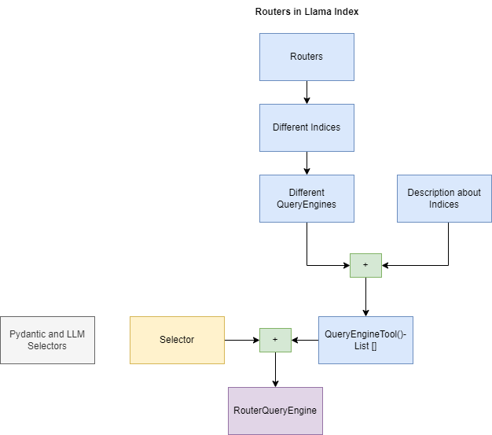

### Routers

1.  Routers are modules that take in a user query and a set of “choices”
    (defined by metadata), and returns one or more selected choices.

2.  They can be used on their own (as “selector modules”), or used as a query
    engine or retriever (e.g. on top of other query engines/retrievers).

3.  They are simple but powerful modules that use LLMs for decision making
    capabilities. They can be used for the following use cases and more:

        1. Selecting the right data source among a diverse range of data sources

        2. Deciding whether to do summarization (e.g. using summary index query engine) or semantic search (e.g. using vector index query engine)

        3. Deciding whether to “try” out a bunch of choices at once and combine the results (using multi-routing capabilities).

4.  The core router modules exist in the following forms:

        1. LLM selectors put the choices as a text dump into a prompt and use LLM text completion endpoint to make decisions

        2. Pydantic selectors pass choices as Pydantic schemas into a function calling endpoint, and return Pydantic objects

### Flow Diagram

#### Explanation

_Routers in Llama Index will help us route to a query_engine based on the user
query from the list of query_engines available in it._

1. Difference `query_engines` can be constructed from different `indexes`.
2. A `QueryEningeTool` can be created with any query_engine and a description
   about it. This description is really important as routers understand the
   behavior of this query engine from this description.
3. Now a list of QueryEngineTool is passed to `RouterQueryEngine` along with the
   `Selector`. This selector is responsible for selecting either a single
   query_engine or multiple query_engine for the given user query.

4. Now when a query is being passed to a `RouterQueryEngine` based on the
   description of the list of query_engines available it will pick either a
   single or multiple query_engine to fetch the answer
   from.

### Advantages

1. Task-Specific Retrieval: Routers allow for dynamic decision-making based on
   the type of query. This means they can handle a broad range of queries, not
   just specific fact-based questions.
2. Integration with Other Modules: Routers can be used in conjunction with other
   modules in LlamaIndex, such as query engines and data agents, to perform
   complex tasks like joint question-answering and summarization, or combining
   structured and unstructured queries.

### Disadvantages

1. Complexity: The use of routers can add a layer of complexity to the system,
   as they require careful configuration and integration with other modules to
   function effectively.
2. The performance is actually dependent on the quality of the description about
   the query_engine only then for a given user query router will be able to pick
   up the right query_engine.

### SourceLinks

:::info 
Learn more about [LlamaIndex Documentation](https://docs.llamaindex.ai/en/stable/module_guides/querying/router/root.html)
:::
