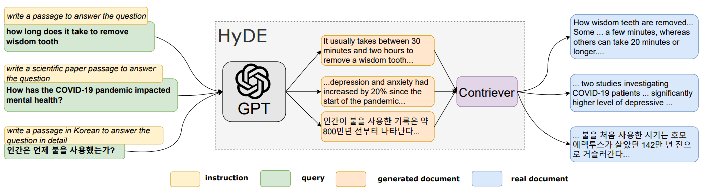

### What is HyDE in the Context of Query Transformations?

1. HyDE, short for Hypothetical Data Embedding, is a technique used in
   information retrieval that generates a hypothetical response based on a
   provided query.

2. This response isn't actual data retrieval but a crafted approximation to
   enhance understanding and processing of the query by embedding both the query
   and responses into vector spaces, facilitating a more semantic match with
   database content.

3. Within the broader context of query optimization and transformations in
   systems handling unstructured data, HyDE is crucial for interpreting and
   optimizing queries to align better with existing information, thereby helping
   systems provide more accurate and contextually relevant search results by
   interpreting intentions and possible answers.

### Why HyDE is Important?

Often, traditional search queries may not directly represent the semantic
intentions of the user. There can be a mismatch between the user's search terms
and the language or the phrasing used in the database or information repository.
This can lead to less accurate or irrelevant search results.

### Advantages and Disadvantages of HyDE

#### **Advantages**

<table class="table-size-for-cloud-services">
    <thead>
        <tr>
            <th>Factors</th>
            <th>Reason</th>
        </tr>
    </thead>
    <tbody>
        <tr>
            <td>Efficiency</td>
            <td>Saves time by increasing the probability of users finding the correct information on the first try.</td>
        </tr>
        <tr>
            <td>Understanding</td>
            <td>Enhances the semantic understanding of queries, thereby improving how information systems manage and respond to them.</td>
        </tr>
        <tr>
            <td>Scalability</td>
            <td>Can be adapted and integrated into larger, more complex systems without substantial changes to existing architectures.</td>
        </tr>
    </tbody>
</table>

#### **Disadvantages**

<table class="table-size-for-cloud-services">
    <thead>
        <tr>
            <th>Factors</th>
            <th>Reason</th>
        </tr>
    </thead>
    <tbody>
        <tr>
            <td>Complexity</td>
            <td>The process of generating and matching these hypothetical responses can be computationally intensive and complex.</td>
        </tr>
        <tr>
            <td>Resource Usage</td>
            <td>Might require significant computational resources, particularly in creating and managing the vector representations.</td>
        </tr>
        <tr>
            <td>Limitations</td>
            <td>The effectiveness can depend heavily on the quality of the hypothetical responses generated. Poorly constructed responses could lead to mismatches and irrelevant results.</td>
        </tr>
    </tbody>
</table>

### **Reference**

:::info 
[Source Link](https://arxiv.org/pdf/2212.10496) 
:::
