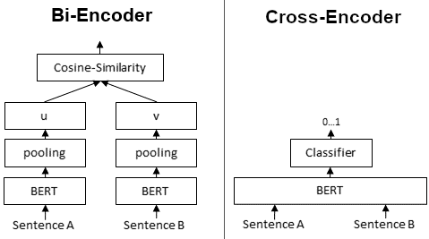

### What is Cross Embedding Models?

1. Cross Embedding Models are a type of machine learning model designed to
   process and compare inputs from different sources or feature spaces.

2. Essentially, these models learn to create embeddings (vector representations)
   of each input in a way that similar items are closer together in the
   embedding space, regardless of their source.

3. Consider, we have two documents, Cross encoders encode two texts
   simultaneously and then produces an output value between 0 and 1 indicating
   the similarity of the input sentence pair.

4. They first generate a single embedding that captures representations and
   their relationships, and the embeddings are dependent on each other.

5. However, cross encoders are slow if you need to compare thousands of
   sentences since they need to encode all the sentence pairs.

#### **Context**

1. In a broader perspective, Cross Embedding Models fit into systems where the
   comparison or interaction of different kinds of data is necessary.

2. They play a crucial role in tasks like recommendation systems, where matching
   user profiles to content is essential, or in cross-modal data applications,
   such as matching text descriptions to images.

### Why We Need Cross Embedding Models

1. Different types of data, such as text and images, naturally exist in different
formats and feature spaces. 

1. Traditional models often struggle to bridge these
discrepancies efficiently. 

1. Cross Embedding Models address this gap by
transforming disparate data types into a common embedding space.

#### **Use Cases**

1. Recommender systems that suggest products based on user activity across
   various media types.
2. Search engines that retrieve information across different formats, like
   finding articles based on image content.
3. Multilingual translation services where sentences from different languages
   are compared semantically.

**Benefits** 

Understanding Cross Embedding Models can significantly enhance an
algorithm’s ability to interact with and process multi-modal data sources,
enriching data interaction and retrieval processes across different domains.

### Advantages and Disadvantages

#### **Advantages**

<table class="table-size-for-cloud-services">
    <thead>
        <tr>
            <th>Factors</th>
            <th>Reason</th>
        </tr>
    </thead>
    <tbody>
        <tr>
            <td>Efficiency</td>
            <td>Saves time and computational resources by handling multiple data types within a unified model.</td>
        </tr>
        <tr>
            <td>Understanding</td>
            <td>Enhances the system's ability to "understand" and process correlations between different forms of data.</td>
        </tr>
        <tr>
            <td>Scalability</td>
            <td>Can be extended to handle increasingly large and diverse datasets, which is invaluable in big data scenarios.</td>
        </tr>
    </tbody>
</table>

#### **Disadvantages**

<table class="table-size-for-cloud-services">
    <thead>
        <tr>
            <th>Factors</th>
            <th>Reason</th>
        </tr>
    </thead>
    <tbody>
        <tr>
            <td>Complexity</td>
            <td>Typically requires a higher degree of sophistication in model design and tuning.</td>
        </tr>
        <tr>
            <td>Resource Usage</td>
            <td>May require more computational power and data for training, especially in cases involving large datasets.</td>
        </tr>
        <tr>
            <td>Limitations</td>
            <td>Effectiveness can depend heavily on the quality and volume of data used for training.</td>
        </tr>
    </tbody>
</table>

### Example Scenario: Image-Text Matching

#### **Situation**

A digital library wants to enhance its search functionality by allowing users to
search for books not only by titles or authors but also by related image
content, such as book covers.

#### **Steps/Workflow**

1. Collect a dataset of books with text descriptions and corresponding cover
   images.
2. Train a Cross Embedding Model to learn embeddings from text descriptions and
   image data.
3. When a query is made using an image, the model retrieves the closest text
   embeddings representing similar book covers.
4. Display the matched book titles and authors to the user.

#### **Outcome**

1. The digital library can now provide a richer, multimodal search experience,
   enabling users to find books through visual input, thus improving user
   engagement and satisfaction.

2. By implementing structure, clear language, and diverse educational tools like
   diagrams and cross-referencing, this approach ensures that the documentation
   is practical, insightful, and user-friendly.

3. To know more about, cross encoder on the re-ranker, check out this
   [blog](https://osanseviero.github.io/hackerllama/blog/posts/sentence_embeddings2/)
