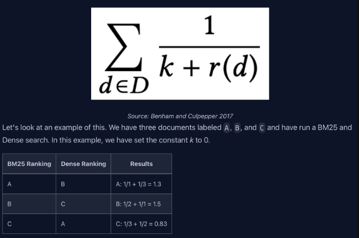
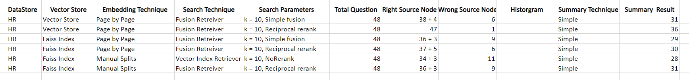

1. So this fusion is basically a search methodology that aims to bridge the gap
   between traditional search paradigms and the multifaced dimensions of human
   queries.

2. The fusion concept is to employ multiple query generation and use the
   reranking system to re-rank the search results.

3. The main goal is to move closer to unearthing that elusive 90% of
   transformative knowledge that often remains hidden behind top search results.

### What the Fusion does

<table class="table-size-for-cloud-services">
    <thead>
        <tr>
            <th>Process Step</th>
            <th>Description</th>
        </tr>
    </thead>
    <tbody>
        <tr>
            <td><span class="custom-header">Query Generation</span></td>
            <td>The system starts by generating multiple queries from a user's initial query using OpenAI's GPT Model.</td>
        </tr>
        <tr>
            <td><span class="custom-header">Vector Search</span></td>
            <td>Conducts vector-based searches on each of the generated queries to retrieve relevant documents from a predefined set.</td>
        </tr>
        <tr>
            <td><span class="custom-header">ReRanking System</span></td>
            <td>Applies the re-ranking algorithm to re-rank the documents based on their relevance across multiple queries.</td>
        </tr>
        <tr>
            <td><span class="custom-header">Output Generation</span></td>
            <td>Produces a final output consisting of the re-ranked list of documents.</td>
        </tr>
    </tbody>
</table>

:::tip 
There are basically 2 types of fusion retrievers powered by Llama Index,
according to the re-rank algorithms.
 1. Simple Fusion Retriever 
 2. Reciprocal ReRank Fusion Retriever 
:::

### QueryFusionRetriever

This QueryFusionRetriever is the retriever released by the Llama Index, which we
can use to combine more vector searches to retrieve the nodes and do the re-rank
over the retrieved nodes which can be used later by the summary generation.

```js
class QueryFusionRetriever(BaseRetriever):
def __init__(
        self,
        retrievers: List[BaseRetriever],
        llm: Optional[LLMType] = "default",
        query_gen_prompt: Optional[str] = None,
        mode: FUSION_MODES = FUSION_MODES.SIMPLE,
        similarity_top_k: int = DEFAULT_SIMILARITY_TOP_K,
        num_queries: int = 4,
        use_async: bool = True,
        verbose: bool = False,
    )
```

1. **retrievers** we can have a list of various retrievers that we used to
   retrieve the top k nodes using different search techniques.
2. **query_gen_prompt** This prompt is used to generate multiple queries from
   user's initial query. By default Llama Index have a prompt, if we need to use
   our own prompt we can just override it by passing out own prompt.

```js
QUERY_GEN_PROMPT = (
    "You are a helpful assistant that generates multiple search queries based on a "
    "single input query. Generate {num_queries} search queries, one on each line, "
    "related to the following input query:\n"
    "Query: {query}\n"
    "Queries:\n"
)
```

3. **mode** as we saw earlier, this fusion retriever has 2 modes simple and
   reciprocal reranking.

   1. Simple - simple re-ordering of results based on the original score.
   2. Reciprocal - Apply the reciprocal re-rank algorithm.

4. **similarity_top_k** - after the reranking the retriever will retrieve the
   top k nodes which are later used by the summary generator to generate the
   output text.

5. **num_queries** - indicates how many queries have to be generated from the
   initial user query. To disable this query generation, set this to 1.

6. **use_async** - If this is true, then only the nodes from the first
   retrievers will be passed down to the query fusion retriever. If this is
   false, then nodes from all the retrievers will be passed down to the query
   fusion retriever.

### Simple Fusion

The retrieved nodes will be returned as the top-k across all queries and
indexes, as well as handling the de-duplication of any nodes. After that, it
will simply reorder with the already existing node score and take the top k
nodes from it for the query fusion retriever.

### Reciprocal Fusion

1. The retrieved nodes will be returned as the top-k across all queries and
   indexes, as well as handling the de-duplication of any nodes.

2. Since all of these retrievers calculate a score, we can use the reciprocal
   rerank algorithm to re-sort our nodes without using an additional model or
   excessive computation.
   

In Llama Index, the way the reciprocal re-ranking is designed like

```js
def fuse_results(results_dict, similarity_top_k: int = 2):
    """Fuse results."""
    k = 60.0  # `k` is a parameter used to control the impact of outlier rankings.
    fused_scores = {}
    text_to_node = {}

    # compute reciprocal rank scores
    for nodes_with_scores in results_dict.values():
        for rank, node_with_score in enumerate(
            sorted(
                nodes_with_scores, key=lambda x: x.score or 0.0, reverse=True
            )
        ):
            text = node_with_score.node.get_content()
            text_to_node[text] = node_with_score
            if text not in fused_scores:
                fused_scores[text] = 0.0
            fused_scores[text] += 1.0 / (rank + k)

    # sort results
    reranked_results = dict(
        sorted(fused_scores.items(), key=lambda x: x[1], reverse=True)
    )

    # adjust node scores
    reranked_nodes: List[NodeWithScore] = []
    for text, score in reranked_results.items():
        reranked_nodes.append(text_to_node[text])
        reranked_nodes[-1].score = score

    return reranked_nodes[:similarity_top_k]
```

### Detailed Observation

 
