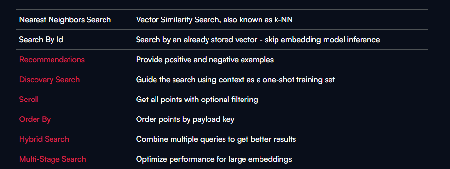
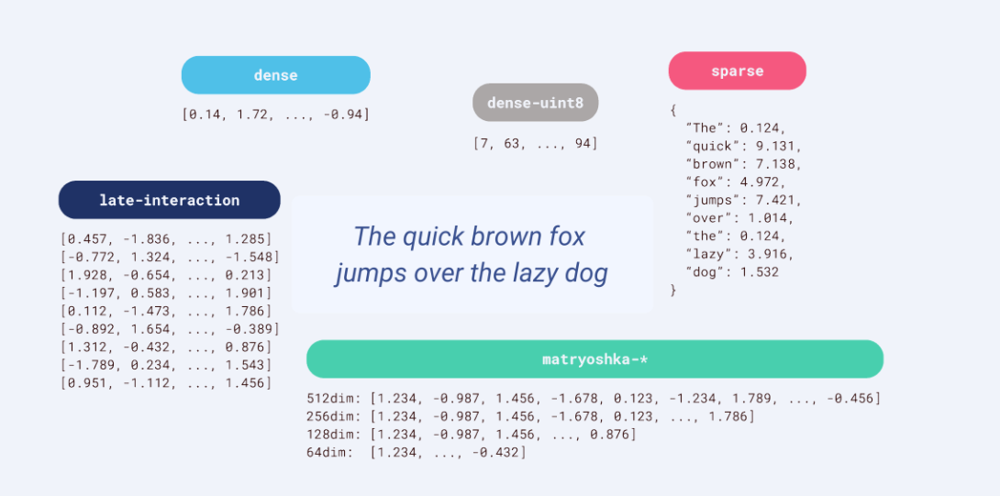
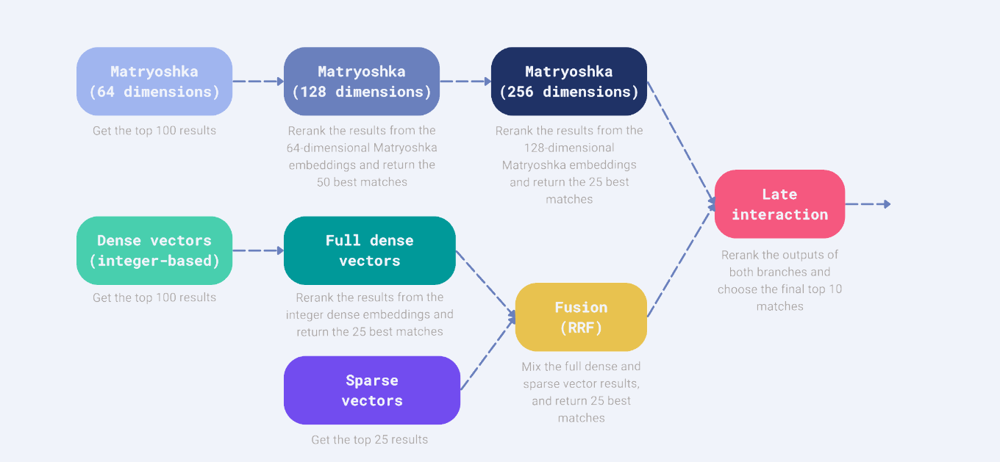

#### Hybrid search for Qdrant vector store with v>=10

:::info

1. Qdrant Client >=1.10
2. Fastembed >= 0.3.4
3. Llama-index-vector-stores-qdrant >=0.2.14 
:::

4. Hybrid search is Qdrant is revamped and it can be customized as per the
   project requirement.

5. Qdrant 1.10 introduces a new Query API that lets you build a search system by
   combining different search methods to improve retrieval quality.

6. This
   [Query API](https://qdrant.tech/documentation/concepts/search/#query-api)
   provides a single interface for different kinds of searches like search by
   Id, similaity saerch, hybrid search, multi stage search etc.
   

### Support for multivectors

1. Earlier Qdrant supports only dense and sparse vectors.

2. With the latest version 1.10, it supports different vectors like dense-uint8,
   dense, sparse, matryoshka vectors and multi-vector representation.
   

### Dense-uint8

1. Dense vectors are typically floating point vectors and each element in the
   vector is represented 32 or 64 bits.

2. E.g text-embedding-ada-002 is f32 bits.

3. But this dense-uint8 are the quantized version of regular dense vectors in
   which each element is represented by 8-bit unsigned integer.

4. This type of vectors are used to reduce memory usage, but it's precision is
   reduced compared to the floating point vectors.

### Matryoshka vectors

1. The dimension of the embedding vector represents how many numerical values
   are used to represent each text input.

2. Each dimension in the vector captures certain features or aspects of the text
   like grammars, sematic features etc..

3. Default dimensions of popular text embedding models

   1. nomic-embed-text - 768
   2. text-embedding-ada-002 - 1536
   3. text-embedding-3-small - 1536
   4. text-embedding-3-large - 3072

4. The high-dimensional vector space allows the embedding to encode rich
   information about the text.

5. The above statement is valid until the introduction of Matryoshka
   Representation Learning.

6. Matryoshka representation learning aims to create hierarchical, nested
   representations that encapsulate multiple levels of information within a
   single vector.

7. In contrast to common vector embeddings, where all dimensions are equally
   important, in Matryoshka embeddings, earlier dimensions store more
   information than dimensions later on in the vector, which simply adds more
   details. :::note You can think of this by the analogy of trying to classify
   an image at multiple resolutions: The lower resolutions give more high-level
   information, while the higher resolutions add more details. :::
8. Nomic embed text, text-embedding-3-small and text-embedding-3-large uses
   Matryoshka representation learning and
   [OpenAI](https://platform.openai.com/docs/guides/embeddings/use-cases) also
   reported that text-embedding-3-large embedding can be shortened to a size of
   256 while still outperforming an unshortened text-embedding-ada-002 embedding
   with a size of 1536 on the MTEB benchmark.

9. With this new representation technique we store Matryoshka vectors with
   different dimension sizes and filter that in each stages.

10. This Matryoshka vectors is also supported in
    [Weaviate](https://weaviate.io/blog/openais-matryoshka-embeddings-in-weaviate#:~:text=%E2%80%8B,and%20search%20for%20it%20faster).

### Multi-vector representation

1.  A dense vector is typically a single, high-dimensional vector representation
    of a piece of text (word, sentence, paragraph, or document). This vector is
    dense because most of its components are non-zero, capturing rich semantic
    information about the text. Each element in a dense vector is a continuous
    value, and together, these values form a vector that resides in a
    high-dimensional space.

2.  Multi-vector representation involves multiple vectors representing different
    entities (queries, documents, etc..)

3.  These multi-vectors are created by specialized models called
    late-interaction models.
    1. E.g ColBERT - Contextualized Late Interaction over BERT

#### Hybrid search

1. Using this support for multiple vectors we can customize the hybrid search
   accordingly specific to the use case.
   

2. We can use retrieve vectors in of different levels and re-ranking it Late
   interaction models to get better results.

:::info 
To know more about how to utilize the different vector types and re-ranking, check out this [github page](https://github.com/qdrant/workshop-ultimate-hybrid-search/tree/main/notebooks)
:::

#### Native support for fusion algorithm

:::info 
In the latest Qdrant version 1.10, Qdrant has it's built in fusion
algorithm - Reciprocal Rank fusion.

To learn more about the Hybrid search revamp check out this
[blog](https://qdrant.tech/articles/hybrid-search/) 
:::
