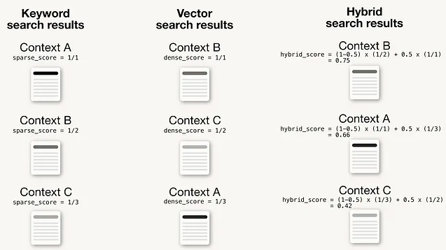

### Keyword Search

### Understanding Keyword Search

1. Keyword Search is a fundamental method in querying databases or search
   engines using specific words or phrases to find relevant information within
   unstructured data such as documents, web pages, and multimedia.

2. This strategy combines traditional keyword-based search techniques with
   modern semantic search methodologies, integrating algorithms like tf-idf
   (term frequency-inverse document frequency) or BM25 with vector-based
   searches.

3. In the context of Retrieval Augmented Generation (RAG), Keyword Search plays
   a crucial role as the initial step in retrieving relevant data that
   significantly enhances the generation of responses or content.

4. This retrieval process is pivotal in adding depth and accuracy to the
   generated outcomes, making RAG systems more robust and informed, and allowing
   them to exploit the benefits of both semantic relevance and keyword matching
   for more comprehensive and inclusive search results.

### Problem Statement

1. The core challenge addressed by Keyword Search is the ability to find the
   most relevant information quickly within a vast pool of unstructured data.

2. As the volume of data over the internet grows exponentially, efficiently
   retrieving specific information becomes increasingly crucial.

### Advantages and Disadvantages

#### **Advantages**

<table class="table-size-for-cloud-services">
    <thead>
        <tr>
            <th>Aspect</th>
            <th>Description</th>
        </tr>
    </thead>
    <tbody>
        <tr>
            <td>Efficiency</td>
            <td>Significantly speeds up the process of finding relevant information.</td>
        </tr>
        <tr>
            <td>Understanding</td>
            <td>Simplifies the discovery of needed data among vast resources.</td>
        </tr>
        <tr>
            <td>Scalability</td>
            <td>Adapts easily to both small-scale and large-scale data environments.</td>
        </tr>
    </tbody>
</table>

#### **Disadvantages**

<table class="table-size-for-cloud-services">
    <thead>
        <tr>
            <th>Aspect</th>
            <th>Description</th>
        </tr>
    </thead>
    <tbody>
        <tr>
            <td>Complexity</td>
            <td>Proper keyword selection and search strategy require understanding and skill.</td>
        </tr>
        <tr>
            <td>Resource Usage</td>
            <td>Highly dependent on computational resources, especially when parsing large datasets.</td>
        </tr>
        <tr>
            <td>Limitations</td>
            <td>Limited by the preciseness of the keywords used; irrelevant results possible if keywords are not well chosen.</td>
        </tr>
    </tbody>
</table>

### References

:::info
[Image Source](https://towardsdatascience.com/improving-retrieval-performance-in-rag-pipelines-with-hybrid-search-c75203c2f2f5)
:::
