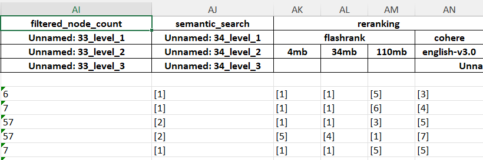

To Help GenAI Developers debug their applications, logging several data and
tracking those with some tools can be useful

### Data to Log

1. Synthesis
1. prompt, response
1. retrieval
1. retrieval config (top-k, threshold, mode etc)
1. query used to retrieve
1. retrieved nodes
1. generating retrieval report

### Available tools

Logging and analyzing the logs for an AI workflow were automated in certain
tools like

1. langsmith
2. mlflow
3. log openai requests

### Retrieval report

1. Retrieval report is preparing a evaluation dataset for retrieval and
   analyzing them, sample workflow would be

   1. Have a excel sheet with columns `query`, `actual_node`,
      `retrieved_position_of_actual_node`. The
      `retrieved_position_of_actual_node` will have numbers (-1 to n), -1
      indicating the node is not retrieved, other numbers indicate the position
      of retrieved node

`  Example retrieval report for a RAG system with metadata filtering and different re-ranking models`

2. Here the inference would be semantic search itself is having good
   performance, re-ranking is an overkill
