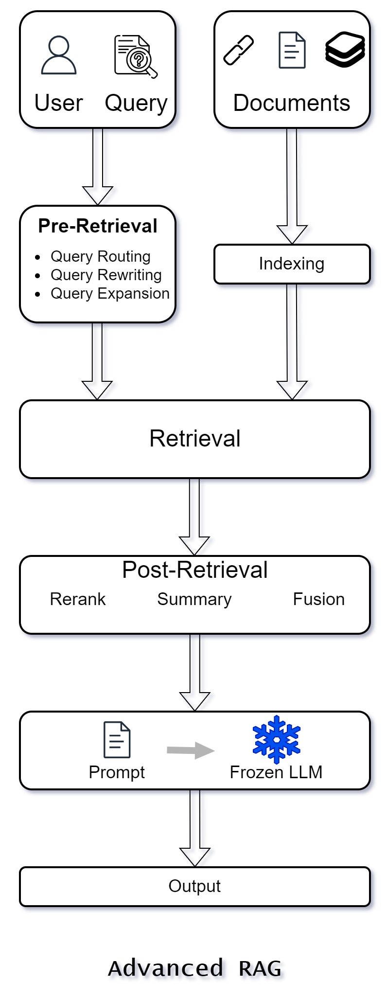

1. **Advanced Retrieval Augmented Generation (RAG)** represents a significant
   evolution over Naive RAG by addressing its limitations through enhanced
   retrieval quality and advanced optimization strategies.

2. This paradigm leverages both pre-retrieval and post-retrieval methods to
   improve the overall efficacy of the RAG system.

### Key Enhancements in Advanced RAG

#### 1. Pre-Retrieval Process

1. The pre-retrieval process in Advanced RAG focuses on optimizing the indexing
   structure and refining the original query.

2. The primary goal here is to enhance the quality of the indexed content and
   ensure the query is well-suited for the retrieval task.

3. This stage involves several strategies:

   1. **Enhancing Data Granularity:** Breaking down information into finer
      segments to improve retrieval precision.

   2. **Optimizing Index Structures:** Implementing more efficient indexing
      methods to speed up and refine the retrieval process.

   3. **Adding Metadata:** Incorporating additional information to enrich the
      context and improve search relevance.

   4. **Alignment Optimization**: Ensuring that the indexed content aligns well
      with potential queries.

   5. **Mixed Retrieval**: Combining different retrieval methods to balance
      precision and recall.

   6. **Query Optimization:** Techniques such as query rewriting,
      transformation, and expansion are used to clarify and refine the user’s
      original query, making it more effective for the retrieval task.

#### 2. Post-Retrieval Process

1. Once relevant context is retrieved, the post-retrieval process focuses on
   integrating this context effectively with the query.

2. Key methods in this stage include:

   1. **Re-ranking Chunks:** Adjusting the order of retrieved information to
      prioritize the most relevant content.

   2. **Context Compressing:** Shortening and refining the context to ensure
      that the focus remains on essential details. This is crucial to prevent
      information overload and maintain the clarity and relevance of the
      retrieved content.

   3. **Selective Information Emphasis:** Highlighting critical sections and
      discarding irrelevant information to maintain the effectiveness of the
      retrieval.

These post-retrieval efforts are vital in frameworks like LlamaIndex, LangChain,
and HayStack, which implement strategies to manage large volumes of retrieved
data and maintain focus on key details.

<!--  -->

### Comparison with Naive RAG

1. Advanced RAG, while maintaining a similar chain-like structure to Naive RAG,
   introduces multiple optimization strategies.

2. This evolution is marked by:

   1. Enhanced indexing techniques through fine-grained segmentation and the use
      of metadata.

   2. Sophisticated pre-retrieval and post-retrieval processes to improve
      retrieval quality.

   3. More complex query optimization methods to refine the initial user query.

### Advantages

<table class="table-size-for-cloud-services">
    <thead>
        <tr>
            <th>Factors</th>
            <th>Reason</th>
        </tr>
    </thead>
    <tbody>
        <tr>
            <td>Improved Retrieval Accuracy</td>
            <td>By enhancing data granularity and optimizing indexing structures, Advanced RAG significantly improves the precision and relevance of retrieved information.</td>
        </tr>
        <tr>
            <td>Enhanced Query Processing</td>
            <td>Advanced query optimization techniques ensure that the user’s query is more effectively interpreted and processed.</td>
        </tr>
        <tr>
            <td>Reduced Information Overload</td>
            <td>Post-retrieval methods like re-ranking and context compressing help mitigate information overload, focusing on the most critical information.</td>
        </tr>
        <tr>
            <td>Greater Flexibility</td>
            <td>The integration of mixed retrieval methods and metadata allows for a more adaptable and responsive retrieval process.</td>
        </tr>
    </tbody>
</table>

### Disadvantages

<table class="table-size-for-cloud-services">
    <thead>
        <tr>
            <th>Factors</th>
            <th>Reason</th>
        </tr>
    </thead>
    <tbody>
        <tr>
            <td>Increased Complexity</td>
            <td>The additional optimization techniques and processes introduce complexity, which can make implementation and maintenance more challenging.</td>
        </tr>
        <tr>
            <td>Higher Computational Costs</td>
            <td>The refined indexing and retrieval processes may require more computational resources, potentially increasing costs.</td>
        </tr>
        <tr>
            <td>Potential Overfitting</td>
            <td>Fine-grained segmentation and query optimization might lead to overfitting, where the system becomes too tailored to specific queries or contexts, reducing generalizability.</td>
        </tr>
        <tr>
            <td>Implementation Overhead</td>
            <td>The need for sophisticated optimization and metadata management can result in higher initial setup and ongoing operational overhead.</td>
        </tr>
    </tbody>
</table>

### Conclusion

1. Advanced RAG represents a substantial improvement over Naive RAG, primarily
   through enhanced retrieval quality and sophisticated optimization strategies.

2. While it introduces complexity and higher computational costs, the benefits
   of improved accuracy, reduced information overload, and greater flexibility
   make it a valuable advancement in the field of Retrieval Augmented
   Generation.
