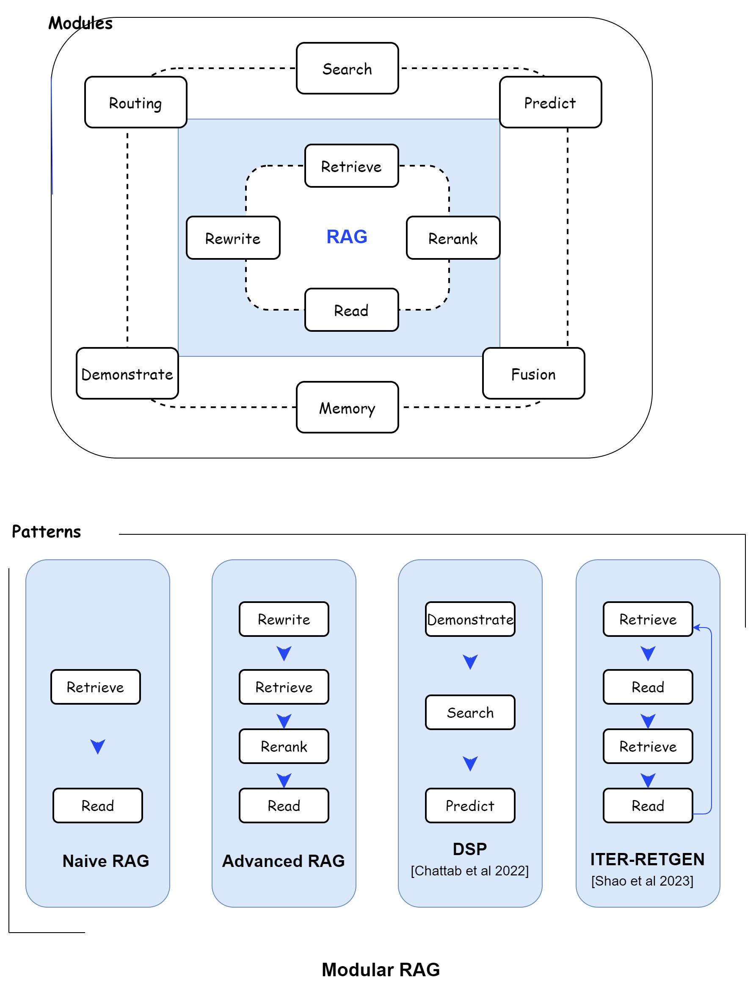

1. The **Modular RAG (Retrieval Augmented Generation)** architecture represents
   an evolution in RAG paradigms, offering enhanced adaptability and
   versatility.

2. This approach integrates various strategies for optimizing its components,
   including the introduction of new modules and the reconfiguration of existing
   ones to address specific challenges.

### Key Components of Modular RAG

#### 1. **Search Module:**

         1. Enhances retrieval capabilities by enabling direct searches across various data sources such as    search engines, databases, and knowledge graphs.

         2.  Utilizes large language model (LLM) generated code and query languages to perform similarity searches.

#### 2. **RAGFusion:**

         1. Employs a multi-query strategy to expand user queries into diverse perspectives.

         2. Utilizes parallel vector searches and intelligent re-ranking to uncover both explicit and transformative knowledge, addressing traditional search limitations.

#### 3. **Memory Module:**

         1. Leverages the LLM’s memory to guide retrieval, creating an unbounded memory pool.

         2. Aligns the text more closely with data distribution through iterative self-enhancement.

#### 4. **Routing Module:**

      1. Navigates through diverse data sources, selecting the optimal pathway for a query.

      2. Capable of performing tasks such as summarization, specific database searches, or merging different information streams.

#### 5. **Predict Module:**

      1. Aims to reduce redundancy and noise by generating context directly through the LLM.

      2. Ensures relevance and accuracy in the retrieved information.

#### 6. **Task Adapter Module:**

      1. Tailors RAG to various downstream tasks by automating prompt retrieval for zero-shot inputs.

      2. Creates task-specific retrievers through few-shot query generation, enhancing precision and flexibility.

### Innovative Patterns in Modular RAG

#### 1. Module Substitution and Reconfiguration

      1. Allows the replacement or adjustment of modules to address specific challenges, offering flexibility beyond the fixed structures of Naive and Advanced RAG.

      2. Enables the integration of new modules or adjustment of interaction flows among existing ones to enhance applicability across different tasks.

#### 2. **Rewrite-Retrieve-Read Model:**

      1. Refines retrieval queries through a rewriting module and a language model feedback mechanism.

      2. Improves task performance by updating the rewriting model.

#### 3. **Generate-Read Approach:**

      1. Replaces traditional retrieval with LLM-generated content, enhancing the model’s ability to handle knowledge-intensive tasks.

#### 4. **Recite-Read Approach:**

      1. Emphasizes retrieval from model weights, further improving task handling capabilities.

#### 5. **Hybrid Retrieval Strategies:**

      1. Integrates keyword, semantic, and vector searches to cater to diverse queries.

      2. Uses sub-queries and hypothetical document embeddings (HyDE) to improve retrieval relevance by focusing on embedding similarities between generated answers and real documents.

#### 6. **Dynamic Module Interactions:**

      1. Adjustments in module arrangement and interaction, such as the Demonstrate-Search-Predict (DSP) framework and the iterative Retrieve-Read-Retrieve-Read flow of ITERRETGEN, showcase the dynamic use of module outputs to bolster another module’s functionality.

      2. Techniques like FLARE and Self-RAG demonstrate adaptive retrieval by evaluating the necessity of retrieval based on different scenarios.

### Advantages

<table class="table-size-for-cloud-services">
    <thead>
        <tr>
            <th>Factors</th>
            <th>Reason</th>
        </tr>
    </thead>
    <tbody>
        <tr>
            <td>Enhanced Flexibility</td>
            <td>
                The modular architecture allows for easy integration and reconfiguration of components, making it adaptable to a wide range of tasks and challenges, Supports both sequential processing and integrated end-to-end training across its components.
            </td>
        </tr>
        <tr>
            <td>Improved Retrieval and Processing</td>
            <td>
               Specialized modules like the Search, RAGFusion, and Memory modules enhance retrieval capabilities by addressing specific limitations and leveraging advanced strategies.
            </td>
        </tr>
        <tr>
            <td>Task-Specific Adaptation</td>
            <td>
                  The Task Adapter module enables the framework to be tailored to various downstream tasks, automating prompt retrieval for zero-shot inputs and creating task-specific retrievers.
            </td>
        </tr>
        <tr>
            <td>Reduced Redundancy and Noise</td>
            <td>The Predict module ensures the generation of relevant and accurate context, minimizing unnecessary information.</td>
        </tr>
        <tr>
            <td>Better Integration with Other Technologies</td>
            <td>The flexible architecture allows for easier integration with technologies like fine-tuning and reinforcement learning, further enhancing retrieval and generation quality.</td>
        </tr>
    </tbody>
</table>

### Disadvantages

<table class="table-size-for-cloud-services">
    <thead>
        <tr>
            <th>Factors</th>
            <th>Reason</th>
        </tr>
    </thead>
    <tbody>
        <tr>
            <td>Increased Complexity</td>
            <td>The introduction of multiple specialized modules can increase the overall complexity of the system, making it more challenging to manage and maintain.</td>
        </tr>
        <tr>
            <td>Resource Intensive</td>
            <td>The enhanced capabilities and flexibility of Modular RAG may require more computational resources, potentially leading to higher operational costs.</td>
        </tr>
        <tr>
            <td>Implementation Challenges</td>
            <td>The reconfiguration and substitution of modules may require significant expertise and effort to implement effectively, posing a barrier for some organizations.</td>
        </tr>
        <tr>
            <td>Potential for Integration Issues</td>
            <td>The flexible nature of Modular RAG may lead to integration challenges, particularly when combining it with existing systems or technologies.</td>
        </tr>
    </tbody>
</table>

<!--  -->

### Conclusion

1. In summary, Modular RAG represents a significant advancement in the field of
   Retrieval Augmented Generation, offering enhanced adaptability, precision,
   and task-specific capabilities.

2. However, these benefits come with increased complexity and potential
   implementation challenges that need to be carefully managed.
