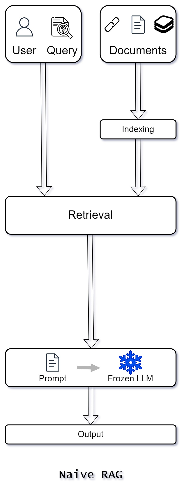

1. Naive RAG (Retrieval Augmented Generation) represents the earliest approach
   to combining retrieval and generation tasks, gaining prominence with the rise
   of large language models such as ChatGPT.

2. This method employs a straightforward `Retrieve-Read` framework, which
   includes three main steps:

   1. Data Ingestion
   2. Retrieval
   3. Generation.

### 1. Data Ingestion

<table class="table-size-for-cloud-services">
    <thead>
        <tr>
            <th>Factors</th>
            <th>Reason</th>
        </tr>
    </thead>
    <tbody>
        <tr>
            <td>Data Cleaning and Extraction</td>
            <td>Raw data from various formats like PDF, HTML, Word, and Markdown is cleaned and converted into plain text.</td>
        </tr>
        <tr>
            <td>Chunking</td>
            <td>The text is segmented into smaller, manageable chunks to accommodate the context limitations of language models.</td>
        </tr>
        <tr>
            <td>Vector Encoding</td>
            <td>These chunks are encoded into vector representations using an embedding model and stored in a vector database. This is crucial for efficient similarity searches during the retrieval phase.</td>
        </tr>
    </tbody>
</table>

### 2. Retrieval

<table class="table-size-for-cloud-services">
    <thead>
        <tr>
            <th>Factors</th>
            <th>Reason</th>
        </tr>
    </thead>
    <tbody>
        <tr>
            <td>Query Encoding</td>
            <td>When a user query is received, it is transformed into a vector representation using the same encoding model used during indexing.</td>
        </tr>
        <tr>
            <td>Similarity Computation</td>
            <td>The system computes similarity scores between the query vector and the vectors of chunks in the indexed corpus.</td>
        </tr>
        <tr>
            <td>Top-K Selection</td>
            <td>The top K chunks with the highest similarity scores are retrieved to serve as the expanded context for the prompt.</td>
        </tr>
    </tbody>
</table>

### 3. Generation

<table class="table-size-for-cloud-services">
    <thead>
        <tr>
            <th>Factors</th>
            <th>Reason</th>
        </tr>
    </thead>
    <tbody>
        <tr>
            <td>Prompt Construction</td>
            <td>The original query and the retrieved documents are synthesized into a coherent prompt.</td>
        </tr>
        <tr>
            <td>Response Generation</td>
            <td>A large language model generates a response based on this prompt. The model can either draw on its inherent parametric knowledge or rely strictly on the retrieved documents. In ongoing dialogues, conversational history can be incorporated to enable effective multi-turn interactions.</td>
        </tr>
    </tbody>
</table>

<!--  -->

### Advantages

1. **Simplicity and Accessibility:** The Naive RAG approach is straightforward
   and easy to implement, making it accessible for early adopters of
   retrieval-augmented generation techniques. 🚀

2. **Broad Applicability:** It can handle a variety of data formats and
   integrates well with existing language models, making it versatile for
   different use cases. 🌍

3. **Enhanced Contextualization:** By retrieving relevant documents, the model
   can provide more contextually rich responses than using only its internal
   knowledge. 📚

### Disadvantages

1. **Retrieval Challenges:** The retrieval phase may struggle with precision and
   recall, leading to the selection of irrelevant chunks and the omission of
   crucial information.

2. **Generation Issues**

   1. **Hallucination:** The model might generate content not supported by the
      retrieved context, resulting in inaccuracies.

   2) **Irrelevance, Toxicity, and Bias:** Responses can suffer from these
      issues, impacting the quality and reliability of the output.

3. **Augmentation Hurdles**

   1. **Integration Difficulties**: Combining retrieved information with the
      task at hand can be challenging, often resulting in disjointed or
      incoherent outputs.
   2. **Redundancy:** Similar information retrieved from multiple sources can
      lead to repetitive responses.
   3. **Significance and Relevance:** Determining the importance of various
      passages and maintaining stylistic and tonal consistency adds complexity.
   4. **Over-Reliance on Retrieved Content:** There's a risk that the model
      might overly depend on the retrieved information, echoing it without
      providing additional insight or synthesis.

### Conclusion

1. Naive RAG, as an early methodology in retrieval-augmented generation, lays
   the foundation for more sophisticated approaches.

2. While it offers a simple and accessible framework, its limitations highlight
   the need for ongoing advancements to improve retrieval precision, response
   generation quality and effective integration of retrieved information.
