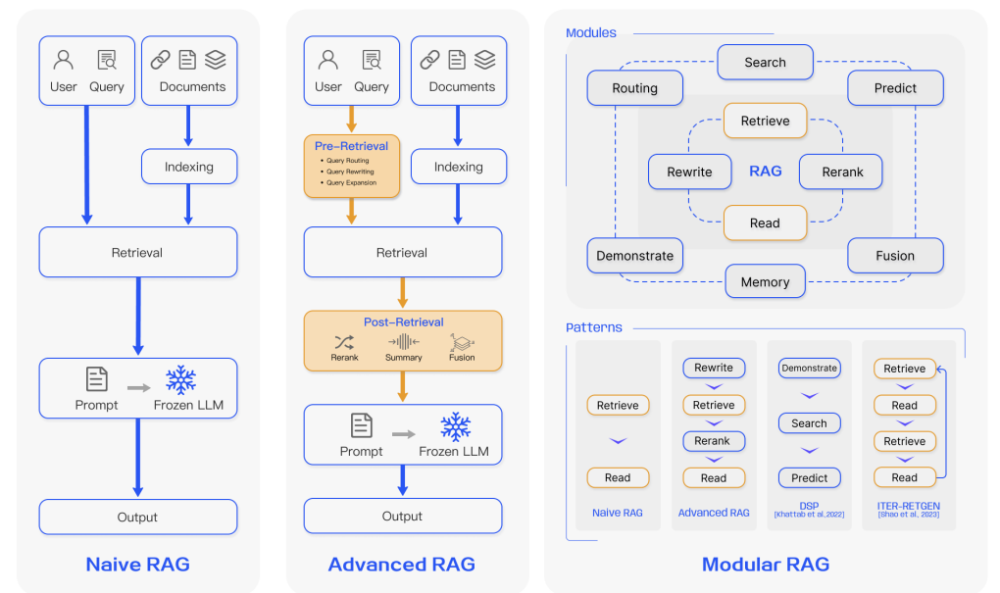

1. Retrieval Augmented Generation has three major evolution or type.

2. We can use the below terminology and look at a RAG solution and say what type
   of RAG are they,
   1. Naive RAG
   2. Advanced RAG
   3. Modular RAG
   4. Graph RAG

### Reference

:::info
 The above contents have been verified and are based on the
[referenced paper](https://arxiv.org/pdf/2312.10997) 
:::
